# KANBAN — Visa Navigator

Slices go by their **capability name**; short IDs (s1, s2…) are filename sort
keys only. A slice advances only on a run acceptance scenario: **mock-green**
when it passes on mocks, **real-green** when it passes for real. The moment a
mock is born, its de-mock task is appended to backlog.

```mermaid
flowchart LR
    A["Walking skeleton ✅ real-green (v0.1)"] --> B["Full Germany route set ✅ real-green (v0.2)"]
    B --> C["Gap analysis on results ✅ real-green (v0.3)"]
    C --> C2["Leverage analysis: what each step unlocks ✅ real-green (v0.4–v0.5)"]
    C2 --> D["Source watch + change flag ✅ real-green (v0.6)"]
    D --> E["Four countries · honest verdicts · exceptions ✅ real-green (v0.7)"]
    E --> E2["Answers recorded as given ✅ real-green (v0.8)"]
    E2 --> E3["Every sentence carries its source ✅ real-green (v0.9)"]
    E3 --> F["Public launch ◀ here 🏁 v1"]
    F -.-> G["Wave 2: CA + AU"]
    G -.-> H["Wave 3: rest of Europe + community"]
```

## roadmap

Candidates, not commitments: capability · why it came up · the bet it rests on.
Promoted (or dropped, with evidence) at a boundary session.

### v1 — launch
- **Public launch** · the dataset is only useful in public · bet: an open,
  dated, source-quoted ruleset earns links and contributions faster than a
  closed one earns users. (Slice s6.)

### v1.x
- **Print or save the record** · the "eligibility record" metaphor has no
  export and a refresh destroys it · bet: people take this to an appointment.
- **Affiliate layer** · the money model from the viability gate · bet:
  route-relevant mandatory services convert without touching eligibility.
- **More citizenship exceptions** · the mechanism shipped in s5c, the data did
  not · bet: association agreements matter to enough users to earn a question.
- **Reduced thresholds, remaining limbs** · ES shortage catalogue, NL follow-up
  criteria · bet: the SEPE catalogue is watchable once located.

### later
- CA + AU · rest of Europe · Turkish UI · quote-grounded "ask about this route"
  · recognition helper (Anabin and its FR/ES/NL equivalents).

## backlog

- **PDF text extraction for the watch** (2026-09-07): both PDF-tier sources
  carry a text layer behind embedded TrueType fonts; decoding the glyph tables
  yields verbatim text. A pdf strategy that extracts text would move the five
  unverifiable quotes to the machine tier and let the fidelity gate read them.
  Source: the s5e human pass, done by the session.

- **Bare preconditions carry no provenance** (s5e review, 2026-09-07): 38
  route preconditions state what an authority requires with no source; s5d
  built sourced precondition statements for exactly this and the conversion
  was never finished. Source: s5e review, Standards axis.
- **es-highly-qualified fails people Spain would pass** (s5e, 2026-09-07):
  Ley 14/2013 art. 71.2 counts three years of experience; the nearest option
  asks five in seven. Changes verdicts — **back-edge candidate**, needs a
  declarable three-year option or a rewording of the band. Source: s5e build
  report; stated on the card as a reading meanwhile.

- **Migrate remaining Turkish docs to English** (steward-3 language rule):
  one-pager, assumptions, research-01, scenarios s1–s3b, older DECISIONS
  entries (STATUS/KANBAN/ARCHITECTURE already translated).
- **Buzer → official-source URL migration** · Replace buzer.de mirror links
  in the dataset with the verified gesetze-im-internet.de URLs (human
  verified them via VPN; agents cannot reach the official site — relevant to
  s4 source selection).
- **Model the 45+ age rules (55% threshold) as criteria** (currently notes).
- **Criterion-note provenance** (s5 review catch): verbatim legal quotes on
  eq/in/any criteria ride as bare `note` strings — no source_url/retrieved_at,
  so 7 routes (§18a/b, §18d, §19, es-ict, es-researcher, nl-orientation-year)
  show zero provenance and their source pages escape watch coverage. Needs a
  provenanced `basis` structure on non-numeric criteria + watchlist growth
  (BAMF pages, IND route pages).
- **Print / save the record** (golden G5): the "eligibility record" metaphor
  has no export; refresh destroys it. Print stylesheet + "save as PDF" hint,
  possibly a shareable-by-URL profile (privacy: answers in the fragment,
  never sent). Joins s6.
- **Reduced thresholds, three countries** (s5 verification 4.2): NL HSM
  €3,122 and Blue Card €4,754 for recent graduates; ES Blue Card €33,085.09
  for CNO 1–2 shortage occupations or a qualification obtained in the last 3
  years (and NOT for PAC nacional — it is per-route, not a global flag).
  Needs a declarable "recent graduate" fact and the SEPE catalogue.
- **More citizenship exceptions** — the mechanism shipped in s5c (`implies`
  plus a notice keyed to a country); what is missing is data. Candidates: the
  EU association agreements beyond Türkiye, and the countries whose nationals
  have privileged access to Germany (§ 26 BeschV).
- **FR talent subtypes — entreprise innovante, salarié en mission** (s5
  verification 2.1): both thresholds equal €39,582 and are on F16922; what is
  missing is a qualifier field for the employer/mission type, not a number.
- **Orientation-year English requirement**: IELTS 6.0 / equivalent / an
  English- or Dutch-taught programme. Stated as a precondition today; a gap
  row would be better once there is a declarable field.
- **Country vocabulary follow-ups** (s5c review + light critique): dependent
  territories are deliberately absent — adding one back means sourcing which
  passport its residents hold; CLDR labels "Congo - Kinshasa" and "Hong Kong
  SAR China" read oddly; alias coverage is the 35 names people most often
  type, not a complete exonym list.
- **Public launch** (s6) · `visa-rules` public (CC-BY-4.0, CONTRIBUTING,
  coverage tiers), site deploy, per-route micro-pages, disclaimer/legal
  wording (A1 conditions), GitHub/HN launch. _Tests A2, A7, A8 for real._

### v1.x / wave 2 (post-v1)
- **Affiliate layer** (viability decision 2026-09-02): route-relevant
  mandatory services (blocked account, visa insurance, language) — labelled
  "affiliate", multi-provider, disclosure next to the disclaimer; never
  affects eligibility. (GitHub Sponsors link is small — may join s6.)
- Trackerless ads evaluation — only if 25–50k visits/month is crossed
- LLM extraction + code validation + auto-PR (full pipeline)
- "Ask about this route" (quote-grounded RAG)
- LLM build-time question-wording polish (A14)
- Turkish UI
- CA + AU (A6) · wave 3: rest of Europe · US as a separate decision
- JobRadar integration (cross-referral)
- Privacy-preserving usage counter
- Recognition helper: look up the user's university/program in Anabin (and
  FR/ES/NL equivalents) — research first (reachability, A1-compatible output
  wording, per-country recognition source inventory)

## active

- **Answers recorded as given, verdicts in plain words** (s5d) ·
  `docs/spine/scenarios/s5d.md`. Built, code-reviewed on both axes (10 findings,
  all applied), and extended twice by findings from the human's own walk: the
  orientation-year false requirement, and a four-part package now in flight —
  a card must name the threshold it was measured against · preconditions must
  read as requirements, not as claims about the reader · five caveats must leave
  the "Also required" heading · the Chancenkarte's twin of the false
  requirement, settled against § 20a. Awaiting the human's scenario walk on the
  finished build.

## mock-green

_(empty — s5e stamped into done as **v0.9**, 2026-09-07)_

## real-green

_(empty — everything real-green so far is stamped into done)_

## done

- **Every sentence carries its source, not only every number** (s5e) ·
  **real-green 2026-09-07** — the five PDF-tier quotes read from the PDFs' own text layers by the session (verbatim string match), at the human's request (docs/spine/scenarios/s5e.md). 45 criterion notes
  with no provenance became 55 sourced conditions, 8 readings declared ours,
  1 declared unsourced with a reason; machine-verified quotes 28 → 78; value
  set and verdict SHA unchanged. Reviewed on both axes, 12 findings applied —
  the gate re-keyed from quotation marks to a declared kind, and slice markers
  on every IND and BAMF entry so an intermittent shell response reports
  unreachable instead of overwriting the snapshot. → **v0.9**

- **Four countries filled: FR·ES·NL + honest verdicts + exceptions**
  (s5 · s5b · s5c) · real-green 2026-09-06. Two gates cleared on the same day:
  the human verified all 39 checklist values at their official sources
  (`verify-s5.md` 21/21, `verify-s5c.md` 18/18, including the Spanish PDF tier
  no machine here can read), and then walked the acceptance scenarios on the
  live product — the DE regression, the NL monthly flow, the "anywhere" weak
  profile, back-and-edit, and the EU-passport notice. → **v0.7**

  What the three slices carry, for the record:

- **Exceptions and reduced thresholds** (s5c) · mock-green 2026-09-04
  (`docs/spine/scenarios/s5c.md`, spec `docs/spine/specs/s5c-exceptions-and-reduced.md`):
  the passport question asks a country (199 issuers, class carried by
  `implies`, three sourced legs), reduced thresholds as second paths
  (NL €3,122 / €4,754, ES €33,085.09), two French talent routes, and the
  Türkiye rights as a notice beside the results. Built by the builder agent
  (165 tests), two code reviews and a light product-critique acted on.
  **Real-green rides on the same human pass as s5/s5b** — `data/verify-s5c.md`
  adds the ES reduced number and the EEA leg.

- **Honest verdicts and designed edge states** (s5b) · mock-green 2026-09-03
  (`docs/spine/scenarios/s5b.md`, spec `docs/spine/specs/s5b-honest-verdicts.md`):
  born from the product-critique run — dataset notices (EU free movement),
  route preconditions ("Also required — not checked here"), zero-open
  headlines that carry the steps, learn boxes only where the unknown binds,
  step-gated hold rows grouped under a data-derived summary, period-aware
  money everywhere, the NL orientation-year question split in two.
  Built by the builder agent (113 tests, test-first), reviewed in the main
  session: 6 findings verified by measurement and fixed. **Real-green rides
  on the same human pass as s5.**

- **Four countries filled: FR·ES·NL** (s5) · mock-green 2026-09-02
  (`docs/spine/scenarios/s5.md`): 21 routes / 4 countries, destination-first
  interview, NL monthly bands, qualifier-forked leverage ("a job offer in
  Spain"), collapsible country sections verified on screen (headless Chrome,
  3 personas). 93 engine tests + review round (10 findings triaged) done.
  Human pass complete 2026-09-06 (`visa-rules/data/verify-s5.md` + the
  interactive browser run).

- **Walking skeleton** (s1) · real-green 2026-09-01; human run 2026-09-02
  (`docs/spine/scenarios/s1.md`). → **v0.1**
- **Full Germany route set** (s2) · real-green 2026-09-02 — human verified
  every value against official sources (`docs/spine/scenarios/s2.md`). → **v0.2**
- **Gap analysis on results** (s3) · real-green 2026-09-02
  (`docs/spine/scenarios/s3.md`; last loose end: human click-check of the two
  learn links — in de-mock list). → **v0.3**
- **Leverage analysis: what each step unlocks** (s3b) · real-green 2026-09-02
  (`docs/spine/scenarios/s3b.md`; born from a human question). → **v0.4–v0.5**
- **Source watch + change flag** (s4) · real-green 2026-09-02 on the
  review-fixed revision (`docs/spine/scenarios/s4.md`): live run 5/5 sources,
  change-detection demoed, 10 code-review findings fixed, 69 tests.
  Deferred bit tracked: daily cron fires once the repo is public (s6). → **v0.6**

## versions

- **v0.1** — Walking skeleton: one route family (DE Blue Card ×2) end to end —
  questions derived from data, boundary schema validation, quoted+dated
  result screen, zero backend. (2026-09-01)
- **v0.2** — Full Germany: 8 routes, 12-item Chancenkarte points engine,
  `in`/`any` criteria, adaptive information-gain flow, human-verified values.
  (2026-09-02)
- **v0.3** — Gap analysis screen: summary strip + OPEN/WITHIN REACH/NOT YET
  groups, compact hold rows, data-driven "don't know → learn from the
  official source" boxes. (2026-09-02)
- **v0.4** — Leverage analysis: counterfactual "this step unlocks…" section
  for path fields + job-search-card bridge note; per-criterion
  "needs X / you declared Y" breakdowns on hold rows. (2026-09-02)
- **v0.5** — Leverage generalized to every improvable field (language, funds,
  salary, experience, recognition); provable "With German B2 → Chancenkarte
  met" recommendations; base-language question removed (derived from language
  levels — contradictions impossible, one question fewer). Follow-up: bounded
  gaps (money band / points / improvable fails) never end the interview —
  routes finish as "within reach" with field-aware gap notes. (2026-09-02)
- **v0.6** — Source watch: both-way coverage gate, watch CLI (html/pdf/human
  tiers, ndjson, commit-gated state, flag files with quoted context), DE via
  ZAV edition-index sentinel, daily CI workflow hardened against alert loss.
  (2026-09-02)
- **v0.9** — Every sentence carries its source: 55 sourced conditions, 8
  readings declared ours, 1 declared unsourced with a reason; machine-verified
  quotes 28 → 78; the provenance gate keyed to a declared kind; slice markers on
  every IND and BAMF entry so a shell response reports unreachable. Value set
  and verdicts unchanged. 289 + 69 tests. (2026-09-07)
- **v0.8** — Answers recorded as given, verdicts in plain words: real listbox
  semantics on the country picker (Enter commits the highlighted row, exact
  matches first), the Dutch reduced salary criterion gated on where you
  studied rather than on a country-less question, every not-met reason a
  sentence rather than a field id, a masthead that cannot claim a comparison
  that has not happened, localStorage persistence with a print stylesheet, and
  cards that name the threshold that actually decided them. Three false
  requirements removed — Chancenkarte part-time work, the orientation year and
  the Chancenkarte both conditioned on having no job offer — each our own
  reasoning shipped as a rule, each found by a human reading a screen.
  264 + 57 tests. (2026-09-07)
- **v0.7** — Four countries, honest verdicts, exceptions: 23 routes across
  DE/FR/ES/NL with a destination-first interview; notices that answer "do you
  even need a permit"; route preconditions stated rather than implied;
  period-aware money everywhere; the passport asked as a country (199 issuers,
  free-movement class carried by `implies` on four sourced legs); reduced
  thresholds as second paths inside existing routes. Guarded by a
  quote-fidelity gate that re-reads every shipped quote in the latest snapshot,
  and by symptom-level regression tests for each cleared blocker. Every value
  verified by a human at its source. (2026-09-06)
