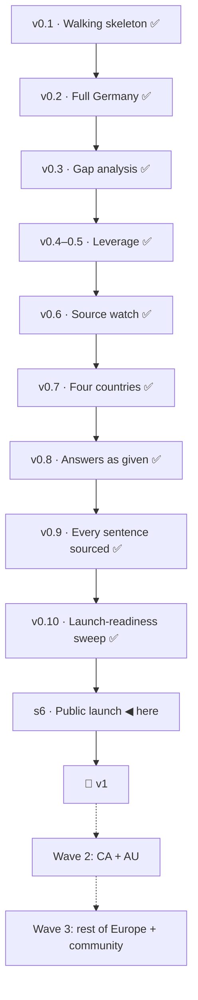

# KANBAN — Visa Navigator

Slices go by their **capability name**; short IDs (s1, s2…) are filename sort
keys only. A slice advances only on a run acceptance scenario: **mock-green**
when it passes on mocks, **real-green** when it passes for real. The moment a
mock is born, its de-mock task is appended to backlog.

## roadmap

Candidates, not commitments: capability · why it came up · the bet it rests on.
Promoted (or dropped, with evidence) at a boundary session.

### v1 — launch
- **Launch-readiness sweep** (s5f) · the last known wrong verdict, the last
  human-tier quotes, the last unsourced sentences and the last Turkish docs
  must not go public · bet: a launch with zero known defects earns more trust
  than a faster one. Source: s6 boundary 2026-09-07 (forks A1, D1, D2, D3).
- **Public launch** (s6) · the dataset is only useful in public · bet: an open,
  dated, source-quoted ruleset earns links and contributions faster than a
  closed one earns users. Carries the research harvest routed *now* at the
  boundary: per-route coverage tiers (research-01, PathWise), per-route page
  shape (research-01, Workbeyond), micro-page SEO (research-01, Visaora).

### v1.2 — open (2026-09-17)

The stamp is Spine's, when the last item below is live; if that day is the
2026-10-09 reading, one isolated walk serves both (human, 2026-09-17). The
fixes are the v1.1 critique's residue and the data tracker — corrections
under the open version. A landed line carries its slice's title and the
mark `promoted <date>`; the board's done column holds the step.

**Landed**
- **Data #17 — the browser-read strategy for the IND** · promoted 2026-09-23 · s34 · live 2026-09-24 ·
  real-green 2026-09-24 · the road back from the human tier (five IND
  route pages read by a person since s14; the BMI sentinel since s29):
  headless Chrome from the runner reads what the fetcher cannot (s14 measured
  yes) · bet: a `browser` watch strategy keeps the daily read honest without
  a person; source: data #17, s14.
- **A cached page outlives its assets** · promoted 2026-09-23 · s33 · live 2026-09-23 · (the CLS chase, 2026-09-23; human:
  "tamamdır" to option A) · `/` is served with a ten-minute cache while
  `_astro/*` is content-hashed and replaced every deploy, so a reader holding
  a ten-minute-old page asks for a stylesheet and a module that answer 404
  (verified on the live host: `index.CpGG1ZDr.css`, `index.BcmUcb7-.css`,
  `index.qYLZ_mcb.js`). The deploy carries the previous build's referenced
  assets forward — one generation, fetched from the live site, never failing
  the deploy, with a check that what it carries is byte-identical to what the
  live host served · bet: one generation covers the ten-minute window, and a
  reader never meets an unstyled page with a dead interview; source: the
  2026-09-23 chase of metric 6.
- **the experience ladder is two questions** (F2) · promoted 2026-09-17 · s25
- **one reader, one hierarchy** (the four-country headline) · promoted 2026-09-17 · s26
- **five small slips** (P8, plus the tagline's colon and the card's door from the human's walk) · promoted 2026-09-17 · s27
- **a learn link says what the reader does there** (the learn links, unglossed) · promoted 2026-09-17 · s28
- **three data corrections** (data #13, data #15, the Algerian notice's learn label) · promoted 2026-09-17 · s29
- **on a phone the next question comes up to meet the reader** (P10, with the ledger line above the question and the result — the human's amendments) · promoted 2026-09-18 · s30
- **the hold state says where it is, and two small things** (the finished-record hold state, focus after a re-answer, `scrollbar-gutter`) · promoted 2026-09-18 · s31
- **a statement names the question that asks it** (`field` on precondition statements, with the section sign's explainer gone — the human's walk) · promoted 2026-09-18 · s32
- **the copy pass** (a route page names its own unread sources, F3 — moved from the `v1.x` bucket 2026-09-17) · promoted 2026-09-17 · s23

**Queue** (in order; the first unpromoted line is the next slice)
- **A source that fails once is read again** (intake #21, 2026-09-22) · promoted 2026-09-24 · s35 · live 2026-09-24 · the
  daily watch gives up on the first `unreachable`: 09-20 six sources answered
  403 (buzer.de ×5, wetten.overheid.nl), 09-21 three timed out (boe.es ×2,
  bamf.de), 09-22 all 46 read clean — two red days for outages that were gone
  by the next morning. A source unreachable in one run is retried (in the run,
  or on the next) and only an unbroken second failure raises the flag · bet:
  the sources' own hiccups, not our reach, are what redden the watch; source:
  metric 2 off target 2026-09-22, data #21. Next to #17 — the same file, the
  same tests.
- **Resolve-time address check for the fetchers** · promoted 2026-09-24 · s36 · real-green 2026-09-25 · versioned to v1.2 at the fork of
  2026-09-24 (human: "uygula"; from s34's Security review, 2026-09-24) · the floor under a `link` entry's redirects
  classes the literal host, so a hostname that resolves to a private or
  loopback address at request time passes it (DNS rebinding); the code's own
  comment declares this as its boundary · bet: pinning the connect address
  is a real mechanism (resolve, check the class, connect to what was
  checked), worth its own entry rather than a line in the floor. The floor's declared
  boundary (human: "sınır", 2026-09-24) leaves to this candidate the
  transition and legacy prefixes that embed or mean another address — NAT64
  `64:ff9b::/96`, 6to4 `2002::/16`, the compat form `::/96`, site-local
  `fec0::/10`.
- **Back on a restored record** (s30 build, 2026-09-18) · promoted 2026-09-25 · s37 · live 2026-09-25 · a reader who arrives
  fresh with a restored record and taps ← Back leaves the site (the rebuilt
  history has no entries in the browser); reload mid-interview then Back
  lands on the first question · pre-existing (s16-era); a steward pass.
- **An unknown link's first paint** (s30 delta review, 2026-09-18) · `?country=zz`
  measures CLS 0.057 / 0.045 at 390×844 / 390×1400 — the masthead's promise
  swaps from the link's to the fresh one after the module lands; an arrival
  the s10 gate never seeded · a steward pass.

**Candidates** (through `spine:idea`; none filed yet for this version)
- **A flag quotes a page; the quote is the page's** · versioned to v1.2 at the fork of
  2026-09-25 (human: "uygula", last in the queue; from s36's delta round 4,
  2026-09-24, human: "ayrı") · a flag file exists so a person
  can judge a change, so it carries `report.context` — the diff of the page —
  verbatim into committed Markdown (`../permit-rulebook-data/src/watch/core.ts:507`
  → `cli-watch.ts:68`) and from there into the issue a curator reads: a source
  that puts `
## ` or a bidi override in its own text ends the paragraph and
  reorders what follows. Sanitising the quote would change what the curator
  reads, which is why this is not a line in s36 · bet: the fix is the flag's
  FORMAT, not its content — the quoted block fenced so Markdown cannot act on
  it, the steering characters dropped as `printable` drops them, the page's
  words otherwise untouched. By design since s11; s36 named it. Source: s36's
  delta round 4, the human's "ayrı".

### v1.3

_Opened at the roadmap fork of 2026-09-17; candidates, not commitments. Not before v1.2 stamps._

- **Compare, don't rank: published facts on each open route card** (v1.1,
  human 2026-09-08) · why: a reader with five open routes gets no help
  choosing, and "start with this one" would be advice with no published
  basis · bet: facts an authority publishes — permit duration, family
  reunification, path to permanent residence — beside each card let the
  reader rank for themselves without the product ruling · source: the
  second v1-gate critique (2026-09-08), "only you can decide" item 4. **Versioned to v1.3 at the 2026-09-17 fork.**
- **Quoted, not asked — pages for the 14 excluded active routes** (v1.1,
  **first five promoted to s9 at the v1.1 boundary, 2026-09-10**; nine remain
  here for v1.2)
  human 2026-09-08) · why: the one-pager promised ~35–40 routes and the
  product ships 23; the excluded routes are real and searched for, and the
  third scope value ("rules quoted, nothing asked") exists for exactly them ·
  bet: a route page that quotes and dates the rules without scoring earns the
  same trust and traffic as a scored one (A2/A7) · first five: FR carte
  salarié, ES cuenta ajena, ES digital nomad, NL GVVA, DE § 21 · source:
  `data/exclusions.md`, the v1-gate critique's scope note.
- ~~Print or save the record~~ · **dropped 2026-09-07 — done in s5d** (print
  stylesheet, localStorage record). **Versioned to v1.3 at the 2026-09-17 fork.**

### v2 — wave 2
- **What a permit leads to** (v1.x candidate, human 2026-09-11) · why: the
  product answers "can I go and work there" and stops, and the reader's next
  question is "and then what" · what it is: **one quoted, dated statement per
  route** — the years of holding it that count toward permanent residence, and
  whether they count in full — using the s9 machinery exactly: stated, sourced,
  **not scored** · bet **A16**: most of the value of a residency answer is reachable
  without modelling time at all, and this measures the appetite before v2 pays
  for the engine · cost: four countries' residence-law pages, one statement per
  route, no new question and no new verdict.
- **Permanent residence** (v2 candidate, human's idea 2026-09-11: *"permanent
  residency ve vatandaşlık yollarını da eklesek mi"*) · why: same reader, same
  journey, later step; and the rules are the shape this engine already handles
  — years, language level, income, no benefits · **what it needs first, and it
  is not small: a history.** Every PR rule keys on years of lawful residence
  *under a particular status*, and which status changes the count — study years
  often count half or not at all, a Blue Card shortens the track, Türkiye's
  Decision 1/80 runs on its own clock. Today the interview asks only where the
  reader stands now; PR turns a snapshot into a timeline, which is a new
  question set and a new engine concept · **and it changes what a verdict is:**
  work permits say "you meet this today", PR says "you will, on this path, in
  N years" — a projection, which is a much stronger claim than this product has
  ever made and a more harmful one to get wrong · bets **A17** and **A18**: the timeline is worth
  building because the dated-and-quoted promise is worth more across a journey
  than across one step · gate: **one country, one PR route, measured end to
  end** before a second is opened.
- **Citizenship** (v3 candidate, same source) · why: it is where the search
  volume is · why it is *behind* PR and not beside it: naturalisation is where
  nationality law bites hardest — dual-nationality rules that turn on the
  reader's *other* passport, renunciation requirements and their exceptions,
  discretionary integration judgements — and that class (data #8) already cost
  this project two slices and four country reads for one dimension. A large
  part of the surface would land in "quoted and dated · not scored", which is
  honest but is not the answer a person searching for it wants · bet **A19**: worth
  doing only after PR proves the timeline model, and only where a rule can be
  quoted rather than judged.

- **CA + AU** · points systems; the one-pager's own second wave · bet A6: the
  model fits points-based systems without a new engine. Versioned at the s6
  boundary 2026-09-07 after three versions in *later*.

### v3 — wave 3

- **A countries menu in the header** (v3, session 2026-09-08) · why: the
  one-row header holds four country names with ~23 px of slack at the 56 rem
  cap; the rest of Europe does not fit in a row · bet: a grouped menu keeps
  every country one step away without a second nav row · source: the isolated
  critique of the navigation mock (F1), .
- **Rest of Europe** · versioned at the s6 boundary 2026-09-07.

### later (clock: DECISIONS rows since 2026-09-24)

- **An id is a word the watch chose** · after: s35 (from s35's delta rounds 3
  and 4, 2026-09-24; human: "sınır") · nothing anywhere spells what a
  watchlist id may be: `checkCoverage` gates urls, kind, steps, glyphs and
  credentials and never the id, so an id of `constructor` or `__proto__` is
  legal — and every record this project keys by id reads through a plain
  object's prototype. s35 closed that for the week's mornings
  (`daysBySource`, a null-prototype record) and left it standing in s11's
  `entries` (`../permit-rulebook-data/src/watch/core.ts:476`: id
  `constructor` throws `prev.history is not iterable` outside the per-entry
  `try` and the whole run dies; `nextEntries["__proto__"]` is never baselined
  — a permanent silent green) and in `state.ts:202,226`, which read the
  state's `unread` unguarded and take the coverage gate down with a
  `TypeError`. Three parts, one afternoon: a grammar in the coverage gate
  (`^[a-z0-9-]+$`, plus the duplicate-id check nobody wrote), a
  null-prototype `entries`, `unreadOf` in `state.ts` · bet: a name the code
  trusts is a boundary like any other, and one grammar closes the class for
  every record at once — cheaper than a null-prototype record per site.
  Source: s35's delta rounds 3 and 4, the human's "sınır".
- **Move the two workflows to Ubuntu 26** · after: 2026-10-19 (the runner's
  own notice on the 2026-09-24 watch run: `ubuntu-latest` migrates to
  Ubuntu 26 from that day) · both workflows are pinned to `ubuntu-24.04`
  since 2026-09-24 (human: "uygula") so the image changes on a day we pick,
  not under a scheduled run — the browser tier reads the image's Chrome and
  the site's harness runs there too · bet: an explicit label costs one line
  and turns a surprise red day into a read: unpin, dispatch the watch with
  `commit=false`, read the seven browser lines and the site's deploy on the
  new image, then pin `ubuntu-26.04`. Source: the runner's notice,
  run 35985154468.
_Roadmap fork 2026-09-17 (human: "uygula"): six kept, two versioned to v1.3, one dropped as a duplicate of v1.2's data #17. Fork 2026-09-18 (human: "uygula"): all six kept. Fork 2026-09-23 (human: "hepsi keep"): all six kept again. Fork 2026-09-24 (human: "uygula"): nothing points at any of them yet, so ten take `after: 2026-10-09` — the pre-registered readings are the evidence that could — and the two born of s33/s34's reviews take `after: s34`; the twelfth, the resolve-time address check, born with that day. The guard asks again only when a condition lands. Fork 2026-09-24, on s34's real-green (human: "uygula"): the resolve-time address check versioned to v1.2 behind the retry slice; the digest-list split takes `after: 2026-10-09`. Fork 2026-09-25, on s36's real-green (human: "uygula"): the flag's quoted page versioned to v1.2, last in the queue behind the two steward items._

- **A Security-only read of the launch code** · after: 2026-10-09 (from s33's waiver,
  2026-09-23; human: "uygula") · the ten pre-record slices s1–s8-algeria are
  the whole product — the interview engine, the saved record, the four
  countries' data, the public pages — and were reviewed under their day's
  two-axis discipline; no Security axis has ever read them. One axis, not
  three; a findings list, not a record per slice; scoped to the code that is
  live today · bet: s33 drew 11 hard Security findings from one new file in
  nine rounds, and that same eye has never looked at the ten files readers
  actually use. Its clock is a reading, not the calendar: an intake line, a
  metric, or an incident that points at the launch code promotes it.
- **Split the digest list out of the carrier** · after: 2026-10-09 (was `after: s34`;
  the fork of 2026-09-24, human: "uygula" — s33's two-part real-green is
  read on the two deploys after the first `src/` change, and the split waits
  for the carry to have run once as written; `scripts/asset-digests.mjs`,
  from s33's review, 2026-09-23) · `carry-assets.mjs` is 1,024 lines at 674
  comment / 313 code, and the digest list is already its own thing — its own
  `CONTEXT.md` term, its own vocabulary, its own import in two test files;
  about 185 lines: the trust section, `writeAssetDigests`,
  `readAssetDigests`, `getAssetDigests`, the four list constants,
  `digestOf` · bet: a file with two subjects rots at the seam; the split is
  a no-behaviour refactor that gets more expensive every round it waits.
  Deferred on 2026-09-23 because a refactor touching every line of a
  security-critical file is at its worst at the end of a nine-round loop.
- **Model the 45+ age rules (55% threshold) as criteria** · after: 2026-10-09 (from the old
  backlog, 2026-09-18) · currently notes on the German cards · bet: an age
  rule the engine scores is worth a question. Kept.
- **Orientation-year English requirement** · after: 2026-10-09 (from the old backlog, 2026-09-18) ·
  IELTS 6.0 / equivalent on the Dutch orientation year · bet: the English
  question already asked covers it once the rule is quoted. Kept.
- **Country vocabulary follow-ups** · after: 2026-10-09 (s5c review + light critique; from the old
  backlog, 2026-09-18) · dependent territories and the class names · bet:
  the vocabulary's edge cases matter to few readers. Kept.
- **Affiliate layer** · after: 2026-10-09 · the money model from the viability gate · bet:
  route-relevant mandatory services convert without touching eligibility. **Kept 2026-09-17** (fork: no intake or metric evidence yet).
- **More citizenship exceptions** · after: 2026-10-09 · the mechanism shipped in s5c, the data did
  not · bet: association agreements matter to enough users to earn a question. **Kept 2026-09-17** (fork: no intake or metric evidence yet).
- **Reduced thresholds, remaining limb** · after: 2026-10-09 · only the SEPE shortage catalogue
  remains — NL and ES reduced thresholds shipped in s5c/s5d · bet: the SEPE
  catalogue is watchable once located. Source: s5 verification 4.2. **Kept 2026-09-17** (fork: no intake or metric evidence yet).
- **Turkish UI** · after: 2026-10-09 · the first audience is Turkish, the product is English · bet:
  worth it only once A8 shows organic traffic; trigger: Turkish share of
  post-launch traffic. Kept. **Kept 2026-09-17** (fork: no intake or metric evidence yet).
- **Quote-grounded "ask about this route"** · after: 2026-10-09 · a presentation layer over the
  quotes, not a decision layer · bet: value unproven before launch. Kept. **Kept 2026-09-17** (fork: no intake or metric evidence yet).
- **Recognition helper** · after: 2026-10-09 (Anabin and FR/ES/NL equivalents) · research first;
  Anabin is reachable now · bet: a per-country recognition source inventory
  exists. Kept. **Kept 2026-09-17** (fork: no intake or metric evidence yet).
## active

_(empty)_

## mock-green

_(empty)_

## real-green

_(empty — everything real-green so far is stamped into done)_

## done

- **s37 — Back on a restored record** · merged and live 2026-09-25 (human:
  "merge"; site `14d399d`, deploy run 36159979338 green) — **real-green waits
  on the live walk**: a restored entrance on `https://permitrulebook.com/` at
  phone width, three screen Backs, each the question before and never off the
  site; and the human's own phone for one tap. What landed: the interview's
  "← Back" asks the browser to go back only onto an entry the browser holds
  for this interview, and steps to the previous question in place otherwise;
  every history entry carries how many of the page's steps the browser holds
  behind it, believed only where the entry's step is the step the page stands
  on; the page no longer reads the navigation's type; the browser's own Back
  untouched. Four rounds, eleven reviews, three deltas, one brake ("düzelt");
  `docs/spine/reviews/s37.md`.

- **s36 — the address the watch connects to** · real-green 2026-09-25
  (human: "yeşil"; the first scheduled run after the merge, 36122852274:
  46 sources read through the new connect path, none `unreachable`, state
  `1c42cd8`, the site's pin `d1f7b81`) · merged 2026-09-25 (human: "merge";
  data `dbf2dad`, site `bc0a9ad`, deploy run 36066130541 green). What landed: the
  fetch tier resolves a name inside the connection's own `lookup` hook,
  classifies every address the resolver gives with the floor's relative rule
  and connects only to one it judged — so a source can no longer name a public
  host and have the watch connect to a private one; the four transition and
  legacy prefixes (NAT64, 6to4, the compat form, site-local) are spelled; a
  body is bounded on the wire and unpacked (16 MiB, measured against the
  largest the watch reads, 1,040,895 bytes); every printed sentence is cut and
  made printable by one owner, on both tiers. No page, no string, no dataset
  field changed. Eight review rounds, twenty-one reviews, seven deltas; the
  runner read 46/46 six times; `docs/spine/reviews/s36.md`.

- **s35 — a source that fails once is read again** · merged and live
  2026-09-24 (human: "merge"; data `a9e6277`, site `6e8259c`, deploy run
  36025114404 green) — **real-green waits on the metric-2 reading of
  2026-09-29**: over the seven runs ending that day, every red run names an
  outage or a refusal by us, and no run is red for a source that read clean
  the next morning. What landed: a failure has a class (transient · refused
  by the source · refused by us), a transient one is asked once more after
  the pass, one silent morning is a lapse and two within seven days are an
  outage (the human's word "düzelt"), the state keeps each source's mornings
  and reads a file's days as days; the page and the workflow do not change.
  Five review rounds, fifteen reviews, four deltas, two brakes answered
  ("düzelt", "sınır"); `docs/spine/reviews/s35.md`.

- **s34 — the watch reads the IND itself again** · real-green 2026-09-24
  (human: "yeşil"; the first scheduled watch run after the merge,
  35985154468: the seven browser entries read with no `unreachable`, state
  `c25bc8c`, the site's pin `4df0655` with `human_tier: 1`, `/data/`
  *re-read daily — last run 2026-09-24*) · merged 2026-09-24 (human: "merge";
  data `5a28fee`, site `3bceff0`). A `browser` watch strategy — headless
  Chrome on the runner, steps declared on the entry, from there the html
  read — takes seven entries off the human tier (the five IND route pages,
  the BMI notice, EUR-Lex; `human_tier` 40 → 1, `verified` 156 → 195, the
  dataset untouched); Legifrance and gesetze stay, with the reason; the fetch
  tier judges a redirect before taking it. Nine review rounds, 14 hard
  findings closed, the reloaded floor's first brake answered ("düzelt",
  "sınır"); `docs/spine/reviews/s34.md`.

- **s33 — a cached page still finds its assets** · real-green 2026-09-23
  on the proof list as written (human: "merge"; site `1cc7800`, run
  35892373166 green; both live assets still 200, `asset-digests.txt` live
  with two sha256 lines matching the local build) — **and the carry itself is
  not yet exercised**: the slice touches nothing under `src/`, so nothing
  was needed; the record reads the real-green in two parts on later deploys.
  What landed: each build publishes `asset-digests.txt` beside its page,
  and the next deploy carries a previous-generation asset only if its bytes
  hash to what our own build recorded — because every guard built on the
  origin's own headers was the origin vouching for itself. Nine delta rounds
  on three axes, 14 hard findings closed; one Security entry stays open
  (the origin is a repository variable) and point 1's narrowing was ratified
  the same day (human: "tamam"; `docs/spine/reviews/s33.md`).

- **s32 — a statement names the question that asks it** · real-green
  2026-09-18 (human: "merge"; data `295f204`, site `f7832f0`). v1.2 fix from
  s19: a typed `field` on precondition statements decides "asked" (schema
  0.8.2; the shared-sentence rule retired; the validator holds the field to
  its route and the verbatim cross-check the other way); eleven statements
  decided — the two tenures were never asked, de-researcher's hosting
  agreement is. Plus the human's amendment: the section sign carries no
  explainer anywhere (the act's name still expands once). Three-axis
  review on both repositories and on the delta (`docs/spine/reviews/s32.md`).

- **s31 — the hold state says where it is, and two small things** ·
  real-green 2026-09-18 (human: "merge"; site `370f9e9`). v1.2 fixes: the
  returning reader's hold is one line under the eyebrow (the covered parts
  take no space; the s10 gate re-measured at 0/0/0 by the reviewer), focus
  on the headline when a gesture draws the verdict, `scrollbar-gutter:
  stable` (measured at 1280×1400 — at 900 the question page already
  scrolls). Three-axis review (`docs/spine/reviews/s31.md`); *hold line* in
  CONTEXT.md.

- **s30 — on a phone the next question comes up to meet the reader** ·
  real-green 2026-09-18 (human: "merge"; site `3535086`). v1.2 fix P10, chosen
  from three options after a throwaway build the human tried in Chrome's
  phone emulation, then amended three times from the human's own walks:
  the ledger line above the question and above the result once answers
  exist (declared pre-paint, s10 gate at CLS 0), ✎ landing too, and the
  landing on the question card itself. Every answer, correction or later
  history move on a phone brings the card under the header; desktop
  unchanged. Three-axis review on the build and on each delta
  (`docs/spine/reviews/s30.md`); *reveal*/*landing* in CONTEXT.md; two
  pre-existing Back behaviours and an unknown link's first paint filed.

- **s29 — three data corrections** · real-green 2026-09-17 (human: "merge";
  data `d062750`, site `434d16c`). v1.2 fixes data #13 (the Opportunity
  Card's official page is the BMI's — a human-tier sentinel, since the page
  answers the fetcher with a cookie check), data #15 (the free-movement
  notice carries the IND's EEA/Swiss sentence and Your Europe's Swiss one,
  both watched) and the Algerian door as an action. Three-axis review
  (`docs/spine/reviews/s29.md`); one hard finding — content checks in
  tests — removed. Both tracker issues closed.

- **s28 — a learn link says what the reader does there** · real-green
  2026-09-17 (human: "merge"; data `76c1d52`, site `74a4c5a`). v1.2 fix from
  the human's walk: three learn labels rewritten as what the reader does
  there, in plain words (the contract's sentence and a test on its declared
  verb set); link text never glossed on any of the three surfaces; label and
  href asserted on each. Three-axis review on both repositories
  (`docs/spine/reviews/s28.md`); the NL label kept s5d's "IND is explained"
  rule.

- **s27 — five small slips** · real-green 2026-09-17 (human: "merge"; site
  `46663d9`). v1.2 fix P8, plus two from the human's walk: *Close* on the
  open menu (words as attributes), the disclosure mark bound to the
  country's name, the 404's sentence once as its heading, the pencil bound
  to the answer's last word (276 ledger rows measured), the route H1 as the
  name with the tagline its own line ending in a colon, and the result
  card's door to the route page as a door — its own line, underlined, in
  the internal-link colour (option A). Three-axis review on the build and
  again on the walk's delta (`docs/spine/reviews/s27.md`); two fingerprints
  regenerated with their reasons.

- **s26 — one reader, one hierarchy** · real-green 2026-09-17 (human:
  "merge"; site `85c505c`). v1.2 fix: the four-country headline's hierarchy.
  A reader who named a country at question 3 whose scored routes do not take
  their situation reads, when nothing is open anywhere, the direct path's
  written state as the headline — one function keyed by `situation_country`
  — with that country's section first and open; every other four-country
  result byte-for-byte what it was (measured on seeded screens). The first
  three-axis review (Standards · Spec · Security, `docs/spine/reviews/s26.md`):
  no hard finding; the "answers never leave the device" check now walks this
  path.

- **s25 — the experience ladder is two questions** · real-green 2026-09-17
  (human: "merge"; data `0292869`, site `8e432a4`). v1.2 fix F2, the
  finding three critiques had made: one question with four rungs and a false
  `y3in7 ⇒ y2in5` read § 6 BeschV's "two in the last five" as met for a
  reader whose three years lay six-to-seven years ago. Two questions now —
  the last five years (Germany's window), the last seven (the IND's) —
  every rule on the rung it names, the Opportunity Card paying the best of
  two rows. Schema 0.8.1; two Spanish citations corrected on the way. The
  first slice with a recorded review (`docs/spine/reviews/s25.md`).

- **s24 — the deploy tells Bing what changed** (IndexNow) · real-green
  2026-09-17 (human: "merge"; `318d059`). First run: *IndexNow answered
  202 to 36 addresses*. The daily schedule announces every address whether
  or not the data moved — tolerated; gate it on `built != locked` if Bing
  ever objects.

- **s23 — the copy pass** · real-green 2026-09-17 (human: "merge"; data
  `53db438`, site `e12ec3c`). v1.1 gate adjustment 3: F1, F3, F4, P1–P7
  cleared; the twelve strings in the reader's words, each derived or gated.
  Still open from the same critique: F2 (the experience ladder), the
  four-country headline's hierarchy, P8 (small slips), P10 (phone hero).

- **s21 — the mark on the country, and on the four-country result** ·
  real-green 2026-09-16 (human: "merge"; live in `fc783ca`). v1.1 re-score
  N1 cleared; the all-closed branch pinned as unreachable.
- **s22 — the finished-record arrival is measured, and painted once** ·
  real-green 2026-09-16 (human: "merge"; live in `fc783ca`). v1.1 re-score
  N2 cleared: the s10 gate re-seeded (it had never measured a verdict; 0.58
  / 0.72 / 0.46), then CLS 0 by extending the stand-in to the frame; the
  record carries one bit, `done`. Backlog: `scrollbar-gutter: stable` for
  classic-scrollbar desktops.

- **s19 — a situation no scored route asks** · real-green 2026-09-16 (human:
  "merge"; data `7156a56`, site in `1ca9e2c`). v1.1 gate B1 and F8 cleared:
  question 2 marks a situation no scored route in the country takes; the
  zero-open result is a written state; *Talent — chercheur* is quoted (a
  €2,200 floor the exclusions row had denied); `not_asked` is validated.
  Backlog from it: a `field` on precondition statements; containment (not
  equality) on three more routes' shared sentences.
- **s20 — the correction lands on the question and returns to the verdict** ·
  real-green 2026-09-16 (human: "merge"; live in `1ca9e2c`). v1.1 gate B2,
  F6, F5 cleared; an s10-era blank-card defect for returning readers fixed.
  The resumed line costs 44 px of footer travel on a record arrival at 390
  (CLS 0.037, under the bound) — recorded.

- **s18 — `spatialCoverage` as Place** · real-green 2026-09-16 (human:
  "merge"; live in `de094a7`). Site #11 closed. The deploy needed one
  re-run: `first-paint.test.ts` read an `undefined` evaluate after a 250 ms
  settle on a slow runner — a timing flake, green on re-run; if it repeats,
  the settle is too short for CI and becomes a finding.

- **s16 — `/data/` in the reader's words, and the last two tracker doors** ·
  real-green 2026-09-16 (human: "merge"; live in `7d5ef51`). Site #10 closed.
  Three corrections from the human's reads: the lede's door, the meta
  description, the lede's presupposition.
- **s17 — the comparison has no subject called "Code"** · real-green
  2026-09-16 (human: "2", then "merge"; live in `7d5ef51`). The B4 detector
  learned to tell the present promise from the past claim.

- **s15 — the first unread day** · real-green 2026-09-16 (human: "merge";
  `5f7d1fb`, live in `6fe4eb5` with s13 and s14). The clean-day tests
  measured today; now they measure a clean day, and both branches are
  proved with fabricated states. One production change: the footer's
  last-run parenthesis may break at 390, after the dot.

- **s14 — the IND's requirements moved behind a form** · real-green
  2026-09-16 (human: "merge"; data `b2488b9`, site pin `c4c3b04`). Data #20
  closed. Five IND route pages to the human tier, read in Chrome the same day
  (26/26 sentences); the quote gate green on 145 verified + 40 human-tier.
  The road back to machine-checking is data #17 (headless browser).

- **s13 — the feedback door** · real-green 2026-09-16 (human: "merge";
  site `f06badd`). Site #6, #7 (and #9, from s12) closed. Live 2026-09-16 in `6fe4eb5`. Scenario
  `docs/spine/scenarios/s13-feedback-door.md` with seven dated corrections
  from the human's two preview walks; critique `docs/spine/critiques/2026-09-16-s13-light.md`.
  Polish left for the tracker: the disclosure arrow's size, *Where (link)* as
  a body heading.

- **Two labels that mean what they say** (s12) · site #9 · **real-green
  2026-09-16, live** — `docs/spine/scenarios/s12-two-labels.md`. `/data/`'s
  facts list names both of its dates under words that mean them: *Newest value
  changed*, read from the newest date among values (not the page stamp, which
  folds in the notices' dates), and *Last checked*, from the run the freshness
  sentence prints. The list is three rows the human chose on a live prototype
  — four dates, two counts, Routes alone — every cell centred, the version
  shown as a day; counts stack at a phone's width because two across broke
  each value over three lines.

  The spec was corrected four times by the build (the row's real source, the
  `lastRun` parameter, a build before the tests, the no-run case); reviewed on
  both axes (nine findings; the blocker: the decision was invisible to its own
  nine checks, fixed with a dataset bent until a notice's date outruns every
  value's). **The first slice to exit through a light-mode critique before its
  merge** (steward-54): no blocker, three polish items filed as site #10. Site
  `f5df33c`; **426 tests**.

- **The first paint stops shifting** (s10) · site #8 · **real-green
  2026-09-15, live** — `docs/spine/scenarios/s10-first-paint.md`. The page
  ships with the first question in it, drawn at build time by the one renderer
  the module also uses; thirteen lines of inline script decide the first
  paint's shape before the first paint — a record, a link, a narrow screen —
  and CSS paints from the decision, so the 220 KB module arrives to the page it
  would have chosen. Measured with the module held back 700 ms: `/` cold 0.110
  → **0** with the footer at 0 px, `?country=` 0.280 → 0.005, a saved record
  0.156 → 0, `?route=` 0.305 → 0.006; nothing above the box moves at any of
  three viewports.

  The scenario was corrected three times, each time by measurement: `?route=`
  was the worst arrival and not in the table; "the footer does not move" held
  only at the one viewport where it was out of frame; "the page paints once"
  was false because the module closed the ledger after the HTML shipped it
  open. Reviewed on both axes (12 findings applied; the blocker a `<noscript>`
  check satisfiable by nothing). The human's first walk changed it: a returning
  reader had seen question one for a moment before their own screen — now a
  quiet box at the question's height, *"Your answers are on this device —
  bringing them back."* The first slice built under steward-53, in the
  builder's own worktree. Site `8e67ffd`; **412 tests**.

  **Judged a week from now** by the counter, the issue's own criterion: CLS
  poor back to 0%, LCP and INP unchanged.

- **A partial run says so** (s11) · **real-green 2026-09-15, live** —
  `docs/spine/scenarios/s11-partial-run.md`. The site said "Every source is
  re-read daily — last run <today>" through five days in which two sources went
  unread. Now the claim carries what it rests on: when a run leaves a source
  unread, `/data/` names the country and the day the values it backs were
  read, the footer counts it, and every route page says the last run did not
  reach one of them; on a clean day every surface is byte-identical to before,
  and a fixture proves it against the pre-s11 template.

  The spec was wrong twice and the build measured it: the fact was not
  derivable from `retrieved_at` (an unchanged page keeps its date, so 39 of 39
  looked stale), and "two Spanish sources" was one (a sentinel no value cites).
  Then the walk found a third — the approved sentence claimed a duration
  nothing in the system knows, and the same morning's CI log proved the four
  named sources had answered. Reviewed on both axes, fourteen findings applied,
  the sharpest being 28 route pages still typing the unqualified claim.

  Not a hand-written state anywhere: the first run after the merge writes the
  list itself. Beside it, from the same days: the watch's User-Agent repaired
  (a URL inside the name was the five-day failure, not a wall), the browser
  strategy's gate answered 2 of 5, and two joins on `/data/` given their
  breath. Site `777b3ff`, data `165f39a`; **539 + 349 tests**.

- **Five routes quoted and dated, and not scored** (s9) · **real-green
  2026-09-11, live** — `docs/spine/scenarios/s9-quoted-not-asked.md`. The
  French employee card, Spain's general employed regime and its international
  teleworker, German self-employment and the Dutch single permit: rules in the
  authority's words, dated and watched, under the third scope value —
  **quoted and dated · not scored** — which the dataset had carried since s6
  and never used. Nothing is scored, no profile can be told it qualifies, and
  validation refuses both directions.

  Reviewed on both axes (fifteen findings applied). The two the reviewers put
  first were the same one from opposite sides: a single route total on the
  country heading and on the social card, blurring the five that cannot be
  scored into the twenty-three that can. One finding was a rule read and never
  stated — article 76.2 of the Spanish regulation, inside the watched slice and
  nowhere on the page.

  Walked by the human (site `f1f49e1`, data `29fde08`; **513 + 336 tests**),
  who took three more things off it on the way: the country heading counts in
  figures, the call to action is a centred column, and the stamps stopped
  touching the header's rule.

  Bound to **A5** (refuted: 23 routes against a promise of 35–40) — the dataset
  now states 28, of which 23 are scored.

- **A route the authority closes, and a question nobody answers** (s8) ·
  **real-green 2026-09-10, live** — `docs/spine/scenarios/s8-algeria.md`. The
  first slice to ship under Steward mode's rule that **merge is the deploy and
  the deploy is the human's word**: built on `algeria-closure` in both
  repositories, reviewed on both axes (eleven findings applied), walked by the
  human, merged on their word (site `f6af596`, data `6bbc831`; **504 + 320
  tests**).

  France's intra-corporate transfer card closes itself to an Algerian passport
  in the fiche's own words — the dataset gained `not-in`, a closure that ships
  only with its own plain sentence — and the four talent routes stay scored
  under a heading that claims nothing: *Open on the rules — unsettled for your
  passport*, with an open-question notice above them.

  Three things the human's walk added after the build was green: a route keeps
  its address when its name changes (four live URLs had moved), four labels
  that had not earned their meaning, and the same partition applied to the
  second layout, the card badge, the summary strip and the headline — that one
  was found by walking, twice, after the code had been read and believed.

- **Answers recorded as given, verdicts in plain words** (s5d) · **real-green 2026-09-05, shipped in v0.8** —
  `docs/spine/scenarios/s5d.md`. Built, code-reviewed on both axes (10 findings,
  all applied), and extended twice by findings from the human's own walk: the
  orientation-year false requirement, and a four-part package now in flight —
  a card must name the threshold it was measured against · preconditions must
  read as requirements, not as claims about the reader · five caveats must leave
  the "Also required" heading · the Chancenkarte's twin of the false
  requirement, settled against § 20a. Awaiting the human's scenario walk on the
  finished build.

  *(Moved out of "active" on 2026-09-10, at the v1.1 boundary: every finding named above was applied and
  walked, and the board had gone on describing a finished slice as work in flight.)*

- **A statement can name the passports it does not bind** (s7) ·
  **real-green 2026-09-10** — the interview asked which passport a reader would
  apply with and then scored them against conditions the authority itself sets
  aside for it. Found by the human on the live site (data #7), diagnosed as a
  class (data #8): `citizenship` was an `eq third_country` gate in all 23
  routes, and 168 third-country passports produced one screen. Now: a
  `RouteStatement` carries an optional carve-out, keyed on the passport,
  refused without its own quote; the IND's Turkish exemption on the two highly
  skilled migrant permits and the researcher permit; the provisional residence
  permit stated on all six Dutch routes with the ten passports it does not
  bind; two new watched sources, sliced and re-baselined in the same commit.
  Schema 0.6.0. Reviewed on both axes — the blocker was ours: the MVV shipped
  as a caveat and is a precondition. 466 + 294 tests.

- **Public launch** (s6) · **real-green 2026-09-09** · mock-green 2026-09-07 — withdrawn once the same hour
  (the interview rendered nothing in a browser: a `node:fs` read reached the
  client bundle) and re-stamped after the fix, a real-browser smoke test on
  both surfaces gated in CI, and the session's own walk of every screen.
  342 + 116 tests.
  Name sweep to Permit Rulebook; 23 route pages generated from the dataset
  with the identity pair; scope value per route (22 / 1 / 0), exclusions twin;
  CONTRIBUTING, issue templates, tracker link on the product; favicon, social
  card checked against the dataset; Pages workflow; one-sentence disclaimer;
  ISO dates; six invariants as tests. Reviewed on both axes: 3 blockers, 12
  should-fix, 10 nits applied. 338 + 111 tests. **Real-green needs the
  human**: GitHub renames, Pages + domain, labels, the watch live, the phone
  walk on the preview, the first flag read against its source, the go; and
  the isolated v1-gate critique on the deployed preview.
  **Real-green, 2026-09-09:** the repositories renamed and public, the domain
  bound with HTTPS, the labels and the tracker link live, the watch filing
  issues, the phone walk done on a real handset, the first flags read against
  their sources (all three ours, not the law), the isolated critique run twice
  on the deployed site with every blocker cleared, the dispatch token made and
  proven end to end, and the announcement out on LinkedIn. 280 + 428 tests.

- **Every sentence carries its source, not only every number** (s5e) ·
  **real-green 2026-09-07** — the five PDF-tier quotes read from the PDFs' own text layers by the session (verbatim string match), at the human's request (docs/spine/scenarios/s5e.md). 45 criterion notes
  with no provenance became 55 sourced conditions, 8 readings declared ours,
  1 declared unsourced with a reason; machine-verified quotes 28 → 78; value
  set and verdict SHA unchanged. Reviewed on both axes, 12 findings applied —
  the gate re-keyed from quotation marks to a declared kind, and slice markers
  on every IND and BAMF entry so an intermittent shell response reports
  unreachable instead of overwriting the snapshot. → **v0.9**

- **Four countries filled: FR·ES·NL + honest verdicts + exceptions**
  (s5 · s5b · s5c) · real-green 2026-09-06. Two gates cleared on the same day:
  the human verified all 39 checklist values at their official sources
  (`verify-s5.md` 21/21, `verify-s5c.md` 18/18, including the Spanish PDF tier
  no machine here can read), and then walked the acceptance scenarios on the
  live product — the DE regression, the NL monthly flow, the "anywhere" weak
  profile, back-and-edit, and the EU-passport notice. → **v0.7**

  What the three slices carry, for the record:

- **Exceptions and reduced thresholds** (s5c) · mock-green 2026-09-04
  (`docs/spine/scenarios/s5c.md`, spec `docs/spine/specs/s5c-exceptions-and-reduced.md`):
  the passport question asks a country (199 issuers, class carried by
  `implies`, three sourced legs), reduced thresholds as second paths
  (NL €3,122 / €4,754, ES €33,085.09), two French talent routes, and the
  Türkiye rights as a notice beside the results. Built by the builder agent
  (165 tests), two code reviews and a light product-critique acted on.
  **Real-green rides on the same human pass as s5/s5b** — `data/verify-s5c.md`
  adds the ES reduced number and the EEA leg.

- **Honest verdicts and designed edge states** (s5b) · mock-green 2026-09-03
  (`docs/spine/scenarios/s5b.md`, spec `docs/spine/specs/s5b-honest-verdicts.md`):
  born from the product-critique run — dataset notices (EU free movement),
  route preconditions ("Also required — not checked here"), zero-open
  headlines that carry the steps, learn boxes only where the unknown binds,
  step-gated hold rows grouped under a data-derived summary, period-aware
  money everywhere, the NL orientation-year question split in two.
  Built by the builder agent (113 tests, test-first), reviewed in the main
  session: 6 findings verified by measurement and fixed. **Real-green rides
  on the same human pass as s5.**

- **Four countries filled: FR·ES·NL** (s5) · mock-green 2026-09-02
  (`docs/spine/scenarios/s5.md`): 21 routes / 4 countries, destination-first
  interview, NL monthly bands, qualifier-forked leverage ("a job offer in
  Spain"), collapsible country sections verified on screen (headless Chrome,
  3 personas). 93 engine tests + review round (10 findings triaged) done.
  Human pass complete 2026-09-06 (`visa-rules/data/verify-s5.md` + the
  interactive browser run).

- **Walking skeleton** (s1) · real-green 2026-09-01; human run 2026-09-02
  (`docs/spine/scenarios/s1.md`). → **v0.1**
- **Full Germany route set** (s2) · real-green 2026-09-02 — human verified
  every value against official sources (`docs/spine/scenarios/s2.md`). → **v0.2**
- **Gap analysis on results** (s3) · real-green 2026-09-02
  (`docs/spine/scenarios/s3.md`; last loose end: human click-check of the two
  learn links — in de-mock list). → **v0.3**
- **Leverage analysis: what each step unlocks** (s3b) · real-green 2026-09-02
  (`docs/spine/scenarios/s3b.md`; born from a human question). → **v0.4–v0.5**
- **Source watch + change flag** (s4) · real-green 2026-09-02 on the
  review-fixed revision (`docs/spine/scenarios/s4.md`): live run 5/5 sources,
  change-detection demoed, 10 code-review findings fixed, 69 tests.
  Deferred bit tracked: daily cron fires once the repo is public (s6). → **v0.6**

## versions

- **v0.1** — Walking skeleton: one route family (DE Blue Card ×2) end to end —
  questions derived from data, boundary schema validation, quoted+dated
  result screen, zero backend. (2026-09-01)
- **v0.2** — Full Germany: 8 routes, 12-item Chancenkarte points engine,
  `in`/`any` criteria, adaptive information-gain flow, human-verified values.
  (2026-09-02)
- **v0.3** — Gap analysis screen: summary strip + OPEN/WITHIN REACH/NOT YET
  groups, compact hold rows, data-driven "don't know → learn from the
  official source" boxes. (2026-09-02)
- **v0.4** — Leverage analysis: counterfactual "this step unlocks…" section
  for path fields + job-search-card bridge note; per-criterion
  "needs X / you declared Y" breakdowns on hold rows. (2026-09-02)
- **v0.5** — Leverage generalized to every improvable field (language, funds,
  salary, experience, recognition); provable "With German B2 → Chancenkarte
  met" recommendations; base-language question removed (derived from language
  levels — contradictions impossible, one question fewer). Follow-up: bounded
  gaps (money band / points / improvable fails) never end the interview —
  routes finish as "within reach" with field-aware gap notes. (2026-09-02)
- **v0.6** — Source watch: both-way coverage gate, watch CLI (html/pdf/human
  tiers, ndjson, commit-gated state, flag files with quoted context), DE via
  ZAV edition-index sentinel, daily CI workflow hardened against alert loss.
  (2026-09-02)
- **v1.1** — The site that answers back. Public at https://permitrulebook.com,
  stamped 2026-09-16 at s18's merge and confirmed at s22's: 29 routes across
  Germany, France, Spain and the Netherlands — 23 scored against a reader's
  answers, 6 quoted and dated but not scored, each with a page of its own —
  and 192 quotes re-read daily, each carrying the authority's sentence, its
  page and the day it was read; five of the Dutch pages are read by a person
  on a 90-day clock since the IND put its requirements behind a form. What
  changed since v1: a question that no scored route in the chosen country can
  use says so before it is picked, and a result reached that way is a written
  state naming the route that would; a partial watch run says which sources
  it missed, on every page; the first paint no longer shifts on any of five
  arrivals, a returning reader's included; the feedback door is one word,
  Feedback, on every page, opening a mail with the subject written; the
  header folds the countries under one word; every correction lands on the
  question and returns to the verdict; `/data/` says what it holds in the
  reader's words. Two isolated critiques on RUBRIC 1.3 the same day — 35/50
  with two blockers, 39/50 with none after four slices — every blocker
  cleared by operation on the live site. 568 + 573 tests, 0 vulnerabilities
  in either repository. (2026-09-16)
- **v1** — Public: https://permitrulebook.com, announced 2026-09-09. 23
  employment routes across Germany, France, Spain and the Netherlands, each
  with a page of its own; an interview of about seven questions that says which
  routes fit, which are close and by how much, and the one step that would open
  the most; 122 quotes re-read daily against their sources, each carrying the
  authority's sentence, its page and the day it was read. The whole loop ran
  for real before the stamp: a source re-read, a history line, a commit, a
  dispatch, a rebuild, the new date on a live page. Answers never leave the
  device, and a real-browser test asserts it. Open data (CC BY 4.0) with JSON
  per route, the site MIT; `/data` describes itself as a dataset for the
  indexes that read one. Two isolated critiques (32/45 on RUBRIC 1.2, 36/50 on
  1.3) with every blocker cleared on the live site. 280 + 428 tests, 0
  vulnerabilities in either repository. (2026-09-09)
- **v0.10** — Launch-readiness sweep: Spain measured against three years on
  two routes (es-highly-qualified, es-ict); the experience ladder made ordinal
  (y3in7 implies y2in5) after the review caught a regression the guard could
  not see; pdf-text watch strategy — human tier 0, quotes verified 78 → 120;
  37 bare preconditions given a kind (34 sourced, 2 ours, 1 deleted as
  repealed law); every document on disk English. Real-green walked by the
  session at the human's delegation. 323 + 70 tests. (2026-09-07)
- **v0.9** — Every sentence carries its source: 55 sourced conditions, 8
  readings declared ours, 1 declared unsourced with a reason; machine-verified
  quotes 28 → 78; the provenance gate keyed to a declared kind; slice markers on
  every IND and BAMF entry so a shell response reports unreachable. Value set
  and verdicts unchanged. 289 + 69 tests. (2026-09-07)
- **v0.8** — Answers recorded as given, verdicts in plain words: real listbox
  semantics on the country picker (Enter commits the highlighted row, exact
  matches first), the Dutch reduced salary criterion gated on where you
  studied rather than on a country-less question, every not-met reason a
  sentence rather than a field id, a masthead that cannot claim a comparison
  that has not happened, localStorage persistence with a print stylesheet, and
  cards that name the threshold that actually decided them. Three false
  requirements removed — Chancenkarte part-time work, the orientation year and
  the Chancenkarte both conditioned on having no job offer — each our own
  reasoning shipped as a rule, each found by a human reading a screen.
  264 + 57 tests. (2026-09-07)
- **v0.7** — Four countries, honest verdicts, exceptions: 23 routes across
  DE/FR/ES/NL with a destination-first interview; notices that answer "do you
  even need a permit"; route preconditions stated rather than implied;
  period-aware money everywhere; the passport asked as a country (199 issuers,
  free-movement class carried by `implies` on four sourced legs); reduced
  thresholds as second paths inside existing routes. Guarded by a
  quote-fidelity gate that re-reads every shipped quote in the latest snapshot,
  and by symptom-level regression tests for each cleared blocker. Every value
  verified by a human at its source. (2026-09-06)
