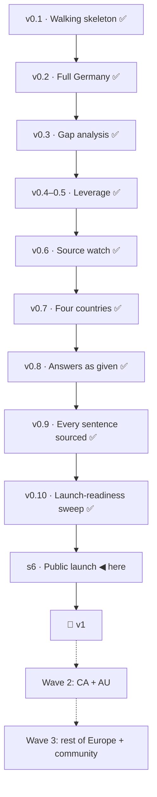

# KANBAN — Visa Navigator

Slices go by their **capability name**; short IDs (s1, s2…) are filename sort
keys only. A slice advances only on a run acceptance scenario: **mock-green**
when it passes on mocks, **real-green** when it passes for real. The moment a
mock is born, its de-mock task is appended to backlog.

## roadmap

Candidates, not commitments: capability · why it came up · the bet it rests on.
Promoted (or dropped, with evidence) at a boundary session.

### v1 — launch
- **Launch-readiness sweep** (s5f) · the last known wrong verdict, the last
  human-tier quotes, the last unsourced sentences and the last Turkish docs
  must not go public · bet: a launch with zero known defects earns more trust
  than a faster one. Source: s6 boundary 2026-09-07 (forks A1, D1, D2, D3).
- **Public launch** (s6) · the dataset is only useful in public · bet: an open,
  dated, source-quoted ruleset earns links and contributions faster than a
  closed one earns users. Carries the research harvest routed *now* at the
  boundary: per-route coverage tiers (research-01, PathWise), per-route page
  shape (research-01, Workbeyond), micro-page SEO (research-01, Visaora).

### v1.x

- **A browser-driven read for bot-walled sources** (v1.1 candidate, session
  2026-09-10) · why: two of s8's sources — the Conseil d'État on Legifrance and
  Directive 2021/1883 on EUR-Lex — answer this watch's fetcher with 403 and an
  empty 202, and open in a real browser with the sentence in place, so they
  ship on the human tier (`human_tier: 2`) with a 90-day re-read · bet: a
  `browser` watch strategy (headless Chrome from the runner, `innerText`,
  hash) reads what `fetch` is refused, and the tier goes back to 0 · **gated
  on one measurement before it is opened:** headless Chrome from the CI runner
  against both pages — the pass that let headed Chrome through may not let a
  headless one · source: the human's question on 2026-09-10, "did you check
  with the Chrome extension".

- **Compare, don't rank: published facts on each open route card** (v1.1,
  human 2026-09-08) · why: a reader with five open routes gets no help
  choosing, and "start with this one" would be advice with no published
  basis · bet: facts an authority publishes — permit duration, family
  reunification, path to permanent residence — beside each card let the
  reader rank for themselves without the product ruling · source: the
  second v1-gate critique (2026-09-08), "only you can decide" item 4.
- **Quoted, not asked — pages for the 14 excluded active routes** (v1.1,
  **first five promoted to s9 at the v1.1 boundary, 2026-09-10**; nine remain
  here for v1.2)
  human 2026-09-08) · why: the one-pager promised ~35–40 routes and the
  product ships 23; the excluded routes are real and searched for, and the
  third scope value ("rules quoted, nothing asked") exists for exactly them ·
  bet: a route page that quotes and dates the rules without scoring earns the
  same trust and traffic as a scored one (A2/A7) · first five: FR carte
  salarié, ES cuenta ajena, ES digital nomad, NL GVVA, DE § 21 · source:
  `data/exclusions.md`, the v1-gate critique's scope note.
- ~~Print or save the record~~ · **dropped 2026-09-07 — done in s5d** (print
  stylesheet, localStorage record).
- **Affiliate layer** · the money model from the viability gate · bet:
  route-relevant mandatory services convert without touching eligibility.
- **More citizenship exceptions** · the mechanism shipped in s5c, the data did
  not · bet: association agreements matter to enough users to earn a question.
- **Reduced thresholds, remaining limb** · only the SEPE shortage catalogue
  remains — NL and ES reduced thresholds shipped in s5c/s5d · bet: the SEPE
  catalogue is watchable once located. Source: s5 verification 4.2.

### v2 — wave 2
- **What a permit leads to** (v1.x candidate, human 2026-09-11) · why: the
  product answers "can I go and work there" and stops, and the reader's next
  question is "and then what" · what it is: **one quoted, dated statement per
  route** — the years of holding it that count toward permanent residence, and
  whether they count in full — using the s9 machinery exactly: stated, sourced,
  **not scored** · bet **A16**: most of the value of a residency answer is reachable
  without modelling time at all, and this measures the appetite before v2 pays
  for the engine · cost: four countries' residence-law pages, one statement per
  route, no new question and no new verdict.
- **Permanent residence** (v2 candidate, human's idea 2026-09-11: *"permanent
  residency ve vatandaşlık yollarını da eklesek mi"*) · why: same reader, same
  journey, later step; and the rules are the shape this engine already handles
  — years, language level, income, no benefits · **what it needs first, and it
  is not small: a history.** Every PR rule keys on years of lawful residence
  *under a particular status*, and which status changes the count — study years
  often count half or not at all, a Blue Card shortens the track, Türkiye's
  Decision 1/80 runs on its own clock. Today the interview asks only where the
  reader stands now; PR turns a snapshot into a timeline, which is a new
  question set and a new engine concept · **and it changes what a verdict is:**
  work permits say "you meet this today", PR says "you will, on this path, in
  N years" — a projection, which is a much stronger claim than this product has
  ever made and a more harmful one to get wrong · bets **A17** and **A18**: the timeline is worth
  building because the dated-and-quoted promise is worth more across a journey
  than across one step · gate: **one country, one PR route, measured end to
  end** before a second is opened.
- **Citizenship** (v3 candidate, same source) · why: it is where the search
  volume is · why it is *behind* PR and not beside it: naturalisation is where
  nationality law bites hardest — dual-nationality rules that turn on the
  reader's *other* passport, renunciation requirements and their exceptions,
  discretionary integration judgements — and that class (data #8) already cost
  this project two slices and four country reads for one dimension. A large
  part of the surface would land in "quoted and dated · not scored", which is
  honest but is not the answer a person searching for it wants · bet **A19**: worth
  doing only after PR proves the timeline model, and only where a rule can be
  quoted rather than judged.

- **CA + AU** · points systems; the one-pager's own second wave · bet A6: the
  model fits points-based systems without a new engine. Versioned at the s6
  boundary 2026-09-07 after three versions in *later*.

### v3 — wave 3

- **A countries menu in the header** (v3, session 2026-09-08) · why: the
  one-row header holds four country names with ~23 px of slack at the 56 rem
  cap; the rest of Europe does not fit in a row · bet: a grouped menu keeps
  every country one step away without a second nav row · source: the isolated
  critique of the navigation mock (F1), .
- **Rest of Europe** · versioned at the s6 boundary 2026-09-07.

### later (aging counter reset 2026-09-07 — next fork after three more versions)
- **Turkish UI** · the first audience is Turkish, the product is English · bet:
  worth it only once A8 shows organic traffic; trigger: Turkish share of
  post-launch traffic. Kept.
- **Quote-grounded "ask about this route"** · a presentation layer over the
  quotes, not a decision layer · bet: value unproven before launch. Kept.
- **Recognition helper** (Anabin and FR/ES/NL equivalents) · research first;
  Anabin is reachable now · bet: a per-country recognition source inventory
  exists. Kept.

## backlog

- ~~es-ict's `situation` criterion carries the precondition's quote~~ → **fixed the same hour** (visa-rules `1399abc`, 2026-09-07): the criterion now cites art. 73.1, the sentence that defines the transfer; the live card quotes each sentence once; 120 quotes verified, 323 tests. Original entry kept:
  **es-ict's `situation` criterion carries the precondition's quote** (found on
  the s5f real-green walk, 2026-09-07, `bug`): `dataset.json` gives the
  `situation eq ict` criterion art. 73.2.c ("relación laboral … de 3 meses") as
  its source — the same sentence the precondition "three months with the group"
  rightly carries — so the card quotes it twice. Fix: source the criterion from
  the sentence that defines the transfer (art. 73.1, the traslado
  intraempresarial definition), read from the BOE snapshot; no verdict changes;
  the quote-fidelity gate must stay `ok`. Small; candidate for s6's sweep.

- ~~PDF text extraction for the watch~~ → **promoted into s5f** (2026-09-07): both PDF-tier sources
  carry a text layer behind embedded TrueType fonts; decoding the glyph tables
  yields verbatim text. A pdf strategy that extracts text would move the five
  unverifiable quotes to the machine tier and let the fidelity gate read them.
  Source: the s5e human pass, done by the session.

- ~~Bare preconditions carry no provenance~~ → **promoted into s5f** (s5e review, 2026-09-07): 38
  route preconditions state what an authority requires with no source; s5d
  built sourced precondition statements for exactly this and the conversion
  was never finished. Source: s5e review, Standards axis.
- ~~es-highly-qualified fails people Spain would pass~~ → **promoted into s5f, back-edge chosen FOR** (s5e, 2026-09-07):
  Ley 14/2013 art. 71.2 counts three years of experience; the nearest option
  asks five in seven. Changes verdicts — **back-edge candidate**, needs a
  declarable three-year option or a rewording of the band. Source: s5e build
  report; stated on the card as a reading meanwhile.

- ~~Migrate remaining Turkish docs to English~~ → **promoted into s5f** (steward-3 language rule):
  one-pager, assumptions, research-01, scenarios s1–s3b, older DECISIONS
  entries (STATUS/KANBAN/ARCHITECTURE already translated).
- ~~Buzer → official-source URL migration~~ · **dropped 2026-09-07, with evidence:** gesetze-im-internet.de times out from Türkiye (measured 2026-09-06); buzer.de is the reachable consolidated mirror and NOTICE says so. The migration would have killed the link for the reader the tool exists for. · Replace buzer.de mirror links
  in the dataset with the verified gesetze-im-internet.de URLs (human
  verified them via VPN; agents cannot reach the official site — relevant to
  s4 source selection).
- **Model the 45+ age rules (55% threshold) as criteria** (currently notes).
- ~~Criterion-note provenance~~ · **dropped 2026-09-07 — done by s5e** (s5 review catch): verbatim legal quotes on
  eq/in/any criteria ride as bare `note` strings — no source_url/retrieved_at,
  so 7 routes (§18a/b, §18d, §19, es-ict, es-researcher, nl-orientation-year)
  show zero provenance and their source pages escape watch coverage. Needs a
  provenanced `basis` structure on non-numeric criteria + watchlist growth
  (BAMF pages, IND route pages).
- ~~Print / save the record~~ · **dropped 2026-09-07 — done in s5d** (golden G5): the "eligibility record" metaphor
  has no export; refresh destroys it. Print stylesheet + "save as PDF" hint,
  possibly a shareable-by-URL profile (privacy: answers in the fragment,
  never sent). Joins s6.
- ~~Reduced thresholds, three countries~~ · **folded into the roadmap item 2026-09-07; only SEPE remains** (s5 verification 4.2): NL HSM
  €3,122 and Blue Card €4,754 for recent graduates; ES Blue Card €33,085.09
  for CNO 1–2 shortage occupations or a qualification obtained in the last 3
  years (and NOT for PAC nacional — it is per-route, not a global flag).
  Needs a declarable "recent graduate" fact and the SEPE catalogue.
- **More citizenship exceptions** — the mechanism shipped in s5c (`implies`
  plus a notice keyed to a country); what is missing is data. Candidates: the
  EU association agreements beyond Türkiye, and the countries whose nationals
  have privileged access to Germany (§ 26 BeschV).
- ~~FR talent subtypes — entreprise innovante, salarié en mission~~ · **dropped 2026-09-07 — done in s5c** (two routes shipped) (s5
  verification 2.1): both thresholds equal €39,582 and are on F16922; what is
  missing is a qualifier field for the employer/mission type, not a number.
- **Orientation-year English requirement**: IELTS 6.0 / equivalent / an
  English- or Dutch-taught programme. Stated as a precondition today; a gap
  row would be better once there is a declarable field.
- **Country vocabulary follow-ups** (s5c review + light critique): dependent
  territories are deliberately absent — adding one back means sourcing which
  passport its residents hold; CLDR labels "Congo - Kinshasa" and "Hong Kong
  SAR China" read oddly; alias coverage is the 35 names people most often
  type, not a complete exonym list.
- **Public launch** (s6) · `visa-rules` public (licence ✓ MIT + CC BY 4.0,
  CONTRIBUTING, per-route coverage tiers), site deploy with the phone walk on
  the preview before any announcement, per-route micro-pages, disclaimer/legal
  wording (A1 conditions), the rename to **Permit Rulebook** at the v1 tag, a
  GitHub Sponsors link, GitHub/HN launch, and the v1-gate full critique in
  isolation. _Tests A2, A7, A8 for real._

### v1.x / wave 2 (post-v1)
- **Affiliate layer** (viability decision 2026-09-02): route-relevant
  mandatory services (blocked account, visa insurance, language) — labelled
  "affiliate", multi-provider, disclosure next to the disclaimer; never
  affects eligibility. (GitHub Sponsors link is small — may join s6.)
- Trackerless ads evaluation — only if 25–50k visits/month is crossed
- LLM extraction + code validation + auto-PR (full pipeline)
- "Ask about this route" (quote-grounded RAG)
- LLM build-time question-wording polish (A14)
- Turkish UI
- CA + AU (A6) · wave 3: rest of Europe · US as a separate decision
- JobRadar integration (cross-referral)
- Privacy-preserving usage counter
- Recognition helper: look up the user's university/program in Anabin (and
  FR/ES/NL equivalents) — research first (reachability, A1-compatible output
  wording, per-country recognition source inventory)

## active

- **The first paint stops shifting** (s10) · site #8 · CLS is poor for 23% of
  samples (`#app` 0.402, the footer 0.414, against a 0.25 threshold) while LCP
  and INP are good for 100%: the interview paints, then fills itself. Measured,
  not guessed — the first defect this project learned from a metric.

## mock-green

_(empty)_

## real-green

_(empty — everything real-green so far is stamped into done)_

## done

- **Five routes quoted and dated, and not scored** (s9) · **real-green
  2026-09-11, live** — `docs/spine/scenarios/s9-quoted-not-asked.md`. The
  French employee card, Spain's general employed regime and its international
  teleworker, German self-employment and the Dutch single permit: rules in the
  authority's words, dated and watched, under the third scope value —
  **quoted and dated · not scored** — which the dataset had carried since s6
  and never used. Nothing is scored, no profile can be told it qualifies, and
  validation refuses both directions.

  Reviewed on both axes (fifteen findings applied). The two the reviewers put
  first were the same one from opposite sides: a single route total on the
  country heading and on the social card, blurring the five that cannot be
  scored into the twenty-three that can. One finding was a rule read and never
  stated — article 76.2 of the Spanish regulation, inside the watched slice and
  nowhere on the page.

  Walked by the human (site `f1f49e1`, data `29fde08`; **513 + 336 tests**),
  who took three more things off it on the way: the country heading counts in
  figures, the call to action is a centred column, and the stamps stopped
  touching the header's rule.

  Bound to **A5** (refuted: 23 routes against a promise of 35–40) — the dataset
  now states 28, of which 23 are scored.

- **A route the authority closes, and a question nobody answers** (s8) ·
  **real-green 2026-09-10, live** — `docs/spine/scenarios/s8-algeria.md`. The
  first slice to ship under Steward mode's rule that **merge is the deploy and
  the deploy is the human's word**: built on `algeria-closure` in both
  repositories, reviewed on both axes (eleven findings applied), walked by the
  human, merged on their word (site `f6af596`, data `6bbc831`; **504 + 320
  tests**).

  France's intra-corporate transfer card closes itself to an Algerian passport
  in the fiche's own words — the dataset gained `not-in`, a closure that ships
  only with its own plain sentence — and the four talent routes stay scored
  under a heading that claims nothing: *Open on the rules — unsettled for your
  passport*, with an open-question notice above them.

  Three things the human's walk added after the build was green: a route keeps
  its address when its name changes (four live URLs had moved), four labels
  that had not earned their meaning, and the same partition applied to the
  second layout, the card badge, the summary strip and the headline — that one
  was found by walking, twice, after the code had been read and believed.

- **Answers recorded as given, verdicts in plain words** (s5d) · **real-green 2026-09-05, shipped in v0.8** —
  `docs/spine/scenarios/s5d.md`. Built, code-reviewed on both axes (10 findings,
  all applied), and extended twice by findings from the human's own walk: the
  orientation-year false requirement, and a four-part package now in flight —
  a card must name the threshold it was measured against · preconditions must
  read as requirements, not as claims about the reader · five caveats must leave
  the "Also required" heading · the Chancenkarte's twin of the false
  requirement, settled against § 20a. Awaiting the human's scenario walk on the
  finished build.

  *(Moved out of "active" on 2026-09-10, at the v1.1 boundary: every finding named above was applied and
  walked, and the board had gone on describing a finished slice as work in flight.)*

- **A statement can name the passports it does not bind** (s7) ·
  **real-green 2026-09-10** — the interview asked which passport a reader would
  apply with and then scored them against conditions the authority itself sets
  aside for it. Found by the human on the live site (data #7), diagnosed as a
  class (data #8): `citizenship` was an `eq third_country` gate in all 23
  routes, and 168 third-country passports produced one screen. Now: a
  `RouteStatement` carries an optional carve-out, keyed on the passport,
  refused without its own quote; the IND's Turkish exemption on the two highly
  skilled migrant permits and the researcher permit; the provisional residence
  permit stated on all six Dutch routes with the ten passports it does not
  bind; two new watched sources, sliced and re-baselined in the same commit.
  Schema 0.6.0. Reviewed on both axes — the blocker was ours: the MVV shipped
  as a caveat and is a precondition. 466 + 294 tests.

- **Public launch** (s6) · **real-green 2026-09-09** · mock-green 2026-09-07 — withdrawn once the same hour
  (the interview rendered nothing in a browser: a `node:fs` read reached the
  client bundle) and re-stamped after the fix, a real-browser smoke test on
  both surfaces gated in CI, and the session's own walk of every screen.
  342 + 116 tests.
  Name sweep to Permit Rulebook; 23 route pages generated from the dataset
  with the identity pair; scope value per route (22 / 1 / 0), exclusions twin;
  CONTRIBUTING, issue templates, tracker link on the product; favicon, social
  card checked against the dataset; Pages workflow; one-sentence disclaimer;
  ISO dates; six invariants as tests. Reviewed on both axes: 3 blockers, 12
  should-fix, 10 nits applied. 338 + 111 tests. **Real-green needs the
  human**: GitHub renames, Pages + domain, labels, the watch live, the phone
  walk on the preview, the first flag read against its source, the go; and
  the isolated v1-gate critique on the deployed preview.
  **Real-green, 2026-09-09:** the repositories renamed and public, the domain
  bound with HTTPS, the labels and the tracker link live, the watch filing
  issues, the phone walk done on a real handset, the first flags read against
  their sources (all three ours, not the law), the isolated critique run twice
  on the deployed site with every blocker cleared, the dispatch token made and
  proven end to end, and the announcement out on LinkedIn. 280 + 428 tests.

- **Every sentence carries its source, not only every number** (s5e) ·
  **real-green 2026-09-07** — the five PDF-tier quotes read from the PDFs' own text layers by the session (verbatim string match), at the human's request (docs/spine/scenarios/s5e.md). 45 criterion notes
  with no provenance became 55 sourced conditions, 8 readings declared ours,
  1 declared unsourced with a reason; machine-verified quotes 28 → 78; value
  set and verdict SHA unchanged. Reviewed on both axes, 12 findings applied —
  the gate re-keyed from quotation marks to a declared kind, and slice markers
  on every IND and BAMF entry so an intermittent shell response reports
  unreachable instead of overwriting the snapshot. → **v0.9**

- **Four countries filled: FR·ES·NL + honest verdicts + exceptions**
  (s5 · s5b · s5c) · real-green 2026-09-06. Two gates cleared on the same day:
  the human verified all 39 checklist values at their official sources
  (`verify-s5.md` 21/21, `verify-s5c.md` 18/18, including the Spanish PDF tier
  no machine here can read), and then walked the acceptance scenarios on the
  live product — the DE regression, the NL monthly flow, the "anywhere" weak
  profile, back-and-edit, and the EU-passport notice. → **v0.7**

  What the three slices carry, for the record:

- **Exceptions and reduced thresholds** (s5c) · mock-green 2026-09-04
  (`docs/spine/scenarios/s5c.md`, spec `docs/spine/specs/s5c-exceptions-and-reduced.md`):
  the passport question asks a country (199 issuers, class carried by
  `implies`, three sourced legs), reduced thresholds as second paths
  (NL €3,122 / €4,754, ES €33,085.09), two French talent routes, and the
  Türkiye rights as a notice beside the results. Built by the builder agent
  (165 tests), two code reviews and a light product-critique acted on.
  **Real-green rides on the same human pass as s5/s5b** — `data/verify-s5c.md`
  adds the ES reduced number and the EEA leg.

- **Honest verdicts and designed edge states** (s5b) · mock-green 2026-09-03
  (`docs/spine/scenarios/s5b.md`, spec `docs/spine/specs/s5b-honest-verdicts.md`):
  born from the product-critique run — dataset notices (EU free movement),
  route preconditions ("Also required — not checked here"), zero-open
  headlines that carry the steps, learn boxes only where the unknown binds,
  step-gated hold rows grouped under a data-derived summary, period-aware
  money everywhere, the NL orientation-year question split in two.
  Built by the builder agent (113 tests, test-first), reviewed in the main
  session: 6 findings verified by measurement and fixed. **Real-green rides
  on the same human pass as s5.**

- **Four countries filled: FR·ES·NL** (s5) · mock-green 2026-09-02
  (`docs/spine/scenarios/s5.md`): 21 routes / 4 countries, destination-first
  interview, NL monthly bands, qualifier-forked leverage ("a job offer in
  Spain"), collapsible country sections verified on screen (headless Chrome,
  3 personas). 93 engine tests + review round (10 findings triaged) done.
  Human pass complete 2026-09-06 (`visa-rules/data/verify-s5.md` + the
  interactive browser run).

- **Walking skeleton** (s1) · real-green 2026-09-01; human run 2026-09-02
  (`docs/spine/scenarios/s1.md`). → **v0.1**
- **Full Germany route set** (s2) · real-green 2026-09-02 — human verified
  every value against official sources (`docs/spine/scenarios/s2.md`). → **v0.2**
- **Gap analysis on results** (s3) · real-green 2026-09-02
  (`docs/spine/scenarios/s3.md`; last loose end: human click-check of the two
  learn links — in de-mock list). → **v0.3**
- **Leverage analysis: what each step unlocks** (s3b) · real-green 2026-09-02
  (`docs/spine/scenarios/s3b.md`; born from a human question). → **v0.4–v0.5**
- **Source watch + change flag** (s4) · real-green 2026-09-02 on the
  review-fixed revision (`docs/spine/scenarios/s4.md`): live run 5/5 sources,
  change-detection demoed, 10 code-review findings fixed, 69 tests.
  Deferred bit tracked: daily cron fires once the repo is public (s6). → **v0.6**

## versions

- **v0.1** — Walking skeleton: one route family (DE Blue Card ×2) end to end —
  questions derived from data, boundary schema validation, quoted+dated
  result screen, zero backend. (2026-09-01)
- **v0.2** — Full Germany: 8 routes, 12-item Chancenkarte points engine,
  `in`/`any` criteria, adaptive information-gain flow, human-verified values.
  (2026-09-02)
- **v0.3** — Gap analysis screen: summary strip + OPEN/WITHIN REACH/NOT YET
  groups, compact hold rows, data-driven "don't know → learn from the
  official source" boxes. (2026-09-02)
- **v0.4** — Leverage analysis: counterfactual "this step unlocks…" section
  for path fields + job-search-card bridge note; per-criterion
  "needs X / you declared Y" breakdowns on hold rows. (2026-09-02)
- **v0.5** — Leverage generalized to every improvable field (language, funds,
  salary, experience, recognition); provable "With German B2 → Chancenkarte
  met" recommendations; base-language question removed (derived from language
  levels — contradictions impossible, one question fewer). Follow-up: bounded
  gaps (money band / points / improvable fails) never end the interview —
  routes finish as "within reach" with field-aware gap notes. (2026-09-02)
- **v0.6** — Source watch: both-way coverage gate, watch CLI (html/pdf/human
  tiers, ndjson, commit-gated state, flag files with quoted context), DE via
  ZAV edition-index sentinel, daily CI workflow hardened against alert loss.
  (2026-09-02)
- **v1** — Public: https://permitrulebook.com, announced 2026-09-09. 23
  employment routes across Germany, France, Spain and the Netherlands, each
  with a page of its own; an interview of about seven questions that says which
  routes fit, which are close and by how much, and the one step that would open
  the most; 122 quotes re-read daily against their sources, each carrying the
  authority's sentence, its page and the day it was read. The whole loop ran
  for real before the stamp: a source re-read, a history line, a commit, a
  dispatch, a rebuild, the new date on a live page. Answers never leave the
  device, and a real-browser test asserts it. Open data (CC BY 4.0) with JSON
  per route, the site MIT; `/data` describes itself as a dataset for the
  indexes that read one. Two isolated critiques (32/45 on RUBRIC 1.2, 36/50 on
  1.3) with every blocker cleared on the live site. 280 + 428 tests, 0
  vulnerabilities in either repository. (2026-09-09)
- **v0.10** — Launch-readiness sweep: Spain measured against three years on
  two routes (es-highly-qualified, es-ict); the experience ladder made ordinal
  (y3in7 implies y2in5) after the review caught a regression the guard could
  not see; pdf-text watch strategy — human tier 0, quotes verified 78 → 120;
  37 bare preconditions given a kind (34 sourced, 2 ours, 1 deleted as
  repealed law); every document on disk English. Real-green walked by the
  session at the human's delegation. 323 + 70 tests. (2026-09-07)
- **v0.9** — Every sentence carries its source: 55 sourced conditions, 8
  readings declared ours, 1 declared unsourced with a reason; machine-verified
  quotes 28 → 78; the provenance gate keyed to a declared kind; slice markers on
  every IND and BAMF entry so a shell response reports unreachable. Value set
  and verdicts unchanged. 289 + 69 tests. (2026-09-07)
- **v0.8** — Answers recorded as given, verdicts in plain words: real listbox
  semantics on the country picker (Enter commits the highlighted row, exact
  matches first), the Dutch reduced salary criterion gated on where you
  studied rather than on a country-less question, every not-met reason a
  sentence rather than a field id, a masthead that cannot claim a comparison
  that has not happened, localStorage persistence with a print stylesheet, and
  cards that name the threshold that actually decided them. Three false
  requirements removed — Chancenkarte part-time work, the orientation year and
  the Chancenkarte both conditioned on having no job offer — each our own
  reasoning shipped as a rule, each found by a human reading a screen.
  264 + 57 tests. (2026-09-07)
- **v0.7** — Four countries, honest verdicts, exceptions: 23 routes across
  DE/FR/ES/NL with a destination-first interview; notices that answer "do you
  even need a permit"; route preconditions stated rather than implied;
  period-aware money everywhere; the passport asked as a country (199 issuers,
  free-movement class carried by `implies` on four sourced legs); reduced
  thresholds as second paths inside existing routes. Guarded by a
  quote-fidelity gate that re-reads every shipped quote in the latest snapshot,
  and by symptom-level regression tests for each cleared blocker. Every value
  verified by a human at its source. (2026-09-06)
