# KANBAN — Visa Navigator

Dilimler **yetenek adıyla** anılır (S-ID'ler yalnız dosya adlarında sıralama
anahtarıdır). Dilim ancak koşulmuş acceptance senaryosuyla ilerler: mock'ta
geçince **mock-green**, gerçekte geçince **real-green**. Doğan her mock,
doğduğu anda backlog'a de-mock görevi ekler.

```mermaid
flowchart LR
    A["Yürüyen iskelet ✅ real-green (v0.1)"] --> B["Almanya tam seti ✅ real-green (v0.2)"]
    B --> C["Gap analizi sonuç ekranında ✅ real-green (v0.3)"]
    C --> C2["Kaldıraç analizi: adımlar ne açar ✅ real-green (v0.4-v0.5)"]
    C2 --> D["Kaynak izleme + değişiklik bayrağı ◀ sıradaki"]
    D --> E["Dört ülke dolu: FR·ES·NL"]
    E --> F["Kamuya açılış 🏁 v1"]
    F -.-> G["Dalga 2: CA + AU"]
    G -.-> H["Dalga 3: diğer Avrupa + topluluk"]
```

## backlog

- **Buzer→resmî kaynak URL göçü** · Dataset'teki buzer.de ayna linklerini
  doğrulanmış resmî gesetze-im-internet.de URL'leriyle değiştir (insan resmî
  siteye VPN'le erişip doğruladı; ajanlar erişemiyordu — pipeline kaynak
  seçiminde not).
- **45+ yaş kurallarını (55% eşiği) kriter modeline al** (S2'de nota indirgendi)
- **Kaynak izleme + değişiklik bayrağı** (s4) · Önce spike: DE stabil değer
  kaynağı (headless / duyuru indeksi / insan-okur). Sonra NL+FR+DE izle+
  hash/diff+issue, ES PDF hash. _Sınar: A13, A3 çözümü._
- **Dört ülke dolu: FR·ES·NL** (s5) · ~35-40 route, ülke başı yazılı
  hariç-tutma listesi; CI şema zorlaması. _Sınar: A5 revize, A12, A4._
- **Kamuya açılış** (s6) · `visa-rules` public (CC-BY-4.0, CONTRIBUTING,
  kapsam katmanları), site deploy, route-başına mikro-sayfalar, disclaimer/
  hukuk dili (A1 koşulları), GitHub/HN lansmanı. _Sınar: A2, A7, A8 gerçekte._

### v1.x / dalga 2 (v1 sonrası)
- **Affiliate katmanı** (viability kararı 2026-09-02): route'a göre mecburi
  hizmet linkleri (Sperrkonto, vize sigortası, dil) — "affiliate" etiketli,
  çok sağlayıcılı, disclosure disclaimer yanında; uygunluk kararına etkisiz.
  (GitHub Sponsors linki küçük iş — s6 açılışa girebilir.)
- İzlemesiz reklam değerlendirmesi — yalnız 25-50k ziyaret/ay eşiği aşılırsa
- LLM çıkarım + kod doğrulama + otomatik PR (pipeline tam hattı)
- "Route hakkında soru sor" (alıntı-temelli RAG)
- LLM build-time soru-ifadesi cilası (A14)
- TR arayüz
- CA + AU (A6) · dalga 3: diğer Avrupa · ABD ayrı karar
- JobRadar entegrasyonu (çapraz yönlendirme)
- Veri-toplamayan kullanım sayacı
- Denklik yardımcısı: üniversite+bölüm beyanıyla Anabin (ve FR/ES/NL
  muadilleri) kaydını gösterme — önce araştırma (erişilebilirlik, A1 uyumlu
  çıktı dili, ülke başına denklik kaynağı envanteri)

## active

_(boş — "Kaynak izleme + değişiklik bayrağı" boundary session bekliyor)_

## mock-green

_(boş)_

## real-green

_(boş — v0.1 ve v0.2 done'a damgalandı)_

## done

- **Yürüyen iskelet** (s1) · 2026-09-01 real-green; insan koşumu 2026-09-02
  (`docs/spine/scenarios/s1.md`). → **v0.1**
- **Almanya tam seti** (s2) · 2026-09-02 real-green — insan tüm değerleri
  resmî kaynaklardan doğruladı (`docs/spine/scenarios/s2.md`). → **v0.2**
- **Gap analizi sonuç ekranında** (s3) · 2026-09-02 real-green
  (`docs/spine/scenarios/s3.md`; kalan tek pürüz: iki learn URL'sinin insan
  tıklaması — de-mock listede). → **v0.3**
- **Kaldıraç analizi: "teklif alırsan şunlar açılır"** (s3b) · 2026-09-02
  real-green (`docs/spine/scenarios/s3b.md`; insan sorusundan doğdu). → **v0.4**

## versions

- **v0.1** — Yürüyen iskelet: tek route ailesi (DE Blue Card ×2) uçtan uca —
  veriden türeyen sorular, sınırda şema doğrulaması, alıntı+tarihli sonuç
  ekranı, sıfır backend. (2026-09-01)
- **v0.2** — Almanya tam seti: 8 route, 12 kalemli Chancenkarte puan motoru,
  `in`/`any` kriterleri, adaptif information-gain soru akışı, insan-doğrulanmış
  değerler. (2026-09-02)
- **v0.3** — Gap analizi ekranı: özet şeridi + OPEN/WITHIN REACH/NOT YET
  grupları, kompakt hold satırları, "bilmiyorum → resmî kaynaktan öğren"
  kutuları (veriden). (2026-09-02)
- **v0.4** — Kaldıraç analizi: path-alanları için karşı-olgusal "bu adım
  şunları açar" bölümü + iş-arama kartı köprü notu; hold satırlarında
  kriter-bazlı "gereken/beyanın" dökümü. (2026-09-02)
- **v0.5** — Kaldıraç her değiştirilebilir alana genellendi (dil, para, maaş,
  deneyim, denklik — `kind: improvable`); "With German B2 → Chancenkarte met"
  tarzı kanıtlanabilir öneriler; language_base sorusu kaldırılıp taban-dil
  şartı dil seviyelerinden türetildi (çelişki imkânsız, 1 soru azaldı).
  Ek düzeltme: sınırlı gap'ler (para bandı/puan) route'u öldürmez — görüşme
  tamamlanır, route "within reach + alan-farkında gap" olur. (2026-09-02)
