# KANBAN — Visa Navigator

Slices go by their **capability name**; short IDs (s1, s2…) are filename sort
keys only. A slice advances only on a run acceptance scenario: **mock-green**
when it passes on mocks, **real-green** when it passes for real. The moment a
mock is born, its de-mock task is appended to backlog.

```mermaid
flowchart LR
    A["Walking skeleton ✅ real-green (v0.1)"] --> B["Full Germany route set ✅ real-green (v0.2)"]
    B --> C["Gap analysis on results ✅ real-green (v0.3)"]
    C --> C2["Leverage analysis: what each step unlocks ✅ real-green (v0.4–v0.5)"]
    C2 --> D["Source watch + change flag ✅ real-green (v0.6)"]
    D --> E["Four countries filled: FR·ES·NL ◀ next"]
    E --> F["Public launch 🏁 v1"]
    F -.-> G["Wave 2: CA + AU"]
    G -.-> H["Wave 3: rest of Europe + community"]
```

## backlog

- **Migrate remaining Turkish docs to English** (steward-3 language rule):
  one-pager, assumptions, research-01, scenarios s1–s3b, older DECISIONS
  entries (STATUS/KANBAN/ARCHITECTURE already translated).
- **Buzer → official-source URL migration** · Replace buzer.de mirror links
  in the dataset with the verified gesetze-im-internet.de URLs (human
  verified them via VPN; agents cannot reach the official site — relevant to
  s4 source selection).
- **Model the 45+ age rules (55% threshold) as criteria** (currently notes).
- **Criterion-note provenance** (s5 review catch): verbatim legal quotes on
  eq/in/any criteria ride as bare `note` strings — no source_url/retrieved_at,
  so 7 routes (§18a/b, §18d, §19, es-ict, es-researcher, nl-orientation-year)
  show zero provenance and their source pages escape watch coverage. Needs a
  provenanced `basis` structure on non-numeric criteria + watchlist growth
  (BAMF pages, IND route pages).
- **Public launch** (s6) · `visa-rules` public (CC-BY-4.0, CONTRIBUTING,
  coverage tiers), site deploy, per-route micro-pages, disclaimer/legal
  wording (A1 conditions), GitHub/HN launch. _Tests A2, A7, A8 for real._

### v1.x / wave 2 (post-v1)
- **Affiliate layer** (viability decision 2026-09-02): route-relevant
  mandatory services (blocked account, visa insurance, language) — labelled
  "affiliate", multi-provider, disclosure next to the disclaimer; never
  affects eligibility. (GitHub Sponsors link is small — may join s6.)
- Trackerless ads evaluation — only if 25–50k visits/month is crossed
- LLM extraction + code validation + auto-PR (full pipeline)
- "Ask about this route" (quote-grounded RAG)
- LLM build-time question-wording polish (A14)
- Turkish UI
- CA + AU (A6) · wave 3: rest of Europe · US as a separate decision
- JobRadar integration (cross-referral)
- Privacy-preserving usage counter
- Recognition helper: look up the user's university/program in Anabin (and
  FR/ES/NL equivalents) — research first (reachability, A1-compatible output
  wording, per-country recognition source inventory)

## active

_(empty)_

## mock-green

- **Four countries filled: FR·ES·NL** (s5) · mock-green 2026-09-02
  (`docs/spine/scenarios/s5.md`): 21 routes / 4 countries, destination-first
  interview, NL monthly bands, qualifier-forked leverage ("a job offer in
  Spain"), collapsible country sections verified on screen (headless Chrome,
  3 personas). 93 engine tests + review round (10 findings triaged) done.
  **Real-green needs the human**: VPN pass over `visa-rules/data/verify-s5.md`
  + an interactive browser run (Back/restart, section toggles).

## real-green

_(empty — v0.1–v0.5 stamped into done)_

## done

- **Walking skeleton** (s1) · real-green 2026-09-01; human run 2026-09-02
  (`docs/spine/scenarios/s1.md`). → **v0.1**
- **Full Germany route set** (s2) · real-green 2026-09-02 — human verified
  every value against official sources (`docs/spine/scenarios/s2.md`). → **v0.2**
- **Gap analysis on results** (s3) · real-green 2026-09-02
  (`docs/spine/scenarios/s3.md`; last loose end: human click-check of the two
  learn links — in de-mock list). → **v0.3**
- **Leverage analysis: what each step unlocks** (s3b) · real-green 2026-09-02
  (`docs/spine/scenarios/s3b.md`; born from a human question). → **v0.4–v0.5**
- **Source watch + change flag** (s4) · real-green 2026-09-02 on the
  review-fixed revision (`docs/spine/scenarios/s4.md`): live run 5/5 sources,
  change-detection demoed, 10 code-review findings fixed, 69 tests.
  Deferred bit tracked: daily cron fires once the repo is public (s6). → **v0.6**

## versions

- **v0.1** — Walking skeleton: one route family (DE Blue Card ×2) end to end —
  questions derived from data, boundary schema validation, quoted+dated
  result screen, zero backend. (2026-09-01)
- **v0.2** — Full Germany: 8 routes, 12-item Chancenkarte points engine,
  `in`/`any` criteria, adaptive information-gain flow, human-verified values.
  (2026-09-02)
- **v0.3** — Gap analysis screen: summary strip + OPEN/WITHIN REACH/NOT YET
  groups, compact hold rows, data-driven "don't know → learn from the
  official source" boxes. (2026-09-02)
- **v0.4** — Leverage analysis: counterfactual "this step unlocks…" section
  for path fields + job-search-card bridge note; per-criterion
  "needs X / you declared Y" breakdowns on hold rows. (2026-09-02)
- **v0.5** — Leverage generalized to every improvable field (language, funds,
  salary, experience, recognition); provable "With German B2 → Chancenkarte
  met" recommendations; base-language question removed (derived from language
  levels — contradictions impossible, one question fewer). Follow-up: bounded
  gaps (money band / points / improvable fails) never end the interview —
  routes finish as "within reach" with field-aware gap notes. (2026-09-02)
- **v0.6** — Source watch: both-way coverage gate, watch CLI (html/pdf/human
  tiers, ndjson, commit-gated state, flag files with quoted context), DE via
  ZAV edition-index sentinel, daily CI workflow hardened against alert loss.
  (2026-09-02)
