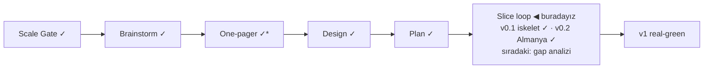

# STATUS — Visa Navigator

## Where are we

Genesis, slice loop; ölçek **Product**, sürüm **v0.2 — Almanya tam seti** (KANBAN `## versions`).

\* One-pager'a Product gereği **Viability** bölümü ekleniyor (orta back-edge, 2026-09-02).

## What is happening now

S2 "Almanya tam seti" **real-green** — insan tüm değerleri resmî kaynaklardan (VPN ile gesetze-im-internet dahil) doğruladı; v0.2 damgalandı. Steward-format defter güncellemeleri uygulandı: KANBAN'a mermaid dilim panosu + `## versions` defteri, ilk `docs/spine/ARCHITECTURE.md`, dilimler yetenek adına geçti. Sırada: (1) one-pager'a Viability bölümü — para/metrik/hedef kararları insanda; (2) "Gap analizi sonuç ekranında" dilimi için boundary: senaryo + değişen sonuç ekranının statik mock'u birlikte onaya gelecek.

## What is expected from you

Viability kapısı 🛑 — para kararı, birincil başarı metriği ve 6-12 ay hedefi (soru seti sunuldu/sunulacak); ardından gap-analizi dilimi senaryo+mock onayı.
