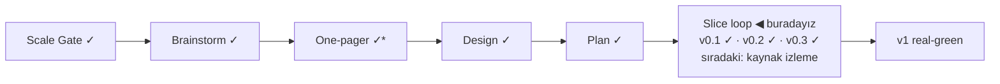

# STATUS — Visa Navigator

## Where are we

Genesis, slice loop; ölçek **Product**, sürüm **v0.3 — Gap analizi ekranı** (KANBAN `## versions`).

\* One-pager Viability bölümüyle tamam (insan onayı 2026-09-02).

## What is happening now

**v0.3 "Gap analizi ekranı" real-green** — özet şeridi, OPEN/WITHIN REACH/NOT YET grupları, kompakt hold satırları ve veriden gelen "bilmiyorum → resmî kaynaktan öğren" kutuları (Anabin, §18g) canlıda; senaryonun 6 adımı tarayıcıda koşuldu, 32 test yeşil. Viability bölümü onaylanıp one-pager'a girdi (affiliate+sponsors modeli, dataset-canlılığı metriği, 1 haftalık v1 temposu). Sırada: "Kaynak izleme + değişiklik bayrağı" boundary'si — DE stabil değer-kaynağı spike'ı dahil.

## What is expected from you

(1) ~1 dk: iki learn linkini tıklayıp açıldığını doğrula (s3 de-mock listesi); (2) sıradaki boundary 🛑: "Kaynak izleme + değişiklik bayrağı" senaryosu onaya gelecek (yeni ekran yok — mock'suz).
