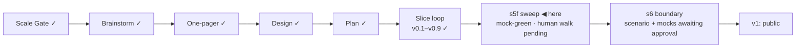

# STATUS — Visa Navigator *(working name; the project is named **Permit Rulebook** from the v1 tag)*

## Where are we

Genesis, slice loop; scale **Product**; **v0.9 shipped**, **s5f mock-green**
(built, reviewed on both axes, 15 findings applied). The release gate is
closed. **s6 (public launch) is drafted and waiting** — its scenario, its
route-page mock (critiqued in isolation and revised) and its identity mock
are all in front of the human; nothing in s6 starts before s5f is real-green.
Spine skills reloaded 2026-09-07 at steward-29.

## What is happening now

**s5f is built and reviewed, and the review earned its place.** The sweep
shipped the three-year experience answer without declaring the band it clears,
so a person answering honestly lost Germany's experienced-worker route and two
Chancenkarte points — a regression the scenario's guard could not see because
it compared a stripped dataset with itself. The Spec reviewer caught it; the
ladder is ordinal now (`y3in7` implies `y2in5`), points score the best row an
answer satisfies, and the guard compares the same person on the two answers
over 600 profiles: 0 worse. `es-ict` read five years beside its own quote of
three; ruled in scope and fixed. Two counts in the record were mine and wrong
(38 bare preconditions was 37; "27 moved rows" reproduces under nothing — the
honest figure is 15). Glyph corrections became declared, dated, bounded data
on the watch entry; the scan has one word, `scanned-image`.

Numbers: 323 tests in visa-rules, 70 in the navigator; 120 quotes verified,
0 unverifiable, `human_tier: 0`; every rendered sentence sourced, ours, or
declared unsourced with a reason; every document on disk in English.

## What is expected from you

- [ ] **s5f real-green — read `visa-rules/data/verify-s5f.md` and mark it.**
      Section 1 is the list the scenario asks for: the 15 verdicts that moved
      because of the three-year answer, ten people across the two Spanish
      routes, each row "from → to" with a yes/no column. Two rows turn *met*
      (row 2, row 13); thirteen stop being dead and stay open. **Pass:** every
      row moved toward the reader, and row 2 is met with the €41,356.36
      threshold genuinely cleared; row 13 is met with no salary of its own
      and the card says so. **Fail:** any row worse for the three-year
      answerer, or "met" without its threshold — a rule bug, raise it. Section
      2 is the translation check: DECISIONS line 245 (s3b, "Leverage
      analysis") against its Turkish original via `git show 7c075a0:DECISIONS.md`;
      pass when the English claims no more than the Turkish did. **Why it is
      yours:** the machine proved the direction; only a person can agree that
      someone in that position *should* see what they now see.
- [ ] **s6, two approvals in one word each:** the scenario
      (`docs/spine/scenarios/s6.md`, 13 decisions) and the route-page mock
      (`docs/spine/design/s6-route-page.html`, two columns, revised after the
      isolated critique and your three corrections). The identity is closed:
      you approved the card on 2026-09-07 (DECISIONS). **Why it is yours:** the
      scenario is the exam the build is graded on, and the screen is the one
      new thing a stranger sees.
- [ ] **One line, optional:** the copyright holder in the three LICENSE files
      reads "Oytun", the git author. Say so if you want the full name before
      the repositories go public.

Nothing else is open.
