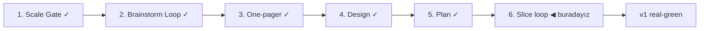

# STATUS — Visa Navigator

## Where are we

Genesis pipeline, ölçek: **Product**. Scale Gate kapandı; Brainstorm Loop başlıyor.

## What is happening now

Tasarım seçildi: "Damgalı Panel" (variant-d; iki turlu kritik sonrası), tokenlar `tokens.css`'te. Plan hazır: KANBAN.md'de 6 dilim risk-öncelikli sırada (S1 walking skeleton → S6 kamuya açılış) + v1.x backlog'u. Slice loop başlıyor: S1'in boundary session'ı — acceptance senaryosu insan diliyle yazılıp onaylanacak, ancak ondan sonra implementasyon başlar.

## What is expected from you

S1 walking skeleton'ın acceptance senaryosunu onaylamak 🛑 — senaryo taslağı sunulacak/sunuldu; onaysız kod yazılmaz.
