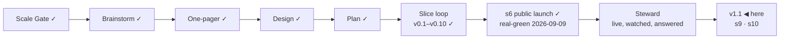

# STATUS — Permit Rulebook

## Where are we

**v1, public and announced** (2026-09-09). Genesis is done: the launch slice's
scenario is real-green, the product is live at https://permitrulebook.com with
23 routes across Germany, France, Spain and the Netherlands, and the
announcement went out on LinkedIn in the human's own words. The project is in
**Steward mode** from here: feedback — a tracker issue, a watch flag, a number
that comes back, a message from a stranger — enters through the steward
protocol, which decides what it is, which promise let it happen, and what to do
about it.

Pace, from the ledger: s5e real-green 2026-09-07, s5f 2026-09-07, s6
2026-09-09, s7 building 2026-09-10 — about one slice a day while the human is
in the loop daily. v1.1 holds two ruled candidates beyond s7; at that pace it
is days, not weeks, but the nationality reads for three more countries sit in
front of it and each is a research day before a build day.

## What is happening now

**s10 is live** (2026-09-15, on your word: *"merge"*, after two walks). Site
`8e67ffd`, 412 tests, deploy green in 2m21s, read on the live host after it
landed: the pre-paint script is in the head, the policy carries its hash, the
box holds a question card from the first byte, the `<noscript>` line is under
it. The page paints once now, and the counter judges it a week from today —
CLS poor back to 0%, LCP and INP unchanged — against the "before" written on
site #8 this afternoon (poor 6% of 44).

**v1.1's two slices are real-green: s9 on the 11th, s10 today.** That is the
whole scope you chose when you opened it. What a stamp brings is the cadence's
full product-critique walk — every persona, all lenses, delta against v1 —
and it is a gate, not a default: **say stamp, or say what v1.1 still needs.**

**Four slices shipped in six days, each on your word:** s8, s9, s11, s10.
Three things this last one taught, written into DECISIONS: a first screen
that depends on what the HTML cannot know is decided before the first paint,
not after a module lands; the gate for a paint defect is a browser with the
script held back at more than one viewport; and the builder's own worktree
(steward-53) held — no tree was touched by two writers today after it was
adopted.

**The watch:** tonight's 05:17 UTC run is the first expected green since the
10th — the User-Agent repair reads Spain, CI read every IND page this morning
— and the first run after s11 writes the unread list, so `/data/` says the
true thing without help from anyone.

**s12 is open at its boundary** (2026-09-15, human: *"tamamdır yapabiliriz"*
on site #9). The scenario is drafted — `docs/spine/scenarios/s12-two-labels.md`
— five points, all small: the row on `/data/` becomes *"Newest value changed"*,
a *"Last checked"* row joins it from the watch's own last run, the words live
in `copy.ts`, nothing else moves. **Built once, corrected the spec four times, one follow-up in flight.** The
row on `/data/` was reading the newest *page* stamp — notice dates included —
not the newest *value* read; the two agree today and the new label does not
permit them to diverge, so the source becomes `readRange` in fact (the stamp
and the freshness paragraph keep the broader date, on purpose). Also: the row
reads the same `lastRun` the sentence reads, not a second call; the gate needs
a build before the tests in a fresh worktree; a state with no run prints no
row. Follow-up in: the row reads `readRange` in fact, the stamp and the footer keep
the broader date on purpose, and the fixture did not move a second time — the
two derivations agree on the frozen dataset too. Committed as `two-labels`
`d35c724` (gates run by me: build clean, **421 tests**, fingerprint unmoved),
on the preview at http://localhost:4500/data/.

**Both reviews came back — nine findings, two blockers — and the sharpest is the
one this project keeps meeting from a new side:** the decision the slice
exists to make was invisible to all nine of its checks. Revert the row from
the values' newest date back to the page's and every case stays green, because
the two dates coincide today — on the live dataset and on the frozen one. A
check that passes on content coinciding is not a check on a decision. The fix
is a fabricated dataset in which a notice's read date is newer than any value's,
asserting the row prints the values' date while the stamp on the same page
prints the later one — red on the revert, by construction. The other blocker
was a case that grepped the source and passed on an empty file. Sent back in
one round; the fixture also stops calling itself "pre-s11" and names a revision
instead of a branch.

**The round is in and gated** (`two-labels` `ad19a0f`; build clean, **423
tests**, fingerprint unmoved). The decision case bends the dataset — a notice
re-read three weeks after the newest value — and goes red on the revert; the
builder did the revert once to prove it. On the preview.

**The skills changed under this session again — four clocks for the product
critique, in Steward mode too** (steward-54, read 2026-09-16). Every
user-facing slice or fix now exits through the product-critique skill in light
mode **on the branch's preview, before the merge**; every version stamped gets
a full walk, isolated when it reaches real users; and **every scheduled metric
reading brings an isolated full walk the same day** — so the 2026-10-09
reading of A2, A7 and A8 brings one. Until this rule, Steward knew the
critique only as an input; s8, s9, s11 and s10 all shipped without their light
walk. **s12 is the first that gets it, and it passed:**
`docs/spine/critique-s12-light.md` — no blocker, no friction, three polish
items older than the slice filed as site #10 (a label that speaks the gate's
language, "the tracker" named to a stranger, two identical dates side by
side). Copy 4/5, trust 5/5, responsive 5/5, fidelity 5/5 — light scores,
scoped to the facts list, not product-wide. One false alarm kept in the
report so the next critic does not repeat it.

**Queued, in order:** **site #9** (the "Newest value read" label, two rows);
`feedback-line` (site #6, built, never walked); **data #15** (the free-movement
notice's evidence for four passports); **data #13** (the Opportunity Card's
link); **data #17** (the IND shell — the browser strategy's gate read 2 of 5);
the Spanish job-search order to re-read at the end of December; the
pre-registered numbers on **2026-10-09**.

What runs without anyone asking:

- **The daily watch** (05:17 UTC) — repaired today.
- **The site's daily rebuild** — pinned and deployed fresh data every day since
  the 11th.
- **The counter** and **the pre-registered numbers** (A2, A7, A8 on 2026-10-09;
  interim reading at day 6 in `docs/spine/assumptions.md`).

## What is expected from you

**The 48-hour window closes 2026-09-11 09:00 (GMT+3)** — the announcement
went out 2026-09-09 around 09:00. Until then the live site is frozen: it is
touched only for a blocker (a wrong verdict confirmed against its source, a
value gone stale on a live page, a legal objection to a quote) — s7 is one, the
CLS fix is not. The three lines, left here until the window closes:

- *Watch:* the counter (visits, entry pages), both trackers, the watch's
  issues, the post's comments.
- *Where:* Cloudflare Web Analytics → permitrulebook.com; `gh issue list` on
  both repositories; the LinkedIn post.
- *Pull if:* a confirmed wrong verdict, a stale live value, or a legal
  objection — fix the value with its history line, let the rebuild land, edit
  the post to say what was wrong and what it says now.

Nothing is blocked on you. These are the things only you can see, when you want
to look:

- [x] **The daily rebuild needs nothing from you.** This list asked you to run
      one by hand if a day passed without one. It was written on a false
      premise: the site's schedule has fired every day, about five hours late
      (11:49 UTC on 2026-09-09, 11:48 on 2026-09-10, both green).

- [x] **The card's quote cap, 10 → 11** (human, 2026-09-10): ratified for
      `nl-hsm-under30`. Twelve would have to be argued again.
- [x] **The human-tier number is 2** (human, 2026-09-10: "tamamdır", after the
      alternatives were laid out). Two of s8's sources ship human-tier with
      their sentences in `verify-s5e.md` and a 90-day re-read. Checked in a
      real browser the same day: both pages open and both sentences are there
      — the limit is this fetcher, not the page. A browser-driven read for
      bot-walled sources is on the roadmap, gated on a headless-Chrome
      measurement from the runner.
- [ ] **Switch on the preview address** (once, ~5 minutes):
      `docs/spine/preview.md` has the six steps — connect Cloudflare Pages to
      `OytunOnal/permit-rulebook`, project name `permit-rulebook`, production
      branch `preview-only` (a branch that does not exist, so this project can
      never publish the live site), build command
      `bash scripts/preview-build.sh`, output `dist`, and two preview
      variables. *Pass:* `feedback-line` builds and
      https://feedback-line.permit-rulebook.pages.dev shows the site with the
      new line at the end of a results screen. *If the build fails:* paste the
      last twenty lines here.
- [x] **s8 walked and merged** (2026-09-10, your word). Live, and walked again
      on the live host afterwards.
- [x] **s9 walked and merged** (2026-09-11, your word). Live, and checked on
      the live host afterwards.
- [x] **Spain's annual ministerial order is read** (2026-09-11, your word:
      *"ispanyayı oku ve okut"*). It opens nothing this year, by two independent
      reads of the BOE text. Recorded, with the date to re-read it: the next
      order, end of December.
- [x] **"Code compared"** — raised on 2026-09-15 while walking, withdrawn the
      same hour (*"yok düzelmiş tamam"*): the page was already right, and no
      record of an earlier ask exists. Nothing changed.
- [x] **Two joins on `/data/` got their breath** (your walk, 2026-09-15): the
      masthead's *"…tell us it is wrong."* sat 0px above `<main>`, and the
      checks section's *"…never on their own."* sat 0px above the Take-it
      box's rule. Both 26px now, from two rules on this page only, so no other
      page's bytes moved; the pre-s11 fixture was regenerated on purpose.
- [x] **s11 walked and merged** (2026-09-15, your word). Live, and read on the
      live host afterwards.
- [x] **s10 scenario approved** (2026-09-15, your word: *"approve"*). The
      builder is on it, in a worktree of its own on the branch `first-paint`
      — the first slice built under steward-53.
- [x] **s10 walked once, and the walk changed it** (2026-09-15): a returning
      reader saw question one for a moment before their own screen replaced
      it. Built and gated (`first-paint` `fc7ea94`, **412 tests**, fingerprint
      unmoved): with a record on the device the box shows *"Your answers are
      on this device — bringing them back."* at question one's exact height
      until the module lands; a link arrival shows *"Setting up your
      questions."*; a fresh visit is unchanged; a screen reader gets the
      sentence and not the covered question.
- [x] **s10 walked twice and merged** (2026-09-15, your word). Live, and read
      on the live host afterwards.
- [x] **s12 scenario approved** (2026-09-15, your word: *"approve"*). Being built.
- [x] **s12 walked once, and the walk changed it** (2026-09-16): "What it
      holds today" read untidily — 3 + 3 + 1 with an orphan, a three-line
      "Routes" beside one-liners, dates and counts interleaved, one dotted
      date among dashed ones. You chose the layout on a live prototype; built
      and gated (`two-labels` `8f859bc`, **426 tests**, fingerprint unmoved).
      At a phone's width the counts stack rather than sit two across — two
      across broke each value over three lines, the thing being fixed.
- [ ] **Walk s12 again, then say merge** — http://localhost:4500/data/ (`8f859bc`).
      "What it holds today": four dates across, two counts across, Routes
      alone on a full-width row with its sentence on one line, every cell
      centred, *Dataset version 2026-09-10*. Narrow the window to a phone's
      width if you like: dates 2×2, counts stacked, Routes two lines, nothing
      overflowing. *Pass:* it looks like one list of seven facts, not a grid
      with a hole in it.

- [ ] **v1.1 — stamp it, or say what it still needs.** Its scope was s9 and
      s10; both are real-green and live. A stamp brings the full critique walk
      (every persona, all nine lenses, delta against v1's 36/50 on RUBRIC 1.3)
      and a versions-ledger line the README quotes. *Say "stamp" and the walk
      runs in isolation; say what is missing and it goes on the board first.*
- [ ] **Walk s10, then say merge** — two previews, both holding the module
      back 700 ms the way a phone network does: **http://localhost:4500** is
      the fix (`f6b9a37`), **http://localhost:4501** is master. *What to look
      for:* hard-reload each on a phone-width window. On :4501 the page paints
      with an empty box and then, a beat later, the first question drops in and
      everything below jumps. On :4500 the first question is there from the
      first paint and nothing moves; you should not be able to tell when the
      script arrived. Then the two harder cases on :4500 only: press "Check
      yours — France" from http://localhost:4500/france/ (a link arrival), and
      reload :4500 with a record you have already started. On both, the
      masthead — headline, promise, stamp — must not move at all; the box
      changes contents, and on the link arrival the footer moves below the
      fold, which is the default recorded in DECISIONS for you to overrule.
      *Pass:* nothing you can see moves after it has painted, on any of the
      three.
- [ ] **Walk `feedback-line`, then say merge** (site #6; this one waits for the
      window to close at 09:00 tomorrow). One line under your results: "Wrong
      about you? A value that does not match its source, or something this
      screen should do — report a wrong value or suggest a change. Both open
      GitHub, where filing needs an account." *Pass:* you would let it sit under
      your own results. *If not:* say what it should say instead.
- [x] **The four country reads are done** (2026-09-10): the Netherlands and
      France produced fixes (s7 is live, s8 waits on your walk), Germany and
      Spain produced findings with dates on them and nothing to change.
- [ ] **A third human-tier source, or not** (your call, and only yours). The
      French employee card's page states the labour-market test in
      service-public's words. The statute's own word for it — CESEDA L414-13,
      « la situation du marché de l'emploi est **opposable** au demandeur » —
      is on Legifrance, which answers this fetcher 403. You ratified the
      human-tier count at **two** this morning; carrying that sentence would
      make it three, with a person re-reading it every 90 days. *Say yes and it
      goes on the page; say no and it stays where it is now — recorded in
      `exclusions.md` with the reason.*
- [ ] **The post's replies.** Anything a reader says that is a bug, a missing
      need or a design flaw is worth pasting here — the steward protocol turns
      it into a fix or a recorded decision, rather than a note that gets lost.
- [ ] **In thirty days (2026-10-09):** the counter's visits from search and
      referrals, whether a stranger has touched the data, and how many domains
      link to it. The numbers that decide A2, A7 and A8 were written before the
      post so they cannot be moved afterwards.
- [ ] **The token expires 2027-09-09** (`DISPATCH_TOKEN`). GitHub e-mails
      first; an expired one turns the watch red and files an issue, so it
      cannot fail quietly.

Ledgers: this file (now), `KANBAN.md` (the board and the versions),
`DECISIONS.md` (why anything is the way it is), `docs/spine/` (the scenario,
the threat model, the architecture, the critiques, the announcement).
