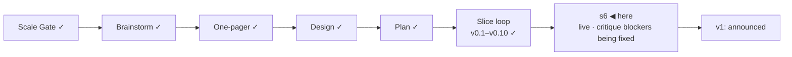

# STATUS — Permit Rulebook

## Where are we

Genesis, slice loop; scale **Product**; **v0.10 shipped**, **s6 "public launch"
mock-green and live at https://permitrulebook.com** (HTTPS enforced,
2026-09-08). The v1-gate isolated critique has run: 32/45, four blockers, fixed and
verified cleared on the live site. v1 is stamped when the blockers are cleared on the live
site and the human's real-green items below are done. Roadmap: v1.1 holds the
14 excluded active routes as "quoted, not asked" pages; 9 further candidates
(5 unversioned). Spine skills at steward-40 (a threat model, a Security review axis, ten
launch dimensions, devils-advocate over the launch scenario).

## What is happening now

**The navigation review round and the footer are pushed and deploying** (site
`d77471d`, data `4741d3d`): reload-safe browser history, whole-sentence
gists, "stated" only of the source's words, one head-meta source, the shared
footer on every page with its critique applied, the `/data` headings
unclipped, the amended disclaimer everywhere, "Check yours" in the header.
**CI is red on that push while the same tree is green locally:** the header's
nav row wraps on the runner's fallback fonts (no Cambria/Segoe UI there), and
the route-page fingerprint test depends on the environment. The footer and
the new disclaimer are therefore not on the live site yet; the builder is
fixing the design (a fold width that holds with any font) and the test, then
the beacon and the pipeline hardening (actions pinned by SHA, read-only
token); then a three-axis review (Standards, Spec, Security); then v1 waits
only on the checklist below.

Numbers: 400 tests in the data repository, 233 in the site; 122 quotes
verified, `human_tier: 0`; 31 pages + 26 endpoints, 0 tap targets under 44 px
at 390 px; critique 32/45 on RUBRIC 1.2 (v0.7: 27/45).

## What is expected from you

Each of these is yours because it is a real device, a preview renderer, or a
judgement on a live source.

- [x] **Navigation + country page approved** (human, 2026-09-08): shared header,
      no crumbs, new scope words, The data as an on-site page. Building.
- [ ] **Phone walk on the live site, real handset:** https://permitrulebook.com
      — the interview end to end, then one route page from a results card's
      "The rules of this route". *Pass:* nothing overflows sideways, every tap
      target is comfortable, the rail's labels read as a list, the scope
      statement reads without zooming, the address bar shows the lock. *If it
      fails:* paste the screen's heading here. (Two rows you already found —
      the place phrase and "§" — are in the fix round.)
- [x] **Test issue from the product** (human, 2026-09-08): landed on
      `permit-rulebook-data` with the `bug` label — pass; closed.
- [ ] **Favicon on a Mac and on an Android phone** (after the next deploy,
      which ships option C): open https://permitrulebook.com and look at the
      tab icon. *Pass:* "PR" centred in the tilted square with margin both
      sides. *Fail:* letters touching or overflowing the frame — say so and
      the letterforms get outlined to paths.
- [x] **Link preview** (human, 2026-09-08): the route title and the €50,700
      description appear beside the card image — pass.
- [ ] **Tomorrow's card date:** after the daily rebuild lands, paste any route
      link into Slack again. *Pass:* the card reads tomorrow's date under
      "Rules read". *Fail:* yesterday's — the rebuild did not run; tell me.
- [x] **French and Spanish question paths** (human, 2026-09-08): pass — counter
      steady, bands sensible, no offer wording on a transfer. One bug found on
      the way (Back jumping questions) — fixed in the navigation round.
- [x] **GitHub Sponsors** (human, 2026-09-08): profile live at
      https://github.com/sponsors/OytunOnal; the small link sits beside the
      licence in both READMEs; the Sponsor button shows on both repositories.
- [x] **Disclaimer** (human, 2026-09-08: "change"): "…and no authority is bound
      by these results…" — in the footer build, every surface, both READMEs.
- [x] **Search Console and Bing** (human, 2026-09-08): the domain property is
      verified, `sitemap.xml` submitted, indexing requested for the home page
      and a route page ("added to a priority crawl queue"); Bing verified via
      `BingSiteAuth.xml`. Indexing itself takes days — nothing more to do.
- [x] **Traffic counter** (human, 2026-09-08: Cloudflare Web Analytics, manual
      snippet): going in with the current builder round; the data page says what
      is counted; the never-leaves-the-device test names the one allowed beacon.
- [ ] **Two-factor authentication (security dimension, before "go"):** GitHub →
      Settings → Password and authentication → enable 2FA (an authenticator
      app); Cloudflare → My Profile → Authentication → Two-Factor. *Pass:* both
      show 2FA enabled. Say "2fa açık" — the site is whatever those two
      accounts say it is.
- [ ] **`DISPATCH_TOKEN` (a credential, so yours):** GitHub → Settings → Developer
      settings → Fine-grained tokens → new token, repository access:
      `permit-rulebook` only, permission Contents: read and write; then on
      `permit-rulebook-data` → Settings → Secrets and variables → Actions → new
      repository secret named `DISPATCH_TOKEN` with that value. *Pass:* the
      next watch run's "dispatch a site rebuild" step is green and a deploy
      run starts in the site repository within a minute. Until then the
      daily 06:40 UTC schedule rebuilds the site anyway; only the same-hour
      rebuild after a data change waits on the token.
- [x] **The watch is live** — it always was: no dry-run switch exists; it has
      filed two issues since the repositories went public (ZAV edition, buzer
      § 6), both read and closed the same day. Watch issues carry
      `source-change`; `bug` is applied at triage if a value proves wrong.
- [ ] **"go":** after the items above pass and the blockers are verified
      cleared on the live site, say it; v1 is stamped and the README's first
      screen is the announcement, told once.

The first 48 hours after "go" (decision 11), written now:
*Watch:* the tracker on `permit-rulebook-data`, the watch's flag issues, the
Show HN thread — every two hours the first day, morning and evening the second.
*Where:* GitHub notifications for both repositories, the watch workflow's run
page, the thread itself, and Cloudflare Web Analytics for page views and
referrers (cookieless; decided 2026-09-08).
*Pull the post if:* a reported wrong verdict is confirmed against the source; a
watch flag shows a value on a live page has gone stale; a legal objection to a
quote arrives. Any one of the three: the post comes down first, the fix second.
