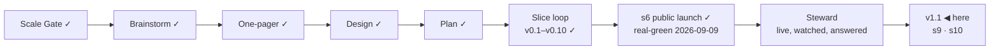

# STATUS — Permit Rulebook

## Where are we

**v1, public and announced** (2026-09-09). Genesis is done: the launch slice's
scenario is real-green, the product is live at https://permitrulebook.com with
23 routes across Germany, France, Spain and the Netherlands, and the
announcement went out on LinkedIn in the human's own words. The project is in
**Steward mode** from here: feedback — a tracker issue, a watch flag, a number
that comes back, a message from a stranger — enters through the steward
protocol, which decides what it is, which promise let it happen, and what to do
about it.

Pace, from the ledger: s5e real-green 2026-09-07, s5f 2026-09-07, s6
2026-09-09, s7 building 2026-09-10 — about one slice a day while the human is
in the loop daily. v1.1 holds two ruled candidates beyond s7; at that pace it
is days, not weeks, but the nationality reads for three more countries sit in
front of it and each is a research day before a build day.

## What is happening now

**s11 is live** (2026-09-15, on your word: *"s11 merge"*). Site `777b3ff`, data
`165f39a`, 539 + 349 tests, deploy green in 2m31s, read on the live host after
it landed: `/data/` says *"Every source is re-read daily — last run
2026-09-15."* with no exception clause, and the footer *"re-read daily (last
run 2026-09-15)"* — the clean sentence, because the shipped state carries no
unread list yet. **The first watch run after this merge writes it**, and from
then on a partial run says so on every surface without anyone's help.

**s10 is built, and the gate reads what the scenario asked** (2026-09-15;
`first-paint` `607d45b`, built in the builder's own worktree — the first slice
under steward-53 — gates run by me: build clean, **358 tests**, route-page
fingerprint unmoved). The page paints the first question at build time through
the one renderer the module also uses (`src/lib/question.ts`, moved out of the
module verbatim); on a fresh visit the module parses what it would draw, finds
it already there, and writes nothing. A browser case holds the module back
700 ms at 390×844:

| arrival | master | now |
|---|---|---|
| `/` cold | 0.110 | **0** |
| `/?country=fr` | 0.280 | 0.057 |
| `/` saved record | 0.156 | 0.082 |
| `/?route=…` | **0.305** | 0.057 |

**The build corrected the spec twice.** The `?route=` arrival was the worst of
all and my reproduction table had not measured it — it is in the gate now. And
what remains is **not the box**: with the box full, the footer leaves the first
viewport on every arrival and stops moving at all; the 0.057–0.082 left is the
masthead's subline shortening by ~94 px for a reader who has answered
something. The empty box was most of the defect, not all of it.

**One design call is yours, and it is the walk's question:** the build left
that 0.082 (82% of the "good" budget) rather than lock the masthead's height,
which measures **0 on every arrival** at the cost of a ~94 px hole under the
shortened subline for a returning reader. It built and measured both. Its
judgment — the hole is worse than the shift on a page this tight — is offered
for you to overrule.

**The review round is built, and it reached what the fork could not**
(`first-paint` `f6b9a37`; gates run by me: build clean, **393 tests**, the
route-page fingerprint unmoved). Thirteen lines of inline script in the head —
hashed into the policy like the menu's — read what the module would read
anyway and set two flags before paint; CSS paints the short subline and the
folded ledger from them; the module arrives to the page it would have chosen.
Measured with the module held back 700 ms, at three viewports:

| arrival | master | 390×844 | 390×1400 | 1280×900 |
|---|---|---|---|---|
| `/` cold | 0.110 | **0** · footer 0 px | **0** | **0** |
| `/?country=fr` | 0.280 | 0.005 | 0.052 | 0.009 |
| `/` saved record | 0.156 | **0** | 0.001 | 0.005 |
| `/?route=…` | 0.305 | 0.006 | 0.062 | 0.009 |

Nothing above the box moves, on any arrival, anywhere — asserted as zero.
**One thing is not by construction and I chose not to force it:** a link
arrival lands on a genuinely taller screen (the citizenship search, where the
build painted a five-button card), and the footer travels ~200 px below the
fold for 0.005 of score. Holding it would cost a hole on every other screen
or a blank box for exactly the readers the slice is for. Recorded as a default
in DECISIONS, reversible by the counter a week after it is live.

The blocker is proven closed by falsification — empty the `<noscript>`
sentence and the gate goes red — and so is the paint-skip: force a write and
three cases fail at CLS 0. The policy became one list structurally on the way,
because a second inline script on one page turned the one-policy-everywhere
test red, correctly.

**What tonight's run should do.** The User-Agent repair means Spain reads
again; CI read every IND page fine this morning. So the 05:17 UTC run is
expected **green** — the first since 2026-09-10 — and `/data/` to stay clean.
If it is not, the page will say which country, and that is the point.

**Three slices shipped this week on your word** — s8, s9, s11 — each built on
a branch, reviewed on both axes, walked on the local preview, merged. Today's
one cost the most and taught the most: the spec was wrong twice and the build
measured it; the approved sentence claimed a duration nothing in the system
knows and the walk caught it; and the working trees were treated as mine while
an agent wrote in them, three times, which is now Spine's rule steward-53.

**The five-day failure is closed** (data #18 stays open for the record). It was
our own header: the watch put a URL inside its User-Agent and
`inclusion.gob.es` refuses that, wherever it comes from. The name stays, the
address moved beside it, both Spanish sources read on the first try, and the
salary threshold was **unchanged** — eight days blind, nothing moved.

**Queued, in order:** **s10** (CLS, site #8 — v1.1's last slice, unbuilt);
**site #9** (the label "Newest value read" that you read as "last checked" —
two rows, "Newest value changed" and "Last checked"); `feedback-line` (site
#6, built, never walked); data #15 (the free-movement notice's evidence for
four passports); data #13 (the Opportunity Card's link); data #17 (the IND
shell — the browser strategy's gate read 2 of 5, worth building for two
sources); the Spanish job-search visa's annual order to re-read at the end of
December.

What runs without anyone asking:

- **The daily watch** (05:17 UTC) — repaired today; expected green tonight.
- **The site's daily rebuild** (06:40 UTC nominal, ~11:48 in practice) — has
  pinned and deployed a fresh data commit every day since 2026-09-11.
- **The counter**, and **the pre-registered numbers** (A2, A7, A8 on 2026-10-09).

## What is expected from you

**The 48-hour window closes 2026-09-11 09:00 (GMT+3)** — the announcement
went out 2026-09-09 around 09:00. Until then the live site is frozen: it is
touched only for a blocker (a wrong verdict confirmed against its source, a
value gone stale on a live page, a legal objection to a quote) — s7 is one, the
CLS fix is not. The three lines, left here until the window closes:

- *Watch:* the counter (visits, entry pages), both trackers, the watch's
  issues, the post's comments.
- *Where:* Cloudflare Web Analytics → permitrulebook.com; `gh issue list` on
  both repositories; the LinkedIn post.
- *Pull if:* a confirmed wrong verdict, a stale live value, or a legal
  objection — fix the value with its history line, let the rebuild land, edit
  the post to say what was wrong and what it says now.

Nothing is blocked on you. These are the things only you can see, when you want
to look:

- [x] **The daily rebuild needs nothing from you.** This list asked you to run
      one by hand if a day passed without one. It was written on a false
      premise: the site's schedule has fired every day, about five hours late
      (11:49 UTC on 2026-09-09, 11:48 on 2026-09-10, both green).

- [x] **The card's quote cap, 10 → 11** (human, 2026-09-10): ratified for
      `nl-hsm-under30`. Twelve would have to be argued again.
- [x] **The human-tier number is 2** (human, 2026-09-10: "tamamdır", after the
      alternatives were laid out). Two of s8's sources ship human-tier with
      their sentences in `verify-s5e.md` and a 90-day re-read. Checked in a
      real browser the same day: both pages open and both sentences are there
      — the limit is this fetcher, not the page. A browser-driven read for
      bot-walled sources is on the roadmap, gated on a headless-Chrome
      measurement from the runner.
- [ ] **Switch on the preview address** (once, ~5 minutes):
      `docs/spine/preview.md` has the six steps — connect Cloudflare Pages to
      `OytunOnal/permit-rulebook`, project name `permit-rulebook`, production
      branch `preview-only` (a branch that does not exist, so this project can
      never publish the live site), build command
      `bash scripts/preview-build.sh`, output `dist`, and two preview
      variables. *Pass:* `feedback-line` builds and
      https://feedback-line.permit-rulebook.pages.dev shows the site with the
      new line at the end of a results screen. *If the build fails:* paste the
      last twenty lines here.
- [x] **s8 walked and merged** (2026-09-10, your word). Live, and walked again
      on the live host afterwards.
- [x] **s9 walked and merged** (2026-09-11, your word). Live, and checked on
      the live host afterwards.
- [x] **Spain's annual ministerial order is read** (2026-09-11, your word:
      *"ispanyayı oku ve okut"*). It opens nothing this year, by two independent
      reads of the BOE text. Recorded, with the date to re-read it: the next
      order, end of December.
- [x] **"Code compared"** — raised on 2026-09-15 while walking, withdrawn the
      same hour (*"yok düzelmiş tamam"*): the page was already right, and no
      record of an earlier ask exists. Nothing changed.
- [x] **Two joins on `/data/` got their breath** (your walk, 2026-09-15): the
      masthead's *"…tell us it is wrong."* sat 0px above `<main>`, and the
      checks section's *"…never on their own."* sat 0px above the Take-it
      box's rule. Both 26px now, from two rules on this page only, so no other
      page's bytes moved; the pre-s11 fixture was regenerated on purpose.
- [x] **s11 walked and merged** (2026-09-15, your word). Live, and read on the
      live host afterwards.
- [x] **s10 scenario approved** (2026-09-15, your word: *"approve"*). The
      builder is on it, in a worktree of its own on the branch `first-paint`
      — the first slice built under steward-53.
- [x] **s10 walked once, and the walk changed it** (2026-09-15): a returning
      reader saw question one for a moment before their own screen replaced
      it. Built and gated (`first-paint` `fc7ea94`, **412 tests**, fingerprint
      unmoved): with a record on the device the box shows *"Your answers are
      on this device — bringing them back."* at question one's exact height
      until the module lands; a link arrival shows *"Setting up your
      questions."*; a fresh visit is unchanged; a screen reader gets the
      sentence and not the covered question.
- [ ] **Walk s10 again, then say merge** — **http://localhost:4500** is the
      rebuilt fix (`fc7ea94`), **http://localhost:4501** is master, both holding
      the module back 700 ms. *Three arrivals on :4500:* (1) as you are now,
      with your record — the quiet box with your sentence, then your screen,
      and nothing above the box moves; (2) press **Start over**, reload — the
      first question is there from the first paint and never changes; (3) from
      http://localhost:4500/france/ press "Check yours — France" — the neutral
      line, then the France-scoped question. *Two words that are mine, not
      yours, and yours to change:* the link line, and that a record beats a
      link when both apply. *Pass:* nothing you can see moves after it has
      painted, and nothing shown is untrue for a moment.

- [ ] **Walk s10, then say merge** — two previews, both holding the module
      back 700 ms the way a phone network does: **http://localhost:4500** is
      the fix (`f6b9a37`), **http://localhost:4501** is master. *What to look
      for:* hard-reload each on a phone-width window. On :4501 the page paints
      with an empty box and then, a beat later, the first question drops in and
      everything below jumps. On :4500 the first question is there from the
      first paint and nothing moves; you should not be able to tell when the
      script arrived. Then the two harder cases on :4500 only: press "Check
      yours — France" from http://localhost:4500/france/ (a link arrival), and
      reload :4500 with a record you have already started. On both, the
      masthead — headline, promise, stamp — must not move at all; the box
      changes contents, and on the link arrival the footer moves below the
      fold, which is the default recorded in DECISIONS for you to overrule.
      *Pass:* nothing you can see moves after it has painted, on any of the
      three.
- [ ] **Walk `feedback-line`, then say merge** (site #6; this one waits for the
      window to close at 09:00 tomorrow). One line under your results: "Wrong
      about you? A value that does not match its source, or something this
      screen should do — report a wrong value or suggest a change. Both open
      GitHub, where filing needs an account." *Pass:* you would let it sit under
      your own results. *If not:* say what it should say instead.
- [x] **The four country reads are done** (2026-09-10): the Netherlands and
      France produced fixes (s7 is live, s8 waits on your walk), Germany and
      Spain produced findings with dates on them and nothing to change.
- [ ] **A third human-tier source, or not** (your call, and only yours). The
      French employee card's page states the labour-market test in
      service-public's words. The statute's own word for it — CESEDA L414-13,
      « la situation du marché de l'emploi est **opposable** au demandeur » —
      is on Legifrance, which answers this fetcher 403. You ratified the
      human-tier count at **two** this morning; carrying that sentence would
      make it three, with a person re-reading it every 90 days. *Say yes and it
      goes on the page; say no and it stays where it is now — recorded in
      `exclusions.md` with the reason.*
- [ ] **The post's replies.** Anything a reader says that is a bug, a missing
      need or a design flaw is worth pasting here — the steward protocol turns
      it into a fix or a recorded decision, rather than a note that gets lost.
- [ ] **In thirty days (2026-10-09):** the counter's visits from search and
      referrals, whether a stranger has touched the data, and how many domains
      link to it. The numbers that decide A2, A7 and A8 were written before the
      post so they cannot be moved afterwards.
- [ ] **The token expires 2027-09-09** (`DISPATCH_TOKEN`). GitHub e-mails
      first; an expired one turns the watch red and files an issue, so it
      cannot fail quietly.

Ledgers: this file (now), `KANBAN.md` (the board and the versions),
`DECISIONS.md` (why anything is the way it is), `docs/spine/` (the scenario,
the threat model, the architecture, the critiques, the announcement).
