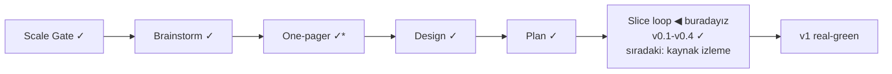

# STATUS — Visa Navigator

## Where are we

Genesis, slice loop; ölçek **Product**, sürüm **v0.4 — Kaldıraç analizi** (KANBAN `## versions`).

\* One-pager Viability bölümüyle tamam (insan onayı 2026-09-02).

## What is happening now

**v0.4 "Kaldıraç analizi" real-green** — insan sorusundan doğan mini dilim aynı gün kapandı: sonuç ekranında "If your situation changes" bölümü her alternatif adımın *gerçekten* açacağı route'ları karşı-olgusal değerlendirmeyle listeliyor (yalnız mevcut cevaplarla karara bağlanabilenler — bilinmeyen "açılır" sayılmaz); iş-arama kartı köprü notu; hold satırlarında kriter-bazlı "gereken/beyanın" dökümü (önceki insan bulgusu). 38 test yeşil. Sırada: "Kaynak izleme + değişiklik bayrağı" boundary'si — DE stabil değer-kaynağı spike'ı dahil.

## What is expected from you

(1) ~1 dk: iki learn linkini tıklayıp açıldığını doğrula (s3 de-mock listesi: Anabin + §18g); (2) sıradaki boundary 🛑: "Kaynak izleme + değişiklik bayrağı" (s4) senaryosu onaya gelecek (yeni ekran yok — mock'suz).
