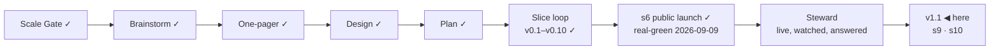

# STATUS — Permit Rulebook

## Where are we

**v1, public and announced** (2026-09-09). Genesis is done: the launch slice's
scenario is real-green, the product is live at https://permitrulebook.com with
23 routes across Germany, France, Spain and the Netherlands, and the
announcement went out on LinkedIn in the human's own words. The project is in
**Steward mode** from here: feedback — a tracker issue, a watch flag, a number
that comes back, a message from a stranger — enters through the steward
protocol, which decides what it is, which promise let it happen, and what to do
about it.

Pace, from the ledger: s5e real-green 2026-09-07, s5f 2026-09-07, s6
2026-09-09, s7 building 2026-09-10 — about one slice a day while the human is
in the loop daily. v1.1 holds two ruled candidates beyond s7; at that pace it
is days, not weeks, but the nationality reads for three more countries sit in
front of it and each is a research day before a build day.

## What is happening now

**The watch has failed every day for five days, and the site says otherwise.**
Found on 2026-09-15 by reading the tracker rather than the ledger. Runs on
2026-09-11, 12, 13, 14 and 15 all ended red (data #18, one issue with four
comments on it), and every one of them failed for the same two sources:

- `es-uge-umbral-pdf` — Spain's salary-threshold PDF, **last read 2026-09-07**
- `es-uge-index` — the UGE requirements page, **last read 2026-09-02**

Both answer this machine fine today (HTTP 200, 702 KB of PDF and 299 KB of
HTML), so the pages are up and it is the CI runner they refuse — the same
shape as Legifrance's 403, from the other side.

**The part that matters is not the failure, it is what the site says while it
fails.** `/data/` reads *"re-read daily — last run 2026-09-15"*, and that
sentence is printed from a state the run commits **before** the unreachable
check fails it. The ordering is deliberate and was right when it was written
("a state that WAS committed still has to reach the site when some other source
was unreachable") — what nobody foresaw is that the footer would turn a partial
run into an unqualified claim. It is true of 42 sources and false of two, and
the two are values on live pages.

**Diagnosed, not fixed** — the fix is a decision, not a patch: the state should
record what a run achieved (read, unreachable, and the oldest read date among
them) and the sentence should say it, the way every other claim on this site
carries what it rests on.

**A second thing, found while checking the first.** The IND highly-skilled-migrant
page — which backs the recognised-sponsor condition, the market-rate
precondition and the ICT statement on both Dutch routes — returned only
navigation to this fetcher today: 7,256 characters of menus, with
"recognised sponsor", "salary" and "€" all absent, where the stored read holds
14,451 characters with the rules in them. Its 2026-09-11 change flag (data #17)
was never triaged. The good snapshot is still in `watch/state.json` and quote
fidelity passes (183 verified, 513 tests green), so nothing is broken today —
but if that shell ever overwrites the snapshot, the Dutch quotes lose the
evidence under them.

**Everything else is where it was left.** v1.1 has one slice to go — **s10**,
the CLS defect (site #8). `feedback-line` is still the only branch standing
and still waits on a walk. The roadmap gained three candidates on 2026-09-11
(what a permit leads to · permanent residence · citizenship, bets A16–A19).

What runs without anyone asking:

- **The daily watch** (05:17 UTC) — running, and red for five days.
- **The site's daily rebuild** — working: it has pinned and deployed a fresh
  data commit every day since 2026-09-11 (`c026900` today).
- **The counter** and **the pre-registered numbers** (A2, A7, A8 on 2026-10-09).

## What is expected from you

**The 48-hour window closes 2026-09-11 09:00 (GMT+3)** — the announcement
went out 2026-09-09 around 09:00. Until then the live site is frozen: it is
touched only for a blocker (a wrong verdict confirmed against its source, a
value gone stale on a live page, a legal objection to a quote) — s7 is one, the
CLS fix is not. The three lines, left here until the window closes:

- *Watch:* the counter (visits, entry pages), both trackers, the watch's
  issues, the post's comments.
- *Where:* Cloudflare Web Analytics → permitrulebook.com; `gh issue list` on
  both repositories; the LinkedIn post.
- *Pull if:* a confirmed wrong verdict, a stale live value, or a legal
  objection — fix the value with its history line, let the rebuild land, edit
  the post to say what was wrong and what it says now.

Nothing is blocked on you. These are the things only you can see, when you want
to look:

- [x] **The daily rebuild needs nothing from you.** This list asked you to run
      one by hand if a day passed without one. It was written on a false
      premise: the site's schedule has fired every day, about five hours late
      (11:49 UTC on 2026-09-09, 11:48 on 2026-09-10, both green).

- [x] **The card's quote cap, 10 → 11** (human, 2026-09-10): ratified for
      `nl-hsm-under30`. Twelve would have to be argued again.
- [x] **The human-tier number is 2** (human, 2026-09-10: "tamamdır", after the
      alternatives were laid out). Two of s8's sources ship human-tier with
      their sentences in `verify-s5e.md` and a 90-day re-read. Checked in a
      real browser the same day: both pages open and both sentences are there
      — the limit is this fetcher, not the page. A browser-driven read for
      bot-walled sources is on the roadmap, gated on a headless-Chrome
      measurement from the runner.
- [ ] **Switch on the preview address** (once, ~5 minutes):
      `docs/spine/preview.md` has the six steps — connect Cloudflare Pages to
      `OytunOnal/permit-rulebook`, project name `permit-rulebook`, production
      branch `preview-only` (a branch that does not exist, so this project can
      never publish the live site), build command
      `bash scripts/preview-build.sh`, output `dist`, and two preview
      variables. *Pass:* `feedback-line` builds and
      https://feedback-line.permit-rulebook.pages.dev shows the site with the
      new line at the end of a results screen. *If the build fails:* paste the
      last twenty lines here.
- [x] **s8 walked and merged** (2026-09-10, your word). Live, and walked again
      on the live host afterwards.
- [x] **s9 walked and merged** (2026-09-11, your word). Live, and checked on
      the live host afterwards.
- [x] **Spain's annual ministerial order is read** (2026-09-11, your word:
      *"ispanyayı oku ve okut"*). It opens nothing this year, by two independent
      reads of the BOE text. Recorded, with the date to re-read it: the next
      order, end of December.
- [ ] **Walk `feedback-line`, then say merge** (site #6; this one waits for the
      window to close at 09:00 tomorrow). One line under your results: "Wrong
      about you? A value that does not match its source, or something this
      screen should do — report a wrong value or suggest a change. Both open
      GitHub, where filing needs an account." *Pass:* you would let it sit under
      your own results. *If not:* say what it should say instead.
- [x] **The four country reads are done** (2026-09-10): the Netherlands and
      France produced fixes (s7 is live, s8 waits on your walk), Germany and
      Spain produced findings with dates on them and nothing to change.
- [ ] **A third human-tier source, or not** (your call, and only yours). The
      French employee card's page states the labour-market test in
      service-public's words. The statute's own word for it — CESEDA L414-13,
      « la situation du marché de l'emploi est **opposable** au demandeur » —
      is on Legifrance, which answers this fetcher 403. You ratified the
      human-tier count at **two** this morning; carrying that sentence would
      make it three, with a person re-reading it every 90 days. *Say yes and it
      goes on the page; say no and it stays where it is now — recorded in
      `exclusions.md` with the reason.*
- [ ] **The post's replies.** Anything a reader says that is a bug, a missing
      need or a design flaw is worth pasting here — the steward protocol turns
      it into a fix or a recorded decision, rather than a note that gets lost.
- [ ] **In thirty days (2026-10-09):** the counter's visits from search and
      referrals, whether a stranger has touched the data, and how many domains
      link to it. The numbers that decide A2, A7 and A8 were written before the
      post so they cannot be moved afterwards.
- [ ] **The token expires 2027-09-09** (`DISPATCH_TOKEN`). GitHub e-mails
      first; an expired one turns the watch red and files an issue, so it
      cannot fail quietly.

Ledgers: this file (now), `KANBAN.md` (the board and the versions),
`DECISIONS.md` (why anything is the way it is), `docs/spine/` (the scenario,
the threat model, the architecture, the critiques, the announcement).
