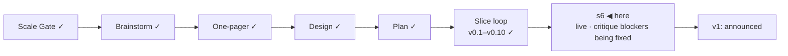

# STATUS — Permit Rulebook

## Where are we

Genesis, slice loop; scale **Product**; **v0.10 shipped**, **s6 "public launch"
mock-green and live at https://permitrulebook.com** (HTTPS enforced,
2026-09-08). The v1-gate isolated critique has run: 32/45, four blockers, fixed and
verified cleared on the live site. v1 is stamped when the blockers are cleared on the live
site and the human's real-green items below are done. Roadmap: v1.1 holds the
14 excluded active routes as "quoted, not asked" pages; 9 further candidates
(5 unversioned). Spine skills at steward-36.

## What is happening now

**The critique-and-walk round is built, committed and pushed** (site `2c30584`,
data `bc2ba49`): the four blockers and adjustment 3, the two READMEs
image-first, "§" glossed, the leverage place bug, the buzer slices, the bot
identity, favicon C, `NOTES.md` as pre-history. Deployed (run 34218847195) and **re-read on
https://permitrulebook.com: all four blockers cleared** — the Chancenkarte card
now says "Up to €1,091/month short of the monthly funds this route asks for —
living costs", consistent with its rail and banner; the home page links the
four country pages, the sitemap lists 29 URLs, robots.txt exists, a wrong URL
lands on our own 404 with the identity pair; the data README opens with the
screenshot and links the live site; the favicon is option C; "§ 20a, section
20a" is glossed. The two-axis code review of the round is running; its
findings get one more round if needed. Then v1 waits only on the checklist
below.

Numbers: 384 tests in the data repository, 187 in the site; 122 quotes
verified, `human_tier: 0`; 30 pages + 24 endpoints, 0 tap targets under 44 px
at 390 px; critique 32/45 on RUBRIC 1.2 (v0.7: 27/45).

## What is expected from you

Each of these is yours because it is a real device, a preview renderer, or a
judgement on a live source.

- [ ] **Phone walk on the live site, real handset:** https://permitrulebook.com
      — the interview end to end, then one route page from a results card's
      "The rules of this route". *Pass:* nothing overflows sideways, every tap
      target is comfortable, the rail's labels read as a list, the scope
      statement reads without zooming, the address bar shows the lock. *If it
      fails:* paste the screen's heading here. (Two rows you already found —
      the place phrase and "§" — are in the fix round.)
- [ ] **One test issue from the product:** on any route page click "Report a
      wrong value", file a one-line test issue, then close it. *Pass:* it
      lands on `permit-rulebook-data` with the `bug` label already applied.
- [ ] **Favicon on a Mac and on an Android phone** (after the next deploy,
      which ships option C): open https://permitrulebook.com and look at the
      tab icon. *Pass:* "PR" centred in the tilted square with margin both
      sides. *Fail:* letters touching or overflowing the frame — say so and
      the letterforms get outlined to paths.
- [ ] **Link preview:** paste
      https://permitrulebook.com/germany/eu-blue-card-general into Slack,
      WhatsApp and X. *Pass:* the title "EU Blue Card — general · Germany ·
      Permit Rulebook" and a description naming €50,700 appear beside the card
      image. *Fail:* a generic site name or a cropped card.
- [ ] **Tomorrow's card date:** after the daily rebuild lands, paste any route
      link into Slack again. *Pass:* the card reads tomorrow's date under
      "Rules read". *Fail:* yesterday's — the rebuild did not run; tell me.
- [ ] **French and Spanish question paths, once, on the phone:** choose France,
      then Spain, and answer through to results. *Pass:* the question counter
      does not swing wildly, salary bands read sensibly, no wording assumes a
      job offer when you declared a transfer.
- [ ] **`DISPATCH_TOKEN` (a credential, so yours):** GitHub → Settings → Developer
      settings → Fine-grained tokens → new token, repository access:
      `permit-rulebook` only, permission Contents: read and write; then on
      `permit-rulebook-data` → Settings → Secrets and variables → Actions → new
      repository secret named `DISPATCH_TOKEN` with that value. *Pass:* the
      next watch run's "dispatch a site rebuild" step is green and a deploy
      run starts in the site repository within a minute. Until then the
      daily 06:40 UTC schedule rebuilds the site anyway; only the same-hour
      rebuild after a data change waits on the token.
- [ ] **"watch live":** say it once the fix round has deployed; I switch the
      daily workflow from dry-run to filing issues. *Pass:* the next real flag
      appears as an issue on `permit-rulebook-data` with the `bug` label.
- [ ] **"go":** after the items above pass and the blockers are verified
      cleared on the live site, say it; v1 is stamped and the README's first
      screen is the announcement, told once.

The first 48 hours after "go" (decision 11), written now:
*Watch:* the tracker on `permit-rulebook-data`, the watch's flag issues, the
Show HN thread — every two hours the first day, morning and evening the second.
*Where:* GitHub notifications for both repositories, the watch workflow's run
page, the thread itself; nothing else is instrumented, no analytics at v1.
*Pull the post if:* a reported wrong verdict is confirmed against the source; a
watch flag shows a value on a live page has gone stale; a legal objection to a
quote arrives. Any one of the three: the post comes down first, the fix second.
