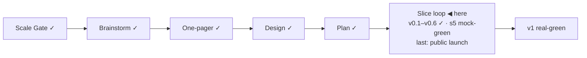

# STATUS — Visa Navigator

## Where are we

Genesis, slice loop; scale **Product**; current version **v0.6** with **s5 "Four countries filled: FR·ES·NL" at mock-green** (v0.7 stamps at real-green; see KANBAN `## versions`).

## What is happening now

**s5 is built and mock-green.** The dataset holds 21 employment-based routes across DE·FR·ES·NL (agent-curated, quote+source+date each; every excluded route recorded with its reason in `data/exclusions.md`). The interview opens with the destination question and never asks another country's questions; NL salaries stay monthly with their own bands; leverage now forks per country for "show me everything" explorers ("a job offer **in Spain** → ICT would be met"). The results screen groups by collapsible country sections with per-country leverage and tally hints, verified on screen. The watch grew to 12 sources (all fetching clean) and learned to slice rotating-ad pages (buzer served 3 page variants per request). Two review rounds ran this slice: 10 findings on the s4 code earlier, 10 more on s5 — including two silent-verdict bugs (adjacency-dependent gaps, unconstrained qualifier forks), both fixed and regression-tested. 93 engine tests green; `astro check` now gates the site build.

## What is expected from you

**Real-green needs your two passes** 🛑: (1) the VPN verification checklist `visa-rules/data/verify-s5.md` — every FR/ES/NL value against its official page (the ES thresholds come from a PDF the policy says a human must read); (2) an interactive browser run on http://localhost:4321 — happy path, weak profile, Back/restart, country-section toggles. Also still open: the s3 learn-link click-check (Anabin + § 18g).
