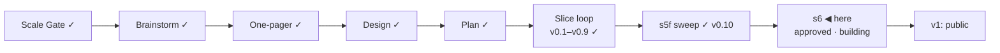

# STATUS — Visa Navigator *(working name; the project is named **Permit Rulebook** from the v1 tag)*

## Where are we

Genesis, slice loop; scale **Product**; **v0.10 shipped** (s5f real-green
2026-09-07, walked by the session at the human's delegation). The release
gate is closed; the identity is closed. **s6 (public launch) is approved and
building** — the last slice before v1.
Spine skills reloaded 2026-09-07 at steward-29.

## What is happening now

**s6 is building.** The human approved the scenario and the route-page mock
on 2026-09-07 with one amendment (the "Rules read" stamp carries the identity
pair). The builder is on: the name sweep, 23 generated route pages with their
coverage values, the contributor files and tracker link, the favicon and
social card, the Pages workflow, the disclaimer, ISO dates, and the
invariants. Then the two-axis code review, then the human's real-green items.

## What is expected from you

- [ ] **Nothing until the build returns.** When it does, the real-green items
      come to you one at a time, each with the exact screen and what a pass
      looks like: the phone walk on the deploy preview; the GitHub renames,
      Pages and the domain; the first live watch flag read against its source;
      the three 48-hour lines; the go for the announcement.
- [ ] **One line, optional:** the copyright holder in the three LICENSE files
      reads "Oytun", the git author. Say so if you want the full name before
      the repositories go public.

Nothing else is open.
