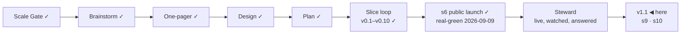

# STATUS — Permit Rulebook

## Where are we

**v1, public and announced** (2026-09-09). Genesis is done: the launch slice's
scenario is real-green, the product is live at https://permitrulebook.com with
23 routes across Germany, France, Spain and the Netherlands, and the
announcement went out on LinkedIn in the human's own words. The project is in
**Steward mode** from here: feedback — a tracker issue, a watch flag, a number
that comes back, a message from a stranger — enters through the steward
protocol, which decides what it is, which promise let it happen, and what to do
about it.

Pace, from the ledger: s5e real-green 2026-09-07, s5f 2026-09-07, s6
2026-09-09, s7 building 2026-09-10 — about one slice a day while the human is
in the loop daily. v1.1 holds two ruled candidates beyond s7; at that pace it
is days, not weeks, but the nationality reads for three more countries sit in
front of it and each is a research day before a build day.

## What is happening now

**s12 is live** (2026-09-16, on your word: *"merge"*, after two walks and the
first light-mode critique this project ran on a branch before a merge). Site
`f5df33c`, 426 tests, deploy green in 2m26s, read on the live host after it
landed: `/data/`'s list is three rows — four dates, two counts, Routes alone —
every cell centred, *Newest value changed 2026-09-10* and *Last checked
2026-09-15* where *Newest value read* was, and the old label is nowhere on the
page.

**"Last checked 2026-09-15" is true, and it is the thing to watch today.** The
watch's 05:17 UTC run has **not fired yet** on 2026-09-16 — the newest run is
yesterday's failed one; GitHub has been running this schedule four to five
hours late, so it is due, not missed. When it runs it is the first since the
10th expected green (the User-Agent repair), and the first that writes s11's
unread list; the site's daily rebuild then pins it and the page says
*Last checked 2026-09-16* on its own. If by tomorrow it still says the 15th,
that is a finding, not a delay.

**s13, s14 and s15 are live** (2026-09-16, deploy `6fe4eb5` green, read on
the live host afterwards). Three merges on your word in one afternoon, each
forced by the one before:

- **s13 — the feedback door** (`f06badd`). Live: one word, *Feedback*, in
  the header, at the end of a result and in the footer, leading to
  `/feedback/` — *Something is wrong · Something is missing · Anything
  else*, each a button that opens Gmail with the subject written, the
  mail-app link under each, the address with a copy glyph, the tracker
  beneath for a reader with an account; the header's four countries under
  *Countries* (the country's name on its pages); the footer's Feedback
  column two rows. Seven corrections from your two walks are in it. Site
  #6 and #7 closed; #9 closed too (s12 was live).
- **s14 — the IND's requirements moved behind a form** (data `b2488b9`).
  s13's first deploy stopped at the quote gate: the IND had rebuilt its
  five route pages around a *Your situation* form with no addressable
  result. The five entries are on the human tier (90-day re-read); all 38
  quotes read in Chrome the same day, 26/26 sentences present. Data #20
  closed; the road back is data #17.
- **s15 — the first unread day** (`5f7d1fb`). s13's second deploy stopped
  on s11's own tests: the first state with a real unread source (BAMF,
  *fetch failed*) reached the site, the site said the right thing, six
  tests that had only seen clean days went red. Clean-day cases now measure
  a clean day; real-state cases expect what the state says; the footer's
  parenthesis may break at 390, after the dot.

Live today: the footer says *(last run 2026-09-16 · 1 source unread)*, and
`/data/` says *A German source did not answer on the last run; the values
it backs were read on 2026-09-07.* — s11 doing its work on its first real
day. Tomorrow's watch re-tries BAMF; if it answers, the clause disappears
on its own.

**Five slices in seven days, each on your word:** s8, s9, s11, s10, s12. The
board is empty between slices.

**v1.1's scope is complete** — s9 and s10, both real-green and live — and the
stamp is yours: it brings the isolated full walk the cadence requires for a
version that reaches real users, and a versions-ledger line the README quotes.

**Queued, in order:** the feedback moment's build, once you pick a shape (site #6); **site
#10** (three copy polish items on `/data/`, from the light critique); **data
#15** (the free-movement notice's evidence for four passports); **data #13**
(the Opportunity Card's link); **data #17** (the IND shell — the browser
strategy's gate read 2 of 5); the Spanish job-search order to re-read at the
end of December; the pre-registered numbers on **2026-10-09**, which now bring
an isolated full walk the same day (steward-54).

What runs without anyone asking:

- **The daily watch** (05:17 UTC nominal, ~10:00–12:00 in practice) — repaired
  yesterday; today's run not yet fired at the time of writing.
- **The site's daily rebuild** — pinned and deployed fresh data every day since
  the 11th; today's waits on the watch.
- **The counter** and **the pre-registered numbers** (A2, A7, A8 on 2026-10-09;
  interim reading at day 6 in `docs/spine/assumptions.md`).

## What is expected from you

**The 48-hour window closes 2026-09-11 09:00 (GMT+3)** — the announcement
went out 2026-09-09 around 09:00. Until then the live site is frozen: it is
touched only for a blocker (a wrong verdict confirmed against its source, a
value gone stale on a live page, a legal objection to a quote) — s7 is one, the
CLS fix is not. The three lines, left here until the window closes:

- *Watch:* the counter (visits, entry pages), both trackers, the watch's
  issues, the post's comments.
- *Where:* Cloudflare Web Analytics → permitrulebook.com; `gh issue list` on
  both repositories; the LinkedIn post.
- *Pull if:* a confirmed wrong verdict, a stale live value, or a legal
  objection — fix the value with its history line, let the rebuild land, edit
  the post to say what was wrong and what it says now.

**Nothing is blocked on you.**

- [x] **The IND path is decided** (2026-09-16, *"url sabit"*): the form's
      result has no address, so the five IND route pages go human-tier.
- [x] **s14's scenario approved** (2026-09-16, *"approve"*); the builder is
      working in `../permit-rulebook-data-s14` (branch `ind-behind-the-form`).
- [x] **The five IND pages are read** (2026-09-16, in Chrome, by the session
      at your request): 26 of 26 sentences present, word for word, on every
      page; recorded in the checklist with the date. s14 is ready: 555 tests,
      `npm run check` green, the quote gate `ok' with 145 verified and 40
      human-tier.
- [x] **s14 merged** (2026-09-16, your word): data `b2488b9`, the site
      pinned to it in `c4c3b04` (the lock's stray conflict markers cleaned
      with it — the workflow reads only the sha line, so they never bit).
      **The deploy stopped again — this time on s11's own tests.** The first
      state with a real unread source (BAMF, *fetch failed* on the 16th)
      reached the site; the site said the right thing (*1 source unread*),
      and six tests that assumed a clean day went red, plus one real
      finding (the footer's parenthesis is 2 px too wide for a 390 column
      with a count in it). You chose to fix the tests now (*"1"*): **s15**,
      scenario `docs/spine/scenarios/s15-the-first-unread-day.md`, building
      in its own worktree — **built**: 467 tests green against today's
      state, the clean day and the unread day both proved with fabricated
      states, one production change (the footer's parenthesis may break at
      390). The build caught my scenario putting the break before the dot,
      against the footer's own 09-08 rule; corrected, the one-token flip is
      landing. Then your word, and the deploy carries s13 + s14 + s15. Live
      stays on s12 until it lands.

- [x] **First walk of s13** (2026-09-16): the doors opened nothing on your
      desktop — decided: Gmail first, the mail app second. Building.
- [x] **s13 walked and merged** (2026-09-16, your word), **s14 merged**
      (your word, after the five IND pages were read in Chrome at your
      request), **s15 merged** (your word). All three live in `6fe4eb5`.
- [x] **s16's scenario approved** (2026-09-16, *"approve"*); the builder is
      in `../permit-rulebook-s16` (branch `data-page-copy`).
- [ ] **Look at the live site once, when you like:** https://permitrulebook.com/feedback/
      — tap *Report what is wrong*; Gmail should open with the subject.
      Nothing is blocked on it.

These are the things only you can see, when you want to look:

- [x] **The daily rebuild needs nothing from you.** This list asked you to run
      one by hand if a day passed without one. It was written on a false
      premise: the site's schedule has fired every day, about five hours late
      (11:49 UTC on 2026-09-09, 11:48 on 2026-09-10, both green).

- [x] **The card's quote cap, 10 → 11** (human, 2026-09-10): ratified for
      `nl-hsm-under30`. Twelve would have to be argued again.
- [x] **The human-tier number is 2** (human, 2026-09-10: "tamamdır", after the
      alternatives were laid out). Two of s8's sources ship human-tier with
      their sentences in `verify-s5e.md` and a 90-day re-read. Checked in a
      real browser the same day: both pages open and both sentences are there
      — the limit is this fetcher, not the page. A browser-driven read for
      bot-walled sources is on the roadmap, gated on a headless-Chrome
      measurement from the runner.
- [ ] **Switch on the preview address** (once, ~5 minutes):
      `docs/spine/preview.md` has the six steps — connect Cloudflare Pages to
      `OytunOnal/permit-rulebook`, project name `permit-rulebook`, production
      branch `preview-only` (a branch that does not exist, so this project can
      never publish the live site), build command
      `bash scripts/preview-build.sh`, output `dist`, and two preview
      variables. *Pass:* `feedback-line` builds and
      https://feedback-line.permit-rulebook.pages.dev shows the site with the
      new line at the end of a results screen. *If the build fails:* paste the
      last twenty lines here.
- [x] **s8 walked and merged** (2026-09-10, your word). Live, and walked again
      on the live host afterwards.
- [x] **s9 walked and merged** (2026-09-11, your word). Live, and checked on
      the live host afterwards.
- [x] **Spain's annual ministerial order is read** (2026-09-11, your word:
      *"ispanyayı oku ve okut"*). It opens nothing this year, by two independent
      reads of the BOE text. Recorded, with the date to re-read it: the next
      order, end of December.
- [x] **"Code compared"** — raised on 2026-09-15 while walking, withdrawn the
      same hour (*"yok düzelmiş tamam"*): the page was already right, and no
      record of an earlier ask exists. Nothing changed.
- [x] **Two joins on `/data/` got their breath** (your walk, 2026-09-15): the
      masthead's *"…tell us it is wrong."* sat 0px above `<main>`, and the
      checks section's *"…never on their own."* sat 0px above the Take-it
      box's rule. Both 26px now, from two rules on this page only, so no other
      page's bytes moved; the pre-s11 fixture was regenerated on purpose.
- [x] **s11 walked and merged** (2026-09-15, your word). Live, and read on the
      live host afterwards.
- [x] **s10 scenario approved** (2026-09-15, your word: *"approve"*). The
      builder is on it, in a worktree of its own on the branch `first-paint`
      — the first slice built under steward-53.
- [x] **s10 walked once, and the walk changed it** (2026-09-15): a returning
      reader saw question one for a moment before their own screen replaced
      it. Built and gated (`first-paint` `fc7ea94`, **412 tests**, fingerprint
      unmoved): with a record on the device the box shows *"Your answers are
      on this device — bringing them back."* at question one's exact height
      until the module lands; a link arrival shows *"Setting up your
      questions."*; a fresh visit is unchanged; a screen reader gets the
      sentence and not the covered question.
- [x] **s10 walked twice and merged** (2026-09-15, your word). Live, and read
      on the live host afterwards.
- [x] **s12 scenario approved** (2026-09-15, your word: *"approve"*). Being built.
- [x] **s12 walked once, and the walk changed it** (2026-09-16): "What it
      holds today" read untidily — 3 + 3 + 1 with an orphan, a three-line
      "Routes" beside one-liners, dates and counts interleaved, one dotted
      date among dashed ones. You chose the layout on a live prototype; built
      and gated (`two-labels` `8f859bc`, **426 tests**, fingerprint unmoved).
      At a phone's width the counts stack rather than sit two across — two
      across broke each value over three lines, the thing being fixed.
- [x] **s12 walked twice, critiqued, merged** (2026-09-16, your word). Live,
      and read on the live host afterwards.
- [ ] **v1.1 — stamp it, or say what it still needs.** Its scope was s9 and
      s10; both are real-green and live. A stamp brings the full critique walk
      (every persona, all nine lenses, delta against v1's 36/50 on RUBRIC 1.3)
      and a versions-ledger line the README quotes. *Say "stamp" and the walk
      runs in isolation; say what is missing and it goes on the board first.*
- [ ] **Walk s10, then say merge** — two previews, both holding the module
      back 700 ms the way a phone network does: **http://localhost:4500** is
      the fix (`f6b9a37`), **http://localhost:4501** is master. *What to look
      for:* hard-reload each on a phone-width window. On :4501 the page paints
      with an empty box and then, a beat later, the first question drops in and
      everything below jumps. On :4500 the first question is there from the
      first paint and nothing moves; you should not be able to tell when the
      script arrived. Then the two harder cases on :4500 only: press "Check
      yours — France" from http://localhost:4500/france/ (a link arrival), and
      reload :4500 with a record you have already started. On both, the
      masthead — headline, promise, stamp — must not move at all; the box
      changes contents, and on the link arrival the footer moves below the
      fold, which is the default recorded in DECISIONS for you to overrule.
      *Pass:* nothing you can see moves after it has painted, on any of the
      three.
- [ ] **Walk `feedback-line`, then say merge** (site #6; this one waits for the
      window to close at 09:00 tomorrow). One line under your results: "Wrong
      about you? A value that does not match its source, or something this
      screen should do — report a wrong value or suggest a change. Both open
      GitHub, where filing needs an account." *Pass:* you would let it sit under
      your own results. *If not:* say what it should say instead.
- [x] **The four country reads are done** (2026-09-10): the Netherlands and
      France produced fixes (s7 is live, s8 waits on your walk), Germany and
      Spain produced findings with dates on them and nothing to change.
- [ ] **A third human-tier source, or not** (your call, and only yours). The
      French employee card's page states the labour-market test in
      service-public's words. The statute's own word for it — CESEDA L414-13,
      « la situation du marché de l'emploi est **opposable** au demandeur » —
      is on Legifrance, which answers this fetcher 403. You ratified the
      human-tier count at **two** this morning; carrying that sentence would
      make it three, with a person re-reading it every 90 days. *Say yes and it
      goes on the page; say no and it stays where it is now — recorded in
      `exclusions.md` with the reason.*
- [ ] **The post's replies.** Anything a reader says that is a bug, a missing
      need or a design flaw is worth pasting here — the steward protocol turns
      it into a fix or a recorded decision, rather than a note that gets lost.
- [ ] **In thirty days (2026-10-09):** the counter's visits from search and
      referrals, whether a stranger has touched the data, and how many domains
      link to it. The numbers that decide A2, A7 and A8 were written before the
      post so they cannot be moved afterwards.
- [ ] **The token expires 2027-09-09** (`DISPATCH_TOKEN`). GitHub e-mails
      first; an expired one turns the watch red and files an issue, so it
      cannot fail quietly.

Ledgers: this file (now), `KANBAN.md` (the board and the versions),
`DECISIONS.md` (why anything is the way it is), `docs/spine/` (the scenario,
the threat model, the architecture, the critiques, the announcement).
