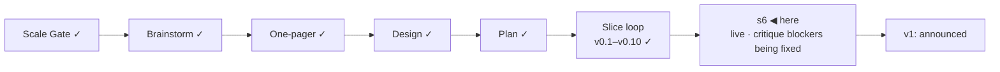

# STATUS — Permit Rulebook

## Where are we

Genesis, slice loop; scale **Product**; **v0.10 shipped**, **s6 "public launch"
mock-green and live at https://permitrulebook.com** (HTTPS enforced,
2026-09-08). The v1-gate isolated critique has run: 32/45, four blockers, fixed and
verified cleared on the live site. v1 is stamped when the blockers are cleared on the live
site and the human's real-green items below are done. Roadmap: v1.1 holds the
14 excluded active routes as "quoted, not asked" pages; 9 further candidates
(5 unversioned). Spine skills at steward-38 (RUBRIC 1.3 adds an Orientation lens; the
site map is now a required record).

## What is happening now

**The critique-and-walk round is built, committed and pushed** (site `2c30584`,
data `bc2ba49`): the four blockers and adjustment 3, the two READMEs
image-first, "§" glossed, the leverage place bug, the buzer slices, the bot
identity, favicon C, `NOTES.md` as pre-history. Deployed (run 34218847195) and **re-read on
https://permitrulebook.com: all four blockers cleared** — the Chancenkarte card
now says "Up to €1,091/month short of the monthly funds this route asks for —
living costs", consistent with its rail and banner; the home page links the
four country pages, the sitemap lists 29 URLs, robots.txt exists, a wrong URL
lands on our own 404 with the identity pair; the data README opens with the
screenshot and links the live site; the favicon is option C; "§ 20a, section
20a" is glossed. The two-axis review of the round found one blocker (the watch's
new rebuild-dispatch step sat between the state commit and the flag-issue
step) and nine should-fix items; all applied, committed (site `a8d50db`, data
`e03649d`), pushed, deployed (run 34222781612; the country pages carry the pair and the
gloss on the live site). The round also gave the site one masthead
source (`identity.ts`), an attribute-escaping gate, and the one-pager's
"answers never leave the device" promise checked in a real browser (proved red
by an injected request, green on the clean build). 397 + 196 tests.

**The navigation is built and pushed** (site `f8737da`, data `d3cbbd7`): the
shared header on every page, country pages to the approved mock, `/data` with
`/status` kept as an alias, no crumbs, the reader's scope words everywhere,
eleven orientation tests. The phone's Back bug went with it: every render had
been pushing a history entry; now one entry per question and the on-screen
Back is the browser's own. Deployed (run 34228597071; the header is on every
live page probed). The two-axis review found one blocker — after
a mid-interview reload the two Backs disagreed again (the screens list is
empty after a reload) — plus sixteen smaller items (gists cut mid-sentence,
"stated" said of our own reading, a loosened "scored" guard, header CSS
leaking from the interview page, duplicated head meta). One more builder
round is running on all of it; it ships when green. **And the footer** (the
human: "düzgünce düzenleyelim") — today it differs page by page; one footer
from the header's source is mocked (`docs/spine/design/s6-footer.html`:
disclaimer · Routes / Do / The data / Feedback · the data line) and is in its
isolated critique; it comes to the human next, then the builder. Then v1
waits only on the checklist below.

Numbers: 397 tests in the data repository, 214 in the site; 122 quotes
verified, `human_tier: 0`; 31 pages + 26 endpoints, 0 tap targets under 44 px
at 390 px; critique 32/45 on RUBRIC 1.2 (v0.7: 27/45).

## What is expected from you

Each of these is yours because it is a real device, a preview renderer, or a
judgement on a live source.

- [x] **Navigation + country page approved** (human, 2026-09-08): shared header,
      no crumbs, new scope words, The data as an on-site page. Building.
- [ ] **Phone walk on the live site, real handset:** https://permitrulebook.com
      — the interview end to end, then one route page from a results card's
      "The rules of this route". *Pass:* nothing overflows sideways, every tap
      target is comfortable, the rail's labels read as a list, the scope
      statement reads without zooming, the address bar shows the lock. *If it
      fails:* paste the screen's heading here. (Two rows you already found —
      the place phrase and "§" — are in the fix round.)
- [x] **Test issue from the product** (human, 2026-09-08): landed on
      `permit-rulebook-data` with the `bug` label — pass; closed.
- [ ] **Favicon on a Mac and on an Android phone** (after the next deploy,
      which ships option C): open https://permitrulebook.com and look at the
      tab icon. *Pass:* "PR" centred in the tilted square with margin both
      sides. *Fail:* letters touching or overflowing the frame — say so and
      the letterforms get outlined to paths.
- [x] **Link preview** (human, 2026-09-08): the route title and the €50,700
      description appear beside the card image — pass.
- [ ] **Tomorrow's card date:** after the daily rebuild lands, paste any route
      link into Slack again. *Pass:* the card reads tomorrow's date under
      "Rules read". *Fail:* yesterday's — the rebuild did not run; tell me.
- [x] **French and Spanish question paths** (human, 2026-09-08): pass — counter
      steady, bands sensible, no offer wording on a transfer. One bug found on
      the way (Back jumping questions) — fixed in the navigation round.
- [x] **GitHub Sponsors** (human, 2026-09-08): profile live at
      https://github.com/sponsors/OytunOnal; the small link sits beside the
      licence in both READMEs; the Sponsor button shows on both repositories.
- [ ] **`DISPATCH_TOKEN` (a credential, so yours):** GitHub → Settings → Developer
      settings → Fine-grained tokens → new token, repository access:
      `permit-rulebook` only, permission Contents: read and write; then on
      `permit-rulebook-data` → Settings → Secrets and variables → Actions → new
      repository secret named `DISPATCH_TOKEN` with that value. *Pass:* the
      next watch run's "dispatch a site rebuild" step is green and a deploy
      run starts in the site repository within a minute. Until then the
      daily 06:40 UTC schedule rebuilds the site anyway; only the same-hour
      rebuild after a data change waits on the token.
- [x] **The watch is live** — it always was: no dry-run switch exists; it has
      filed two issues since the repositories went public (ZAV edition, buzer
      § 6), both read and closed the same day. Watch issues carry
      `source-change`; `bug` is applied at triage if a value proves wrong.
- [ ] **"go":** after the items above pass and the blockers are verified
      cleared on the live site, say it; v1 is stamped and the README's first
      screen is the announcement, told once.

The first 48 hours after "go" (decision 11), written now:
*Watch:* the tracker on `permit-rulebook-data`, the watch's flag issues, the
Show HN thread — every two hours the first day, morning and evening the second.
*Where:* GitHub notifications for both repositories, the watch workflow's run
page, the thread itself; nothing else is instrumented, no analytics at v1.
*Pull the post if:* a reported wrong verdict is confirmed against the source; a
watch flag shows a value on a live page has gone stale; a legal objection to a
quote arrives. Any one of the three: the post comes down first, the fix second.
