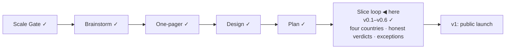

# STATUS — Visa Navigator

## Where are we

Genesis, slice loop; scale **Product**; **v0.6** shipped, with **s5 · s5b · s5c** at mock-green (v0.7 stamps when the human pass lands). 9 candidates on the roadmap (5 unversioned).

## What is happening now

An **isolated product-critique** — the first walk by a session that had not
done the work — found six things on a frozen build, one of them a blocker that
was still live at HEAD: **Dutch amounts rendered with no unit.** A card read
"€5,942" beside a German card reading "45.630 Euro im Jahr"; the same glance
compared a month against a year and was wrong by twelve. The engine knew the
period all along — the field carries it — and every place an amount reached the
screen dropped it. Now the rails read `€4,357/month` and `€45,630/year`, the
tick tooltips carry it, and the source line says `· per month` beside a quote
that never did.

Two more from that run are fixed. A person comparing all four countries used to
get a wall of "Not met: located in France" — a criterion they never answered by
that name, on a fact they had given us; it now reads "5 France routes — you
told us Germany" and collapses to one line. And a zero-result screen that
announced "6 steps would change that" was hiding two of them in collapsed
sections; every section holding a step now opens. A fourth is answered on the
cards: routes with no numeric threshold say so, rather than leaving the
"every value carries its quote and date" promise quietly unmet.

The light critique that preceded it **has had its scores withdrawn**. It did
not walk blind and never opened its own screenshots; a run that breaks its own
conditions publishes findings, not numbers. Its findings stand — and two of its
scores were wrong within the day.

Before that: s5c shipped the passport question as a country (199 issuers, class
carried by `implies`, so no route criterion changed), reduced thresholds as
second paths inside existing routes, two French talent routes, and the
EU–Türkiye rights as a sourced note beside the results. Three review passes
caught what 176 tests could not — Åland and Guadeloupe residents classed as
third-country, an EU membership claim resting on page furniture, and "turkey"
returning "check the spelling".

## What is expected from you

- [ ] **Verify the FR/ES/NL values at their official pages** — `visa-rules/data/verify-s5.md`. Yours because the Spanish thresholds come from a PDF that project policy says a human must read; the europa.eu and EFTA quotes need no VPN.
- [ ] **Verify the s5c additions** — `visa-rules/data/verify-s5c.md`: the reduced Spanish threshold (€33,085.09, PDF tier) and the EEA leg of the passport class.
- [ ] **Walk it on a real phone** — the isolated critique could not resize its viewport, so phone width is un-assessed by it. I measured 390 px through device emulation (no overflow, 54 px rows), but a handset is yours: open the dev server on your phone and run one flow.
- [ ] **Click the two learn links** — Anabin and § 18g — the last open item from s3.
- [ ] **Confirm the two watch-flag verdicts** — nothing is pending; this is your agreement that the buzer flag (our own marker edit) and the IND flag (an unrelated menu item) were closed correctly. `DECISIONS.md`, 2026-09-04.
- [ ] **Open the s6 boundary when you want the launch slice** — I will bring roadmap promotions to it, and the v1 gate's full critique runs in isolation, not by me.
