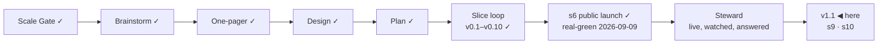

# STATUS — Permit Rulebook

## Where are we

**v1, public and announced** (2026-09-09). Genesis is done: the launch slice's
scenario is real-green, the product is live at https://permitrulebook.com with
23 routes across Germany, France, Spain and the Netherlands, and the
announcement went out on LinkedIn in the human's own words. The project is in
**Steward mode** from here: feedback — a tracker issue, a watch flag, a number
that comes back, a message from a stranger — enters through the steward
protocol, which decides what it is, which promise let it happen, and what to do
about it.

Pace, from the ledger: s5e real-green 2026-09-07, s5f 2026-09-07, s6
2026-09-09, s7 building 2026-09-10 — about one slice a day while the human is
in the loop daily. v1.1 holds two ruled candidates beyond s7; at that pace it
is days, not weeks, but the nationality reads for three more countries sit in
front of it and each is a research day before a build day.

## What is happening now

**The watch has failed every day for five days, and the site says otherwise.**
Found on 2026-09-15 by reading the tracker rather than the ledger. Runs on
2026-09-11, 12, 13, 14 and 15 all ended red (data #18, one issue with four
comments on it), and every one of them failed for the same two sources:

- `es-uge-umbral-pdf` — Spain's salary-threshold PDF, **last read 2026-09-07**
- `es-uge-index` — the UGE requirements page, **last read 2026-09-02**

**And the cause is ours, not theirs** (measured the same day, data #18).
`inclusion.gob.es` returns **403 to the User-Agent the watch identifies itself
with** and **200 to a request that sends none** — reproducibly, from a laptop
and from the CI runner alike, 299,065 and 701,825 bytes in about a second. It
was never a wall and never the runner.

*Correction, and worth keeping:* the first reading of this — written here this
morning — said the pages answer a laptop and refuse the runner. That was wrong,
and avoidably: the laptop check used a bare `fetch` instead of the client that
actually fails. Checking a thing with a different client than the one that
breaks is how a header problem wears a geography costume for five days.

**The fix is a fork, not a patch, and it is yours:** the header is not an
accident — it names the project and links the repository, which is what a daily
reader of public pages should do. Four ways out are written on data #18; the
recommended one keeps the honest identity everywhere it is accepted and records
a per-host exception with this measurement and its date beside it, so the
exception stays visible instead of becoming a silent global change.

**The part that matters is not the failure, it is what the site says while it
fails.** `/data/` reads *"re-read daily — last run 2026-09-15"*, and that
sentence is printed from a state the run commits **before** the unreachable
check fails it. The ordering is deliberate and was right when it was written
("a state that WAS committed still has to reach the site when some other source
was unreachable") — what nobody foresaw is that the footer would turn a partial
run into an unqualified claim. It is true of 42 sources and false of two, and
the two are values on live pages.

**The watch reads Spain again, and the fork was never a fork** (data
`02cee69`, 2026-09-15). You asked what the User-Agent choice traded. It traded
nothing in the end, because the measurement moved: `inclusion.gob.es` objects
to **a URL inside the name**, not to a reader that names itself.

    permit-rulebook-watch/0.1 (+https://github.com/…) change-detection  403
    permit-rulebook-watch/0.1 (+https://github.com/…)                   403
    Mozilla/5.0 (compatible; …; +https://github.com/…)                  403
    permit-rulebook-watch/0.1                                           200, 299,066 bytes
    permit-rulebook-watch                                               200

So the name stays — unique enough to find this repository by — and the address
moves to a header of its own, which the same host serves happily. The other
watched hosts answer the shortened name with 200 too. A test holds the rule
rather than the string: no URL in the name, and the contact still sent.

**Eight days blind, and nothing had moved.** Both Spanish sources read on the
first try afterwards and the salary threshold is **unchanged** since
2026-09-07. The product was wrong to say it had checked; it was not wrong
about the value.

**And the Spanish failure was hiding a second one.** With Spain reading, the
same run reports **four IND pages unreachable** — `slice marker missing: from`
— which is the shell this morning's triage found (data #17): the page no
longer carries the region the slice is cut from. So the watch is still red
tonight, for a different and now-visible reason, and the browser strategy the
gate cleared this afternoon is what answers it.

**s11 is built, and it corrected the spec twice** (branches `s11-site`
`d362184` and `s11-data` `0b3f19f`; **530 + 345 tests**, the root-build
fingerprint unmoved and pinned by a case rather than by luck).

- **The fact was not on disk.** The spec — mine — said a snapshot whose
  `retrieved_at` predates `last_run` went unread, and forbade writing a new
  field. That is false: `retrieved_at` is the day a *reading* was first taken,
  and the unchanged arm keeps it too, so on today's shipped state **39 of 39
  entries look stale and none of them is**. The five-day failure left a
  one-line diff in `state.json`. The run now writes `unread` — a list of
  `{id, url}` computed in one place from the reports the pass already makes,
  empty on a clean day. I asserted the opposite from reading one arm of the
  code; the build measured both.
- **"Two Spanish sources" is one.** The second is a sentinel no dataset value
  cites, and the spec's own rule — a reader is told about values, not about our
  plumbing — drops it. The approved sentence agreed with that and disagreed
  with itself: the date in it, 2026-09-07, is the PDF's; a second source would
  have made it 2026-09-02. So the page says: *"Every source is re-read daily —
  last run 2026-09-15. A Spanish source has not answered since 2026-09-07; the
  values it backs still show that date."* **The count changed after the human
  approved the words, so the sentence goes back to them.**

**Both reviews are in: 14 findings, three of them blockers, all sent back in
one round** (2026-09-15).

- **The sharpest was missed by me and by the Spec axis both.** s11 taught the
  qualification to `/data/` and the footer and left **28 route pages** typing
  *"and a daily check re-reads every source"* into the template
  (`route-page.ts:730` and `:735`, verified by hand). Two surfaces of three.
  `copy.ts` exists to stop exactly that drift.
- **Both axes found the same second one independently:** `--only` keeps a
  source in the unread list after re-reading it, so the documented step for a
  slice change — `npm run watch:sources -- --only=<id>` — would make the page
  say *"has not answered since <the day it was just read>"*. A routine step
  turned into a lie on a live page.
- **The case named for the real state asserts nothing** — both sides of its
  expectation are false today, so it passes on a page that still lies. Its
  replacement may not be written the way its sibling is, by grepping the CLI's
  own source; this project ruled against that on 2026-09-08.

**One finding I answered rather than forwarded.** Spec calls it a blocker that
the shipped `state.json` carries no `unread`, and suggests back-filling the
run of 2026-09-15 by hand. **No:** state is written by a run, never typed —
and since the User-Agent repair a real run reads Spain and reports the four IND
pages instead. The slice closes when the first run after merge writes the list.
What the build owes is that the machinery is provably right, which is the third
blocker.

**Held out of the slice on purpose, and on the roadmap rather than forgotten:**
a route page naming **its own** unread sources instead of the dataset's. Better,
narrower, more useful — and not what s11 owed.

**A working rule I broke three times today and am writing down:** while an
agent is building, the main working trees belong to it and the ledgers are
edited from the `_preview` worktrees, which sit on master. Every slip today —
a mixed diff, a red master, a stale STATUS — came from treating a tree an agent
was writing in as mine.

**A mess of mine, repaired.** `git add -A` ran in a tree the builder was
writing in and swept s11's site half into a ledger commit, which reached master
and broke it: the site imported what the published ruleset does not export yet.
The deploy failed at `astro check`, so **the live site was never touched** — a
failed build publishes nothing — and master is green again (`34fe87c`, deployed
14:35). The work is intact on its own branches. It is the second time today a
working tree was treated as mine while an agent wrote in it; the first cost a
mixed diff, this one a red master.

**The wording chosen, for the record:** (2026-09-15). On a day
when something went unread `/data/` will say: *"Every source is re-read daily —
last run 2026-09-15. Two Spanish sources have not answered since 2026-09-07;
the values they back still show that date."* On a clean day the clause
disappears and the page is byte-identical to today. The scenario is
`docs/spine/scenarios/s11-partial-run.md`, on the branch `partial-run` in both
repositories; the staleness is **derived, not declared** — a snapshot whose
`retrieved_at` predates `last_run` was not read in that run, which is already
on disk because the watch carries an unreachable source's previous reading
forward untouched.

The original shape of the problem, for the record: the state should
record what a run achieved (read, unreachable, and the oldest read date among
them) and the sentence should say it, the way every other claim on this site
carries what it rests on.

**The browser candidate's gate is answered: 2 of 5** (2026-09-15, run on the
runner, `/usr/bin/google-chrome`). Headless Chrome reads **EUR-Lex**
(130,574 characters, the sentence found) and the **IND** (9,816, found); it does
**not** read **Legifrance**, which answers it with a Cloudflare challenge — 270
characters titled "Just a moment…". The runner and a laptop returned the same
five rows, so these walls sort by client, not by address. So the strategy is
worth building, for two sources, and the human tier goes from 2 to 1 rather
than to 0. The measurement lives on the branch `bot-wall` in both repositories
and is meant to be deleted with the decision it informs.

**The Dutch flag is triaged** (data #17, four days late) — and it was not a rule
change. Today's read of the IND page is **7,256 characters of navigation**
against a stored 14,451 with the rules in it: the words that left are
"recognised sponsor", "employment contract", "public register of sponsors", and
the words that arrived are "Skip to main content" and "Open menu". The page did
not change what it requires; it stopped handing this fetcher its body. Nothing
is broken today — the good snapshot stands and quote fidelity passes — and the
issue stays open carrying the argument it makes: the watch refuses an empty 202
since 2026-09-10, and a 200 carrying only chrome is the same failure in a
different status code. **Third bot-wall measured on this project** (Legifrance
403, EUR-Lex empty 202, IND shell), which is what the browser-driven read on
the roadmap is for.

**The original second finding:** The IND highly-skilled-migrant
page — which backs the recognised-sponsor condition, the market-rate
precondition and the ICT statement on both Dutch routes — returned only
navigation to this fetcher today: 7,256 characters of menus, with
"recognised sponsor", "salary" and "€" all absent, where the stored read holds
14,451 characters with the rules in them. Its 2026-09-11 change flag (data #17)
was never triaged. The good snapshot is still in `watch/state.json` and quote
fidelity passes (183 verified, 513 tests green), so nothing is broken today —
but if that shell ever overwrites the snapshot, the Dutch quotes lose the
evidence under them.

**Tracker hygiene:** data #9 and #11 — the Netherlands and France nationality
reads — were still open although s7 and s8 shipped them. Closed, each with what
actually went live.

**Everything else is where it was left.** v1.1 has one slice to go — **s10**,
the CLS defect (site #8). `feedback-line` is still the only branch standing
and still waits on a walk. The roadmap gained three candidates on 2026-09-11
(what a permit leads to · permanent residence · citizenship, bets A16–A19).

What runs without anyone asking:

- **The daily watch** (05:17 UTC) — running, and red for five days.
- **The site's daily rebuild** — working: it has pinned and deployed a fresh
  data commit every day since 2026-09-11 (`c026900` today).
- **The counter** and **the pre-registered numbers** (A2, A7, A8 on 2026-10-09).

## What is expected from you

**The 48-hour window closes 2026-09-11 09:00 (GMT+3)** — the announcement
went out 2026-09-09 around 09:00. Until then the live site is frozen: it is
touched only for a blocker (a wrong verdict confirmed against its source, a
value gone stale on a live page, a legal objection to a quote) — s7 is one, the
CLS fix is not. The three lines, left here until the window closes:

- *Watch:* the counter (visits, entry pages), both trackers, the watch's
  issues, the post's comments.
- *Where:* Cloudflare Web Analytics → permitrulebook.com; `gh issue list` on
  both repositories; the LinkedIn post.
- *Pull if:* a confirmed wrong verdict, a stale live value, or a legal
  objection — fix the value with its history line, let the rebuild land, edit
  the post to say what was wrong and what it says now.

Nothing is blocked on you. These are the things only you can see, when you want
to look:

- [x] **The daily rebuild needs nothing from you.** This list asked you to run
      one by hand if a day passed without one. It was written on a false
      premise: the site's schedule has fired every day, about five hours late
      (11:49 UTC on 2026-09-09, 11:48 on 2026-09-10, both green).

- [x] **The card's quote cap, 10 → 11** (human, 2026-09-10): ratified for
      `nl-hsm-under30`. Twelve would have to be argued again.
- [x] **The human-tier number is 2** (human, 2026-09-10: "tamamdır", after the
      alternatives were laid out). Two of s8's sources ship human-tier with
      their sentences in `verify-s5e.md` and a 90-day re-read. Checked in a
      real browser the same day: both pages open and both sentences are there
      — the limit is this fetcher, not the page. A browser-driven read for
      bot-walled sources is on the roadmap, gated on a headless-Chrome
      measurement from the runner.
- [ ] **Switch on the preview address** (once, ~5 minutes):
      `docs/spine/preview.md` has the six steps — connect Cloudflare Pages to
      `OytunOnal/permit-rulebook`, project name `permit-rulebook`, production
      branch `preview-only` (a branch that does not exist, so this project can
      never publish the live site), build command
      `bash scripts/preview-build.sh`, output `dist`, and two preview
      variables. *Pass:* `feedback-line` builds and
      https://feedback-line.permit-rulebook.pages.dev shows the site with the
      new line at the end of a results screen. *If the build fails:* paste the
      last twenty lines here.
- [x] **s8 walked and merged** (2026-09-10, your word). Live, and walked again
      on the live host afterwards.
- [x] **s9 walked and merged** (2026-09-11, your word). Live, and checked on
      the live host afterwards.
- [x] **Spain's annual ministerial order is read** (2026-09-11, your word:
      *"ispanyayı oku ve okut"*). It opens nothing this year, by two independent
      reads of the BOE text. Recorded, with the date to re-read it: the next
      order, end of December.
- [ ] **Walk `feedback-line`, then say merge** (site #6; this one waits for the
      window to close at 09:00 tomorrow). One line under your results: "Wrong
      about you? A value that does not match its source, or something this
      screen should do — report a wrong value or suggest a change. Both open
      GitHub, where filing needs an account." *Pass:* you would let it sit under
      your own results. *If not:* say what it should say instead.
- [x] **The four country reads are done** (2026-09-10): the Netherlands and
      France produced fixes (s7 is live, s8 waits on your walk), Germany and
      Spain produced findings with dates on them and nothing to change.
- [ ] **A third human-tier source, or not** (your call, and only yours). The
      French employee card's page states the labour-market test in
      service-public's words. The statute's own word for it — CESEDA L414-13,
      « la situation du marché de l'emploi est **opposable** au demandeur » —
      is on Legifrance, which answers this fetcher 403. You ratified the
      human-tier count at **two** this morning; carrying that sentence would
      make it three, with a person re-reading it every 90 days. *Say yes and it
      goes on the page; say no and it stays where it is now — recorded in
      `exclusions.md` with the reason.*
- [ ] **The post's replies.** Anything a reader says that is a bug, a missing
      need or a design flaw is worth pasting here — the steward protocol turns
      it into a fix or a recorded decision, rather than a note that gets lost.
- [ ] **In thirty days (2026-10-09):** the counter's visits from search and
      referrals, whether a stranger has touched the data, and how many domains
      link to it. The numbers that decide A2, A7 and A8 were written before the
      post so they cannot be moved afterwards.
- [ ] **The token expires 2027-09-09** (`DISPATCH_TOKEN`). GitHub e-mails
      first; an expired one turns the watch red and files an issue, so it
      cannot fail quietly.

Ledgers: this file (now), `KANBAN.md` (the board and the versions),
`DECISIONS.md` (why anything is the way it is), `docs/spine/` (the scenario,
the threat model, the architecture, the critiques, the announcement).
