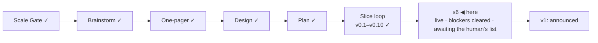

# STATUS — Permit Rulebook

## Where are we

Genesis, slice loop; scale **Product**; **v0.10 shipped**, **s6 "public launch"
mock-green and live at https://permitrulebook.com** (HTTPS enforced,
2026-09-08). Two isolated critiques have run — 32/45 on RUBRIC 1.2, then
36/50 on 1.3 after the rubric grew its Orientation lens — and every blocker
from both is fixed and read on the live site. v1 is stamped when the human's
real-green items below are done. Roadmap: v1.1 holds the 14 excluded active
routes as "quoted, not asked" pages; 9 further candidates (5 unversioned).
Spine skills at steward-41.

## What is happening now

**The build is done and read.** Everything the two critiques and the three
review rounds asked for is on the live site: half-open band labels on the
union ladder, an arrival that re-scopes a saved record and says what is kept
and what the new country still asks, one upward unlock step per numeric
field, headings and one live region on the results, every results control at
the tap floor, the shared header and footer on every page, the amended
disclaimer, the counter, the meta CSP, the translation policy on `/data`,
history entries with a declared reason, both repositories' tests typechecked.
The whole loop — source → history line → commit → rebuild → live page — has
run once for real; the German Blue Card page reads 2026-09-08.

Read live today, after the deploy: the arrival line prints on a country
change and prints nothing when nothing changed. One thing it got wrong was
fixed by reading it rather than testing it — from a country's own page it
said "Starting from France — France is on the record. … France asks 1 more
question."; it now names the country once ("France is on the record now."). All three
cases re-read on the live site after the deploy: a country change prints the
short line, the same country prints nothing, a route arrival still names both
("Starting from EU Blue Card (talent — carte bleue européenne) — France is on
the record.").
Site `0c2d18a`, data `c6d5be3`.

**2026-09-09: the dispatch ran for real, and it found things.** The token the
human made carried a data change to the site in 30 seconds — and the build
failed, twice, on defects only a build against newer data could show: a
"frozen" fingerprint that hashed the watch's last run, and a shallow data
checkout that cannot answer an ancestry question. Both fixed, both now tests.
The day's three watch flags were read: they were our own slice change, not the
law — proved by the new text being a substring of the old — and the gap that
caused them is a test as well. Six flag files resolved, three issues closed.

Since then: the folders were renamed on disk and the manifest, the clone line
and the name sweep followed; a dispatch fired by hand carried the day's data
to the site, so `data.lock` names `bba6dde` and the live page reads **last
run 2026-09-09** — the fast path works end to end. The head gained a 96px icon
(the square a search engine asks for) and a 180px touch icon, after the site
turned up in Chrome's results with no mark beside it.

**Today's scheduled rebuild never fired** (cron 06:40 UTC; nothing by 07:25).
It is the redundant path, not the fast one, and the fast one is proven — but
the sentence "a daily schedule rebuilds even if every signal fails" is only as
true as GitHub's scheduler. If tomorrow's is missing too, that is a decision
to take rather than a line to keep.

The search side, asked about and answered: nothing to do about "keywords"
(the meta tag has been dead for years, and the pages already carry titles,
descriptions with the numbers in them, a sitemap and canonicals). The one
thing missing was structured data — /data now carries schema.org/Dataset, the
vocabulary a dataset index reads, with the licence, coverage, version, read
date and the two JSON downloads. Ranking beyond our own name needs inbound
links and time; that is what the announcement is for.

**Nothing else is waiting on me.** v1 waits on your list below.

Numbers: 426 tests in the data repository, 274 in the site; 122 quotes
verified, `human_tier: 0`; 31 pages + 26 endpoints, 0 tap targets under 44 px
at 390 px; critique 36/50 on RUBRIC 1.3 (1.2 runs: 32/45, and v0.7's 27/45).

## What is expected from you

Each of these is yours because it is a real device, a preview renderer, or a
judgement on a live source.

- [x] **Navigation + country page approved** (human, 2026-09-08): shared header,
      no crumbs, new scope words, The data as an on-site page. Building.
- [x] **Phone walk on the live site, real handset** (human, 2026-09-09:
      "telefon yürüyüşü tamam"): the interview end to end and a route page on a
      real handset — nothing overflows, the taps are comfortable, the lock is
      in the address bar.
- [x] **Test issue from the product** (human, 2026-09-08): landed on
      `permit-rulebook-data` with the `bug` label — pass; closed.
- [x] **Favicon** (human, 2026-09-09: "fav icon tamam"): the stamp reads on
      the tab and on a phone. The deploy of the same day added a 96px square
      (what a search engine asks for) and a 180px touch icon.
- [x] **Link preview** (human, 2026-09-08): the route title and the €50,700
      description appear beside the card image — pass.
- [ ] **Tomorrow's rebuild:** the card's date is the newest read date in the
      dataset and moves only when a value is re-read — not every day. *Pass:*
      `gh run list -R OytunOnal/permit-rulebook --workflow=pages.yml` shows a
      green `schedule` run near 06:40 UTC tomorrow (I check it and tell you).
- [x] **French and Spanish question paths** (human, 2026-09-08): pass — counter
      steady, bands sensible, no offer wording on a transfer. One bug found on
      the way (Back jumping questions) — fixed in the navigation round.
- [x] **GitHub Sponsors** (human, 2026-09-08): profile live at
      https://github.com/sponsors/OytunOnal; the small link sits beside the
      licence in both READMEs; the Sponsor button shows on both repositories.
- [x] **Disclaimer** (human, 2026-09-08: "change"): "…and no authority is bound
      by these results…" — in the footer build, every surface, both READMEs.
- [x] **Search Console and Bing** (human, 2026-09-08): the domain property is
      verified, `sitemap.xml` submitted, indexing requested for the home page
      and a route page ("added to a priority crawl queue"); Bing verified via
      `BingSiteAuth.xml`. Indexing itself takes days — nothing more to do.
- [x] **Traffic counter** (human, 2026-09-08: Cloudflare Web Analytics, manual
      snippet): going in with the current builder round; the data page says what
      is counted; the never-leaves-the-device test names the one allowed beacon.
- [x] **Two-factor authentication** (human, 2026-09-08: "2fa tamam") — GitHub
      and Cloudflare; the human's word is the record, the API cannot see it.
- [x] **`DISPATCH_TOKEN`** (human, 2026-09-09): a fine-grained token scoped to
      the site repository alone (Contents: read and write), stored as an
      Actions secret in `permit-rulebook-data`. Tested the same minute: the
      watch committed `3cf7cbd` (state update 2026-09-09), its "Tell the site
      to rebuild" step is green, and the site repository started a
      `repository_dispatch` build 30 seconds later. The last piece of the
      daily promise — a value read today reaches the page today, not tomorrow.
      **Expires 2027-09-09** (one year, chosen over no-expiry: a leaked
      token stops being a key, and an expired one fails loudly — the watch
      run goes red and files an issue). GitHub e-mails before the date.
- [x] **The watch is live** — it always was: no dry-run switch exists; it has
      filed two issues since the repositories went public (ZAV edition, buzer
      § 6), both read and closed the same day. Watch issues carry
      `source-change`; `bug` is applied at triage if a value proves wrong.
- [x] **Ranking** (human, 2026-09-08: "no rank"): results stay in dataset order
      at v1; a v1.1 candidate adds published facts to each card so the reader
      compares. Translation: policy, never translate.
- [ ] **The announcement — LinkedIn only, for now** (human, 2026-09-09; Show HN
      later): the draft is `docs/spine/announcement.md`, first section — the
      post itself, the image (the README's screenshot), three hashtags, and the
      five answers ready for replies. *Pass:* you would say every sentence
      yourself; change any you would not. Then name a day and an hour you can
      answer comments for the three hours after it.
- [x] **Folder rename on disk** (human, 2026-09-09): `permit-rulebook` and
      `permit-rulebook-data` under Projects. The manifest's `file:` path, the
      README's clone line and the lockfile followed; the name sweep is green in
      both repositories, and the sweep's own stale comments were the last two
      lines carrying the old folder name.
- [ ] **"go":** after the items above pass and the blockers are verified
      cleared on the live site, say it; v1 is stamped and the README's first
      screen is the announcement, told once.

The first 48 hours after "go" (decision 11), written now:
*Watch:* the tracker on `permit-rulebook-data`, the watch's flag issues, the
Show HN thread — every two hours the first day, morning and evening the second.
*Where:* GitHub notifications for both repositories, the watch workflow's run
page, the thread itself, and Cloudflare Web Analytics for page views and
referrers (cookieless; decided 2026-09-08).
*If a reported wrong verdict is confirmed, a flag shows a live value stale, or
a legal objection to a quote arrives:* fix the value (history line, rebuild),
correct the README, post the correction as a top comment in the thread, and
for a legal objection e-mail hn@ycombinator.com — a Show HN thread cannot be
pulled once it has comments, so the response is the correction, in the open.
Expected load: about one watch flag every day or two, each a person's read;
the German thresholds all move on 1 January.
