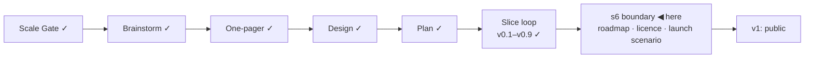

# STATUS — Visa Navigator *(working name; the project is named **Permit Rulebook** from the v1 tag)*

## Where are we

Genesis, slice loop; scale **Product**; **v0.9 shipped** — every sentence
carries its source. **s6 (public launch) is the last slice before v1**, and its
boundary is open. 9 candidates on the roadmap (5 unversioned). Spine skills
reloaded 2026-09-07 at steward-26.

## What is happening now

**v0.9 is stamped.** The human asked whether this session could read the two
PDFs itself instead of handing them over. It could: neither is a scanned image —
both carry a text layer behind embedded fonts, and decoding the glyph tables
yields the full text. All five shipped quotes and the derivation sentence were
found verbatim by string match. The leaflet is "Stand: April 2026", the UGE PDF
"Junio 2026".

That read overturned two things. The Spanish shortage-occupation caveat was
shipped as unsourced on the belief the Orden was a scanned PDF; the UGE PDF
states the conditions in words, and the caveat is being given its quote now.
And "pdf tier — no text snapshot" was a limit of the watch's fetcher, not of
the files — a PDF text strategy is on the backlog with its source.

Twice this project put a source on the human tier because a bare fetch or an
assumption said so — the IND pages yesterday, the PDFs today — and twice it
cost the human a task the session could do. The rule now: before a source goes
on the human tier, try to read it the way a reader would, not the way a fetch
does.

Slices so far: v0.1–v0.9. Tests: 289 in visa-rules, 69 in the navigator.

## What is expected from you

- [ ] **The licence — the last release-gate decision.** Three separate choices,
      because they are three different things and are often confused: the
      **code** (the site and the engine), the **dataset** (the open ruleset
      people will download and cite), and **anything derived from a source with
      its own terms** (official quotes are facts, but a few pages carry their
      own reuse conditions). I will bring the options with what each obliges a
      reuser to do — attribution, share-alike, commercial use, and the
      data-specific ones (CC-BY vs ODbL, and why a code licence on data is a
      mistake). **A pass looks like:** three named licences, or a deliberate
      "same licence for all three" with the reason. **Why it is yours:**
      relicensing after publication needs every contributor's and reuser's
      cooperation; this is decided once. Say when you want the options.
- [ ] **Open the s6 boundary proper.** With v0.9 real-green: the roadmap forks
      (promote / keep / drop, argued risk-first — and five `later` candidates
      have now watched more than three versions ship, so their aging fork is
      due), then the launch scenario, written before any code.

Nothing else is open. The ES shortage caveat's sourcing is with the builder and
needs nothing from you.
