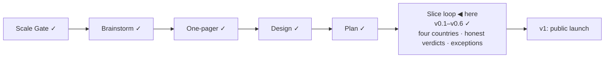

# STATUS — Visa Navigator

## Where are we

Genesis, slice loop; scale **Product**; **v0.6** shipped, with **s5 · s5b · s5c**
at mock-green. 9 candidates on the roadmap (5 unversioned). Spine skills reloaded
2026-09-06 at `steward-17`.

## What is happening now

**The human verification pass is closed — all of it.** Both checklists, 39
items: France and the Netherlands at their official pages, the four BOE
articles, the Spanish salary PDF (the tier no machine here can read, and the
reason this pass was the gate), the four sourced legs of the passport class,
and every learn link clicked. One earlier finding is reversed by it: the Dutch
top-200 mechanic a report called absent is in the source verbatim, two of three
ranking publishers.

Three things came out of that pass rather than into it. The country labels were
CLDR's localisation — "St. Kitts & Nevis", "Congo - Kinshasa", "Hong Kong SAR
China" — and the human chose to hand-write them; twelve now read as the names
people use, every displaced form kept as an alias. Doing that exposed a live
defect: search folded away diacritics but not punctuation, so "Côte d'Ivoire"
was unreachable to anyone typing a straight apostrophe. And the German
shortage-list link had been dead since s3 — not broken, but timing out from
Türkiye, where the first readers are. It now points at buzer.de, and learn links
have joined the coverage gate through a new liveness-only watch tier.

**visa-navigator is a working name.** It was the folder's name and became the
repo's; nobody chose it. The name gate is the first fork of the s6 boundary,
because after launch a domain, GitHub URLs, inbound links and an HN post all
depend on it.

184 tests green, `astro check` clean, ARCHITECTURE.md redrawn.

## What is expected from you

- [ ] **Open the s6 boundary session — say "s6" and I will run it.** It is the
      only thing left. **What happens:** we walk the s5 / s5b / s5c acceptance
      scenarios together (that is what turns them real-green and stamps v0.7),
      then you take two forks — the **name** and the **dataset licence** — and
      I bring the roadmap's candidates for promote/keep/drop. **A pass looks
      like:** three scenarios walked, both forks decided, the s6 scenario
      written and approved before any code. **Why it is yours:** every one of
      those is a gate — a choice with consequences that outlive the slice —
      and gates belong to the human, not to me. Nothing is blocked on you
      technically; the build is green and the data is verified.

Nothing else is open. The phone walk moved into s6 at your call: it runs on the
deploy preview, sequenced before any announcement.
