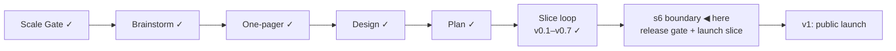

# STATUS — Visa Navigator

## Where are we

Genesis, slice loop; scale **Product**; **v0.7 shipped** — s5 · s5b · s5c are
real-green. **s6 (public launch) is the last slice before v1.** 9 candidates on
the roadmap (5 unversioned). Spine skills reloaded 2026-09-06 at the
release-gate revision.

## What is happening now

**v0.7 is stamped.** Two gates cleared on the same day: the human verified all
39 checklist values at their official sources — France, the Netherlands, the
four BOE articles, the Spanish salary PDF that no machine here can read, the
four sourced legs of the free-movement class — and then walked the acceptance
scenarios on the live product and confirmed they hold. Four countries, 23
routes, honest verdicts, exceptions.

**The s6 boundary is open, and it is the release gate.** Three forks wait for
you, in this order:

1. **The name.** Round 1 is done: four `analyst` agents on Opus, one per
   direction, each blind to the others, produced 47 candidates with their
   graveyards (`docs/spine/naming.md`). All four independently found that
   `visa-navigator` is not merely unchosen but *wrong* — this product answers
   questions about work and residence permits, and a visa is a different
   instrument. Your fork is which directions are alive; rounds 2 (deep critique
   in a fresh context) and 3 (real availability lookups) run only on those.
2. **The licence** — separately for the code, the dataset, and anything derived
   from a source with its own terms. Relicensing after publication needs every
   contributor's and reuser's cooperation, which is why it is decided here.
3. **The roadmap** — promotions, keeps and drops, argued risk-first. Five
   candidates have watched three versions ship without being versioned, so
   their aging fork is due at this session too.

Owed by me before s6 ships, and started rather than filed: **a full
product-critique walk of v0.7**, because the cadence gives every stamped version
one. The v1 gate's walk runs in isolation via the critique agent; this one does
not, because v0.7 does not reach real users.

184 tests green, `astro check` clean, ARCHITECTURE.md redrawn.

## What is expected from you

- [ ] **Say which naming directions are alive and which are dead.** The four
      are: **the tool** (Gapcheck · Test Fit · Rulecheck), **the dataset**
      (Work Permit Sourcebook · Register · Almanac), **the promise** (Verbatim ·
      Footnote · Says Who), **the invented word** (Tesera · Erga · Idonea).
      Each direction's honest ceiling is written out in `docs/spine/naming.md` —
      read that if you want the argument rather than the shortlist. **A pass
      looks like:** two or three directions named live, the rest named dead, so
      rounds 2 and 3 have a smaller space to work in. Killing a direction
      outright is a good answer; so is "none of these, go wider". **Why it is
      yours:** people know what they want when they see options, not when asked
      to constrain a space they have not seen — and the name is the one decision
      here that is expensive to unmake after launch.
