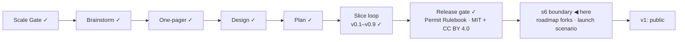

# STATUS — Visa Navigator *(working name; the project is named **Permit Rulebook** from the v1 tag)*

## Where are we

Genesis, slice loop; scale **Product**; **v0.9 shipped**. **The release gate is
closed** — name and licence both decided. **s6 (public launch) is the last
slice before v1**, and its boundary session is the next thing that happens.
9 candidates on the roadmap (5 unversioned). Spine skills reloaded 2026-09-07
at steward-26.

## What is happening now

**The licence is decided and the files exist.** Code MIT in both repositories;
the dataset CC BY 4.0, with an attribution line and a statement of what the
licence does not cover; a NOTICE carrying the Unicode CLDR attribution that
countries.json owes and the terms known to apply to the official texts behind
every quote. The README had said "MIT / CC-BY-4.0" since an agent wrote it —
nobody had chosen. Now chosen, with the costs written into DECISIONS.

**The Spanish shortage caveat has its quote.** It shipped as unsourced on the
belief the Orden was a scanned PDF; the UGE salary PDF states the conditions in
words, read from its text layer. `declared_unsourced` is 0. The source also
settled the institution question in favour of what was modelled, and narrowed
the caveat's plain English to what the PDF says: shortage occupations within
CNO-2011 groups 1 and 2, not the list at large.

Tests: 289 in visa-rules, 69 in the navigator. Every value and every sentence a
card can render carries its source or is declared ours.

## What is expected from you

- [ ] **Say "s6" to open the boundary session.** It is the only thing left
      before the launch slice, and it is a gate conversation, not a task. What
      happens, in order: (1) the roadmap forks — I bring each candidate with a
      promote / keep / drop argument, risk-first, and five `later` candidates
      have now watched more than three versions ship, so each gets an explicit
      keep / version / drop rather than rolling over; (2) the s6 acceptance
      scenario, written in human language with its edge cases before any code,
      for your approval; (3) the deferral check — the riskiest backlog item
      (`es-highly-qualified` fails people Spain would pass) is a back-edge
      candidate and must be chosen for or against, not skipped. **Why it is
      yours:** every one of those is a choice with consequences that outlive
      the slice.
- [ ] **One line, optional:** the copyright holder in the three LICENSE files
      reads "Oytun", the git author. If you want the full name there before
      the repositories go public, say so — it is a one-line change in each.

Nothing else is open.
