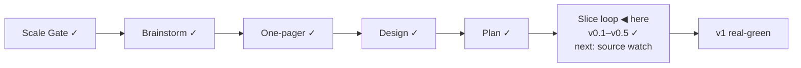

# STATUS — Visa Navigator

## Where are we

Genesis, slice loop; scale **Product**; current version **v0.5 — generalized leverage analysis** (see KANBAN `## versions`).

## What is happening now

steward-3 skill update adopted: everything on disk is English from now on (living ledgers translated; historical docs queued in backlog), scenarios must carry edge-profile lines and named invariants, tdd + code-review are mandatory slice exits. The property-test suite (2,900 seeded-random profiles, 4 invariants incl. recommendation soundness+completeness) is green — 51 tests. The boundary session for **"Source watch + change flag"** (s4) — the riskiest remaining slice, deferred three times, now entered — is open: scenario drafted under the new rules (edge lines, invariants, DE-source spike; no new screen, so no mock).

## What is expected from you

Approve the s4 scenario 🛑 (presented in chat). Also still open: click-check the two learn links (Anabin + § 18g) to close s3's last de-mock item.
