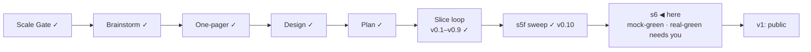

# STATUS — Visa Navigator *(working name; the project is named **Permit Rulebook** from the v1 tag)*

## Where are we

Genesis, slice loop; scale **Product**; **v0.10 shipped** (s5f real-green
2026-09-07, walked by the session at the human's delegation). The release
gate is closed; the identity is closed. **s6 (public launch) is mock-green** (re-stamped 2026-09-07
after the surface walk); real-green is the human's, below.
Spine skills reloaded 2026-09-07 at steward-29.

## What is happening now

**s6 is mock-green — the second time, after a walk, not a count.** The
first stamp was withdrawn within the hour: the interview rendered nothing in
a browser because a review-round module read `node:fs` at import and reached
the client bundle. Fixed, with a real-browser smoke test on both the dev and
the built surface, gated in CI, and an import-graph guard in the data package
that names the importer of any Node built-in. Then walked here: first
question, a persisted record, results with the scope line, a route page at
desktop and 390 px, the call to action pre-scoping the interview, the social
card, the footer links. Console errors: 0. Everything on disk is
built and committed in both
repositories (see git log, 2026-09-08): 23 route pages generated from the
dataset, the name sweep, the identity, the social card, the Pages workflow,
the contributor files, six invariants as tests. The review round found what
the build's green could not — a name gate that inspected none of the new
files, an escaper that let a quotation mark out of an attribute, a dead half
of an invariant — and the scope value stopped being one constant (22 / 1 / 0).
Nothing is on GitHub yet: the repositories still carry the old names, Pages
is off, no domain is bound. The daily watch still dry-runs.

Numbers: 351 tests in the data repository, 135 in the site; 122 quotes
verified, `human_tier: 0`; 25 pages, 0 tap targets under 44 px at 390 px.

## What is expected from you

Real-green, in this order. Each is yours because it is a GitHub account
action, a real device, or a judgement on a live source.

- [x] **1 · Renamed** (session, 2026-09-08): `permit-rulebook`, `permit-rulebook-data`;
      remotes repointed; both pushed.
- [x] **2 · Public** (human, 2026-09-08): both repositories public; Pages enabled
      (GitHub Actions source) at https://oytunonal.github.io/permit-rulebook/;
      `SITE_URL` set to it. Deploy re-run in progress; the site must still learn
      to live under the `/permit-rulebook/` subpath (builder) unless a domain
      is bound first.
- [x] **2b · The first sentinel flag, read** (session, at the human's word,
      2026-09-08): "Ausgabe 05/2026" is a regional issue about Kassel — no
      threshold, amount, law or date of effect; no value moved; resolved on the
      flag file. The FR flag of 09-05 was a false alarm (opening-hours widget),
      the slice is bounded to the fiche's accordions now.
- [x] **3 · Labels** (session, at the human's word, 2026-09-08): `bug`,
      `design-flaw`, `new-need` on `permit-rulebook-data`, in the token colours;
      the three templates carry them. Still yours to see once: one test issue
      from a route page's "Report a wrong value" lands labelled.
- [x] **4 · Live over HTTPS** (2026-09-08): https://permitrulebook.com —
      certificate issued (apex + www, to 2026-12-07), HTTPS enforced, the Pages
      URL redirects there. `SITE_URL` is the domain.
- [ ] **5 · Phone walk on the live site, real handset** (https://permitrulebook.com): the interview end to
      end and one route page. *Pass:* nothing overflows, every tap target is
      comfortable, the rail's labels read as a list, the scope statement reads
      without zooming.
- [ ] **6 · The watch goes live:** say "watch live" and I switch the daily
      workflow from dry-run to filing issues. *Pass:* the first real flag
      becomes an issue; you read the flagged source against the quote; the
      outcome goes in DECISIONS.
- [ ] **7 · Sponsors (optional):** enable GitHub Sponsors; then I add the
      small link beside the licence in both READMEs.
- [ ] **8 · `NOTES.md`:** Turkish design notes from before Genesis, titled
      with the old name. Keep as pre-history (excluded from the name gate),
      move under `docs/spine`, or delete — one word.
- [ ] **9 · The go:** after 1–6 pass and the isolated critique (which I run on
      the preview after step 2) has no open blocker, say "go" and the
      announcement text — the README's first screen, told once — is yours to
      post.
- [ ] **One line, optional:** the copyright holder in the three LICENSE files
      reads "Oytun", the git author.

Nothing else is open.
