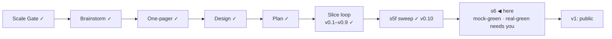

# STATUS — Visa Navigator *(working name; the project is named **Permit Rulebook** from the v1 tag)*

## Where are we

Genesis, slice loop; scale **Product**; **v0.10 shipped** (s5f real-green
2026-09-07, walked by the session at the human's delegation). The release
gate is closed; the identity is closed. **s6 (public launch) is mock-green** — built,
reviewed on both axes, fixes applied; real-green is the human's, below.
Spine skills reloaded 2026-09-07 at steward-29.

## What is happening now

**s6 is mock-green.** Everything on disk is built and committed in both
repositories (`b5e8ec3`, `87d12b1`): 23 route pages generated from the
dataset, the name sweep, the identity, the social card, the Pages workflow,
the contributor files, six invariants as tests. The review round found what
the build's green could not — a name gate that inspected none of the new
files, an escaper that let a quotation mark out of an attribute, a dead half
of an invariant — and the scope value stopped being one constant (22 / 1 / 0).
Nothing is on GitHub yet: the repositories still carry the old names, Pages
is off, no domain is bound. The daily watch still dry-runs.

Numbers: 338 tests in the data repository, 111 in the site; 120 quotes
verified, `human_tier: 0`; 25 pages, 0 tap targets under 44 px at 390 px.

## What is expected from you

Real-green, in this order. Each is yours because it is a GitHub account
action, a real device, or a judgement on a live source.

- [ ] **1 · Rename the repositories on GitHub:** `visa-navigator` →
      `permit-rulebook`, `visa-rules` → `permit-rulebook-data`. Do not rename
      the folders on disk. *Pass:* the old URLs redirect; `git remote -v` in
      both folders still fetches without editing.
- [ ] **2 · Turn Pages on:** `permit-rulebook` → Settings → Pages → Source:
      **GitHub Actions**. Then push both repositories (I will push on your
      word, or you do). *Pass:* the `deploy` workflow reaches its last step and
      prints a preview URL; the `measure:taps` step prints 25 lines and
      "0 with a problem".
- [ ] **3 · Labels on `permit-rulebook-data`:** create `bug`, `design-flaw`,
      `new-need`. *Pass:* "New issue" shows the three templates; one test issue
      filed from a route page's "Report a wrong value" lands labelled.
- [ ] **4 · Domain (optional at v1):** bind it under Pages, then set the
      repository variable `SITE_URL` to it and redeploy. *Pass:* view-source on
      a route page shows `canonical` and `og:url` on that domain. Without a
      domain the site lives at the Pages URL and `SITE_URL` must be set to
      that URL instead — say which and I set it.
- [ ] **5 · Phone walk on the preview, real handset:** the interview end to
      end and one route page. *Pass:* nothing overflows, every tap target is
      comfortable, the rail's labels read as a list, the scope statement reads
      without zooming.
- [ ] **6 · The watch goes live:** say "watch live" and I switch the daily
      workflow from dry-run to filing issues. *Pass:* the first real flag
      becomes an issue; you read the flagged source against the quote; the
      outcome goes in DECISIONS.
- [ ] **7 · Sponsors (optional):** enable GitHub Sponsors; then I add the
      small link beside the licence in both READMEs.
- [ ] **8 · `NOTES.md`:** Turkish design notes from before Genesis, titled
      with the old name. Keep as pre-history (excluded from the name gate),
      move under `docs/spine`, or delete — one word.
- [ ] **9 · The go:** after 1–6 pass and the isolated critique (which I run on
      the preview after step 2) has no open blocker, say "go" and the
      announcement text — the README's first screen, told once — is yours to
      post.
- [ ] **One line, optional:** the copyright holder in the three LICENSE files
      reads "Oytun", the git author.

Nothing else is open.
