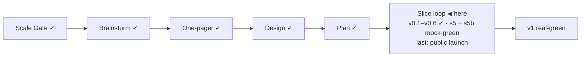

# STATUS — Visa Navigator

## Where are we

Genesis, slice loop; scale **Product**; **v0.6** shipped, with **s5 (four countries)** and **s5b (honest verdicts)** both at mock-green — v0.7 stamps when the human pass lands.

## What is happening now

**The product was walked as a product, and it answered back.** The first
`product-critique` run (four personas + a hostile walk, every control
operated) scored 29/40 on RUBRIC 1.1 and found two blockers: an EU passport
ended on a rejection screen ("0 routes look open · Not met: citizenship ×8")
when the true answer is free movement, and cards said "Criteria met" on
preconditions the interview never asks — for a nurse, the missing BIG
registration. You picked **apply all**, and slice s5b delivered it: notices as
provenanced data (the EU screen is now a sourced "No work permit needed"),
preconditions declared on every card, zero-open results that lead with the
steps that would change them, learn links only where the unknown still binds,
sixteen "Not met: situation" rows collapsed into per-country groups that name
the steps they actually ask for, and money that always says /month or /year.

Built by the `spine:builder` agent test-first (113 engine tests, no mocks
born), then reviewed here: six findings, each verified on the running page
before it was fixed — including a bounded gap that lost its field inside a
disjunction and printed "Gap: up to €2,490 — ." on the NL ICT card. Two
tracker issues carry the deferred polish (#1 contrast, #2 question count).

## What is expected from you

**Real-green needs your two passes** 🛑: (1) the VPN verification checklist
`visa-rules/data/verify-s5.md` — every FR/ES/NL value against its official
page (the ES thresholds come from a PDF the policy says a human must read);
the europa.eu notice quote needs no VPN. (2) An interactive browser run on
http://localhost:4321 — happy path, weak profile, Back/restart, country
sections, and the EU-passport screen. Also still open: the s3 learn-link
click-check (Anabin + § 18g), and a human read of the `nl-ind-work-index`
watch flag in `visa-rules/watch/flags/`.
