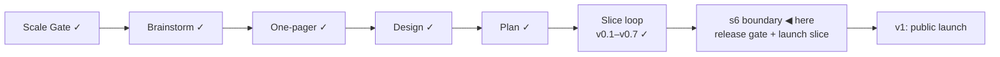

# STATUS — Visa Navigator

## Where are we

Genesis, slice loop; scale **Product**; **v0.7 shipped** — s5 · s5b · s5c are
real-green. **s6 (public launch) is the last slice before v1.** 9 candidates on
the roadmap (5 unversioned). Spine skills reloaded 2026-09-06 at the
release-gate revision.

## What is happening now

**v0.7 is stamped.** Two gates cleared on the same day: the human verified all
39 checklist values at their official sources — France, the Netherlands, the
four BOE articles, the Spanish salary PDF that no machine here can read, the
four sourced legs of the free-movement class — and then walked the acceptance
scenarios on the live product and confirmed they hold. Four countries, 23
routes, honest verdicts, exceptions.

**The s6 boundary is open, and it is the release gate.** Three forks wait for
you, in this order:

1. **The name.** Round 1 is done: four `analyst` agents on Opus, one per
   direction, each blind to the others, produced 47 candidates with their
   graveyards (`docs/spine/naming.md`). All four independently found that
   `visa-navigator` is not merely unchosen but *wrong* — this product answers
   questions about work and residence permits, and a visa is a different
   instrument. Your fork is which directions are alive; rounds 2 (deep critique
   in a fresh context) and 3 (real availability lookups) run only on those.
2. **The licence** — separately for the code, the dataset, and anything derived
   from a source with its own terms. Relicensing after publication needs every
   contributor's and reuser's cooperation, which is why it is decided here.
3. **The roadmap** — promotions, keeps and drops, argued risk-first. Five
   candidates have watched three versions ship without being versioned, so
   their aging fork is due at this session too.

**v0.7's full walk ran in isolation and found four blockers** — the critique
agent, not this session, because a scorer must not grade its own repairs
(`docs/spine/critiques/2026-09-06-product-critique-v0.7.md`, RUBRIC 1.2,
27/45). One of them is a wrong-verdict bug I confirmed in the data: the
country-less question "did you graduate… in the last 3 years?" gates the Dutch
reduced salary criterion, but the IND's own third case requires the applicant to
*meet the orientation-year requirements* — which is where the Dutch-or-designated
institution restriction lives. The product already ships the strict wording one
screen away. Blockers must clear before v1; none of them is a launch-slice task.

184 tests green, `astro check` clean, ARCHITECTURE.md redrawn.

## What is expected from you

- [ ] **One name or two?** Round 2 surfaced this before the shortlist can settle.
      Either the corpus carries the name and the site becomes "the ⟨name⟩ — check
      yours" (**Permit Index**, **Permit Source Index**, **Permit Watch** — Watch
      only works this way, it hosts no verb), or one name does both jobs
      (**Permit Lookup**, **Permit Rulebook**, **Permit Criteria**). **A pass
      looks like:** "one name" or "two names". **Why it is yours:** it is a
      product decision about how the thing is presented, not an analysis result —
      and it changes which candidates survive to the critique round.
- [ ] **Pick the critique adjustments** — 1, 2, 3, or "apply all". They are laid
      out in the message and in the report; 1 and 2 between them close all four
      blockers.
- [ ] **Check one link destination.** On the German Blue Card card the quote line
      reads *"mind. 45.630 Euro im Jahr 2026" · arbeitsagentur.de · 45% BBG ·
      § 6 BeschV · read 2026-09-02*, but "Official page ↗" beside it goes to
      `https://www.bamf.de/EN/Themen/MigrationAufenthalt/ZuwandererDrittstaaten/Arbeit/FachkraefteOhneAusbildung/fachkraefte-ohne-ausbildung-node.html`.
      **A pass looks like:** that German sentence is on the linked page. If it is
      not, the card is pointing at a route overview while claiming it is the
      quote's source, and I will split the two links. **Why it is yours:** the
      critique agent had no outbound network, and bamf.de refuses connections
      from here — it is one of the German hosts that answers you and not us.
