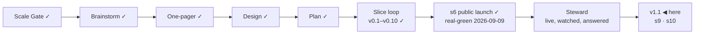

# STATUS — Permit Rulebook

## Where are we

**v1, public and announced** (2026-09-09). Genesis is done: the launch slice's
scenario is real-green, the product is live at https://permitrulebook.com with
23 routes across Germany, France, Spain and the Netherlands, and the
announcement went out on LinkedIn in the human's own words. The project is in
**Steward mode** from here: feedback — a tracker issue, a watch flag, a number
that comes back, a message from a stranger — enters through the steward
protocol, which decides what it is, which promise let it happen, and what to do
about it.

Pace, from the ledger: s5e real-green 2026-09-07, s5f 2026-09-07, s6
2026-09-09, s7 building 2026-09-10 — about one slice a day while the human is
in the loop daily. v1.1 holds two ruled candidates beyond s7; at that pace it
is days, not weeks, but the nationality reads for three more countries sit in
front of it and each is a research day before a build day.

## What is happening now

**s9 is live** (2026-09-11, on your word: *"s9 merge"*). Site `28abe56`, data
`29fde08`, 513 + 336 tests, deploy green in 2m44s, checked on the live host
after it landed: all five new pages answer, `/data/` says *"23 routes scored
against your answers and 5 quoted and dated but not scored"*, the France page
heads *"France: 5 routes scored, 1 quoted"* with its call to action centred.

Five permits the interview does not ask about now carry their rules in the
authority's words, dated and watched, under the third scope value — **quoted
and dated · not scored**, which the dataset had held since s6 and never used.
Each says why it cannot be scored, in a sentence written for it: a labour
market « opposable au demandeur »; a catalogue republished quarterly per
region; five judgements the German statute hands to the local chambers; a
refusal UWV writes on the employer's effort; an income floor reset every year.

**The branches are tidied.** s8 and s9 are merged and their branches are gone
from both repositories, along with a stub that had held nothing but an old
`data.lock` line. The preview worktrees sit on master, so
http://localhost:4500 serves what is live until the next slice takes them.
**One branch is still standing and it is not mine to merge:** `feedback-line`
(site #6, `20681e6`) — one line under the results screen, built and waiting on
your walk since the launch window, which closed this morning.

**The board is empty between slices.** v1.1 opened with two: s9 is done, **s10
is not started** — the CLS defect the counter found (poor for 23% of samples;
`#app` 0.402, the footer 0.414, against a 0.25 threshold, while LCP and INP
are good for 100%). It is the last thing v1.1 needs before it can be stamped.

**Two slices shipped in two days, both on your word.** Built on a branch,
reviewed on two axes, walked by you on a local preview, merged. Neither went
live because a build went green. What that bought: four findings caught before
the deploy rather than after — "criteria met" over a contested route, four URLs
that had moved, a heading mixing numerals with words, and a stamp touching the
header rule.

**Your question about Spain is answered, all three parts of it** (data #16,
`docs/spine/research-05-job-search-routes.md`, rows in `data/exclusions.md`).

- **Spain does have the thing** — RD 1155/2024 arts. 43–45, twelve months in
  Spain to look for work, from abroad, becoming a work authorisation when a
  contract is signed. **And this year it is open to nobody.** It is switched on
  only by the annual collective-recruitment order, and the one in force for
  2026 (Orden ISM/1547/2025) names nothing: every mention of *búsqueda de
  empleo* in it is the same unexercised *« podrá establecer un número de
  visados »*, no annex carries a list or a figure, and the previous order reads
  the same. Zero for descendants of Spaniards, zero for occupations. Read
  twice, by two readers, against the BOE's own text.
- **France's card exists and no reader arriving from abroad can use it** — the
  only branch reachable from outside the country wants the French diploma
  already in hand.
- **Spain's student route is the same shape** — twenty-four months after a
  degree finished in Spain, applied for from inside Spain.

All three are rows now, each with the authority's sentence and the day it was
read. The Spanish one carries something the others do not: **a date on which
its answer can change.** The next annual order is published at the end of
December, and that row says to re-read it then — it is the only line in that
file whose "no" has an expiry.

**A candidate that falls out of this, not taken:** the product could say to a
Spanish jobseeker what it now knows — that a job-search visa exists in Spanish
law and no order opens it this year. Today they see silence. That is a slice,
not a fix, and it waits for a boundary.

One thing measured on the way: the French fiche was put on the watchlist and
taken back off. The watch covers sources the **dataset** uses, and the coverage
gate calls anything else an orphan — a source quoted only in `exclusions.md`
carries its read date in the prose instead. Tried, measured, reverted.

**Also open, from the passport sweep** (data #15): the free-movement notice
claims Iceland, Liechtenstein, Norway and Switzerland, and the only sentence
under it is about EU nationals. The claim is right; the evidence is not
evidence for it. Not a live blocker — no verdict is wrong, no value is stale.

What runs without anyone asking:

- **The daily watch** (05:17 UTC, data repository) re-reads every source, files
  an issue for each change and tells the site to rebuild.
- **The site's daily rebuild** (06:40 UTC nominal, ~11:48 in practice) is the
  redundant path, and it is working — it has fired every day since 2026-09-09.
- **The counter** (Cloudflare Web Analytics) records one view per page load and
  nothing about the reader.
- **The pre-registered numbers** in `docs/spine/assumptions.md` decide A2, A7
  and A8 thirty days after the announcement — 2026-10-09.

## What is expected from you

**The 48-hour window closes 2026-09-11 09:00 (GMT+3)** — the announcement
went out 2026-09-09 around 09:00. Until then the live site is frozen: it is
touched only for a blocker (a wrong verdict confirmed against its source, a
value gone stale on a live page, a legal objection to a quote) — s7 is one, the
CLS fix is not. The three lines, left here until the window closes:

- *Watch:* the counter (visits, entry pages), both trackers, the watch's
  issues, the post's comments.
- *Where:* Cloudflare Web Analytics → permitrulebook.com; `gh issue list` on
  both repositories; the LinkedIn post.
- *Pull if:* a confirmed wrong verdict, a stale live value, or a legal
  objection — fix the value with its history line, let the rebuild land, edit
  the post to say what was wrong and what it says now.

Nothing is blocked on you. These are the things only you can see, when you want
to look:

- [x] **The daily rebuild needs nothing from you.** This list asked you to run
      one by hand if a day passed without one. It was written on a false
      premise: the site's schedule has fired every day, about five hours late
      (11:49 UTC on 2026-09-09, 11:48 on 2026-09-10, both green).

- [x] **The card's quote cap, 10 → 11** (human, 2026-09-10): ratified for
      `nl-hsm-under30`. Twelve would have to be argued again.
- [x] **The human-tier number is 2** (human, 2026-09-10: "tamamdır", after the
      alternatives were laid out). Two of s8's sources ship human-tier with
      their sentences in `verify-s5e.md` and a 90-day re-read. Checked in a
      real browser the same day: both pages open and both sentences are there
      — the limit is this fetcher, not the page. A browser-driven read for
      bot-walled sources is on the roadmap, gated on a headless-Chrome
      measurement from the runner.
- [ ] **Switch on the preview address** (once, ~5 minutes):
      `docs/spine/preview.md` has the six steps — connect Cloudflare Pages to
      `OytunOnal/permit-rulebook`, project name `permit-rulebook`, production
      branch `preview-only` (a branch that does not exist, so this project can
      never publish the live site), build command
      `bash scripts/preview-build.sh`, output `dist`, and two preview
      variables. *Pass:* `feedback-line` builds and
      https://feedback-line.permit-rulebook.pages.dev shows the site with the
      new line at the end of a results screen. *If the build fails:* paste the
      last twenty lines here.
- [x] **s8 walked and merged** (2026-09-10, your word). Live, and walked again
      on the live host afterwards.
- [x] **s9 walked and merged** (2026-09-11, your word). Live, and checked on
      the live host afterwards.
- [x] **Spain's annual ministerial order is read** (2026-09-11, your word:
      *"ispanyayı oku ve okut"*). It opens nothing this year, by two independent
      reads of the BOE text. Recorded, with the date to re-read it: the next
      order, end of December.
- [ ] **Walk `feedback-line`, then say merge** (site #6; this one waits for the
      window to close at 09:00 tomorrow). One line under your results: "Wrong
      about you? A value that does not match its source, or something this
      screen should do — report a wrong value or suggest a change. Both open
      GitHub, where filing needs an account." *Pass:* you would let it sit under
      your own results. *If not:* say what it should say instead.
- [x] **The four country reads are done** (2026-09-10): the Netherlands and
      France produced fixes (s7 is live, s8 waits on your walk), Germany and
      Spain produced findings with dates on them and nothing to change.
- [ ] **A third human-tier source, or not** (your call, and only yours). The
      French employee card's page states the labour-market test in
      service-public's words. The statute's own word for it — CESEDA L414-13,
      « la situation du marché de l'emploi est **opposable** au demandeur » —
      is on Legifrance, which answers this fetcher 403. You ratified the
      human-tier count at **two** this morning; carrying that sentence would
      make it three, with a person re-reading it every 90 days. *Say yes and it
      goes on the page; say no and it stays where it is now — recorded in
      `exclusions.md` with the reason.*
- [ ] **The post's replies.** Anything a reader says that is a bug, a missing
      need or a design flaw is worth pasting here — the steward protocol turns
      it into a fix or a recorded decision, rather than a note that gets lost.
- [ ] **In thirty days (2026-10-09):** the counter's visits from search and
      referrals, whether a stranger has touched the data, and how many domains
      link to it. The numbers that decide A2, A7 and A8 were written before the
      post so they cannot be moved afterwards.
- [ ] **The token expires 2027-09-09** (`DISPATCH_TOKEN`). GitHub e-mails
      first; an expired one turns the watch red and files an issue, so it
      cannot fail quietly.

Ledgers: this file (now), `KANBAN.md` (the board and the versions),
`DECISIONS.md` (why anything is the way it is), `docs/spine/` (the scenario,
the threat model, the architecture, the critiques, the announcement).
