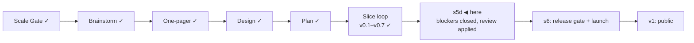

# STATUS — Visa Navigator *(working name; the project is named **Permit Rulebook** from the v1 tag)*

## Where are we

Genesis, slice loop; scale **Product**; **v0.7 shipped**. **s5d** — the slice
that closes the v0.7 critique's four blockers — is built and reviewed, awaiting
the human's scenario walk. **s6 (public launch) is the last slice before v1.**
9 candidates on the roadmap (5 unversioned). Spine skills reloaded 2026-09-07 at
the reviewer-agent revision.

## What is happening now

**The name gate is closed: the project is *Permit Rulebook*, one name.** Two
cycles, six generator passes, two critiques and an availability round produced
59 buried candidates with their reasons (`docs/spine/naming.md`), and the honest
result was that nothing beat the name already on the table. The reset's
apparent convergence on *rulebook* was contamination — this session had put the
benchmark into every generator's brief — but the first cycle had run some
twenty-five head nouns with no benchmark at all, and *rulebook* won there on
reader comprehension. The rename happens at the v1 tag, not before: nothing is
public, so it buys nothing today.

**s5d is built and reviewed.** The builder closed the four blockers; two
`reviewer` agents then read the diff on separate axes and returned ten findings
— worst on Standards, `outgrown` displacing the glossary's fixed term *Moot
criterion* across two repos; worst on Spec, the "a screen that has compared
nothing claims nothing" invariant testing a pure function rather than the reset
and edit paths the scenario names. All ten went back. Two carry a deliberate
escape hatch: where no honest automated check exists at that layer, the builder
records the gap and names the compensating surface check rather than leaving a
guard that can be silenced by rewording.

Independently verified clean by the Spec reviewer: the Dutch reduced-threshold
correctness fix, Spain deliberately untouched with its unverified scope noted,
the excluded orientation-year limbs written in both places, and the acceptance
scenario itself unedited after approval.

## What is expected from you

- [ ] **Walk s5d on the live product** once the review fixes land — I will say
      when. `http://localhost:4321`. Five things, each a blocker this slice
      closes: type `niger`, press ↓ once, press Enter — **the country recorded
      must be the one that was highlighted**, and the next screen must name it ·
      a 27-year-old with a Dutch offer at €3,500/month and a degree from an
      institution that is neither Dutch nor IND-designated must be measured
      against **€4,357**, not €3,122 · every "not met" line must read as a
      sentence, with no lowercase identifier in it · after "Start over",
      question 1 must claim nothing about answers given or values compared ·
      and after "Start over", a **reload** must begin at question 1, not restore
      the old answers. **Why it is yours:** real-green is a person reading the
      screens as prose; two of these four blockers were invisible to the tests
      that were passing at the time.
- [ ] **The licence** — the last release-gate decision, and it is separate for
      three things: the code, the dataset, and anything derived from a source
      with its own terms. Relicensing after publication needs every
      contributor's and reuser's cooperation, which is why it is decided before
      the repo goes public. I will bring the options with what each obliges a
      reuser to do; say when you want them.
