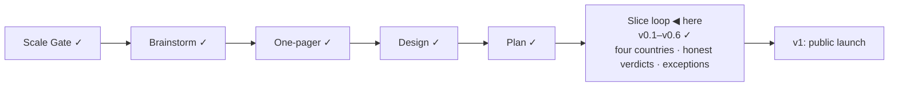

# STATUS — Visa Navigator

## Where are we

Genesis, slice loop; scale **Product**; **v0.6** shipped, with **s5 · s5b · s5c** at mock-green (v0.7 stamps when the human pass lands). 9 candidates on the roadmap (5 unversioned).

## What is happening now

**The human verification pass came back: 35 of 39 items confirmed at their
sources.** `verify-s5.md` is closed 21/21 — France, the Netherlands, the four
BOE articles, and the Spanish salary PDF, which is the tier no machine here can
read and the reason this pass was the gate. `verify-s5c.md` is 16/18. One
earlier finding is reversed by it: the Dutch top-200 mechanic that a report
called absent is in the source verbatim, two of three ranking publishers.

The one open question in that pass — whether to keep CLDR's country labels —
was answered **hand-edit them**. Twelve now read as the names people use:
"Saint Kitts and Nevis", not "St. Kitts & Nevis"; "Democratic Republic of the
Congo", not "Congo - Kinshasa"; "Hong Kong", not "Hong Kong SAR China". Every
displaced form survives as an alias.

Doing it uncovered a live defect the checklist was not looking for. Search
ignored diacritics but not punctuation, so "Côte d'Ivoire" — whose label
carries a typographic apostrophe — was unreachable to anyone typing a straight
one, and "guinea bissau" without its hyphen found nothing. That is the third
time this control has hidden a country from the person holding that passport.
Folding now drops punctuation entirely, and a test types each displaced form
and demands its country back. 178 tests green, `astro check` clean.

## What is expected from you

- [ ] **Click the two learn links** — Anabin and § 18g — the last open item from s3, and the only unchecked thing left from before v0.7.
- [ ] **Confirm the two watch-flag verdicts** — nothing is pending; this is your agreement that the buzer flag (our own marker edit) and the IND flag (an unrelated menu item) were closed correctly. `DECISIONS.md`, 2026-09-04.
- [ ] **Send back the IND researcher row wording** — checklist item 24 is ticked but the text never arrived; our quote is the bare €1,635.90 while the page states the period and "without holiday allowance" in the same row. Paste the row and I will replace the quote.
- [ ] **Open the s6 boundary when you want the launch slice.** Two gates wait there that are cheap now and expensive after launch: the **name** (never chosen — "visa-navigator" is the folder name) and the **dataset licence**. I bring roadmap promotions to it, and the v1 gate's full critique runs in isolation, not by me.

**Moved into s6, at your call:** the phone walk happens on the deployed site. It
is sequenced before the launch announcement, not after — a preview URL is a
deploy, an audience is not, and a responsive defect found by strangers is found
too late.
