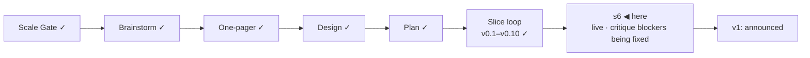

# STATUS — Permit Rulebook

## Where are we

Genesis, slice loop; scale **Product**; **v0.10 shipped**, **s6 "public launch"
mock-green and live at https://permitrulebook.com** (HTTPS enforced,
2026-09-08). The v1-gate isolated critique has run: 32/45, four blockers, all
in the fix round now. v1 is stamped when the blockers are cleared on the live
site and the human's real-green items below are done. Roadmap: v1.1 holds the
14 excluded active routes as "quoted, not asked" pages; 9 further candidates
(5 unversioned). Spine skills at steward-34.

## What is happening now

**The site is public and live** at the domain, over HTTPS, with the Pages URL
redirecting there; both repositories are public under their final names with
About boxes filled; the three triage labels exist; the daily watch still
dry-runs. Today's walk by the human and the isolated critique together
produced one fix round, all of it with the builder now, in this order:

1. the leverage row composing a wrong place phrase ("in your offer, transfer
   or agreement in Germany"), seen twice on the live site;
2. "§" glossed on first use (a reader asked what it means);
3. both READMEs' first screen in the launch shape — an image first, five
   answers, one command tried from a fresh clone, a link to the live site;
4. `NOTES.md` moved under `docs/spine/` as pre-history;
5. the four buzer.de watch entries sliced to the statute body (a false alarm
   on page furniture this morning);
6. the critique's four blockers: the "within reach" sentence blaming salary
   whichever rule was missed · sitemap, robots, country index pages and a
   door from the home page into the route pages · the data README linking the
   product · a 404 page in our own design — plus a daily scheduled rebuild so
   the social card's date cannot go stale;
7. the critique's adjustment 3, approved by the human: the threshold above
   the fold on route pages, situation-aware question wording, the Anabin link
   on the recognition question, a notice when two declarations contradict;
8. the watch bot committing as `github-actions[bot]` (its noreply address was
   mapping to a stranger's account on GitHub);
9. the favicon as option C — transparent outside, cream paper inside the
   tilted frame.

When the builder returns: verify, merge the cron's commit into the data
repository (a buzer flag, already read: false alarm), push both, deploy,
re-read the four blockers on the live site, then stamp.

Numbers: 356 tests in the data repository, 145 in the site; 122 quotes
verified, `human_tier: 0`; 25 pages, 0 tap targets under 44 px at 390 px;
critique 32/45 on RUBRIC 1.2 (v0.7: 27/45).

## What is expected from you

Each of these is yours because it is a real device, a preview renderer, or a
judgement on a live source.

- [ ] **Phone walk on the live site, real handset:** https://permitrulebook.com
      — the interview end to end, then one route page from a results card's
      "The rules of this route". *Pass:* nothing overflows sideways, every tap
      target is comfortable, the rail's labels read as a list, the scope
      statement reads without zooming, the address bar shows the lock. *If it
      fails:* paste the screen's heading here. (Two rows you already found —
      the place phrase and "§" — are in the fix round.)
- [ ] **One test issue from the product:** on any route page click "Report a
      wrong value", file a one-line test issue, then close it. *Pass:* it
      lands on `permit-rulebook-data` with the `bug` label already applied.
- [ ] **Favicon on a Mac and on an Android phone** (after the next deploy,
      which ships option C): open https://permitrulebook.com and look at the
      tab icon. *Pass:* "PR" centred in the tilted square with margin both
      sides. *Fail:* letters touching or overflowing the frame — say so and
      the letterforms get outlined to paths.
- [ ] **Link preview:** paste
      https://permitrulebook.com/germany/eu-blue-card-general into Slack,
      WhatsApp and X. *Pass:* the title "EU Blue Card — general · Germany ·
      Permit Rulebook" and a description naming €50,700 appear beside the card
      image. *Fail:* a generic site name or a cropped card.
- [ ] **Tomorrow's card date:** after the daily rebuild lands, paste any route
      link into Slack again. *Pass:* the card reads tomorrow's date under
      "Rules read". *Fail:* yesterday's — the rebuild did not run; tell me.
- [ ] **French and Spanish question paths, once, on the phone:** choose France,
      then Spain, and answer through to results. *Pass:* the question counter
      does not swing wildly, salary bands read sensibly, no wording assumes a
      job offer when you declared a transfer.
- [ ] **`DISPATCH_TOKEN` (a credential, so yours):** GitHub → Settings → Developer
      settings → Fine-grained tokens → new token, repository access:
      `permit-rulebook` only, permission Contents: read and write; then on
      `permit-rulebook-data` → Settings → Secrets and variables → Actions → new
      repository secret named `DISPATCH_TOKEN` with that value. *Pass:* the
      next watch run's "dispatch a site rebuild" step is green and a deploy
      run starts in the site repository within a minute. Until then the
      daily 06:40 UTC schedule rebuilds the site anyway; only the same-hour
      rebuild after a data change waits on the token.
- [ ] **"watch live":** say it once the fix round has deployed; I switch the
      daily workflow from dry-run to filing issues. *Pass:* the next real flag
      appears as an issue on `permit-rulebook-data` with the `bug` label.
- [ ] **"go":** after the items above pass and the blockers are verified
      cleared on the live site, say it; v1 is stamped and the README's first
      screen is the announcement, told once.

The first 48 hours after "go" (decision 11), written now:
*Watch:* the tracker on `permit-rulebook-data`, the watch's flag issues, the
Show HN thread — every two hours the first day, morning and evening the second.
*Where:* GitHub notifications for both repositories, the watch workflow's run
page, the thread itself; nothing else is instrumented, no analytics at v1.
*Pull the post if:* a reported wrong verdict is confirmed against the source; a
watch flag shows a value on a live page has gone stale; a legal objection to a
quote arrives. Any one of the three: the post comes down first, the fix second.
