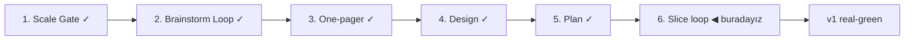

# STATUS — Visa Navigator

## Where are we

Genesis pipeline, ölçek: **Product**. Scale Gate kapandı; Brainstorm Loop başlıyor.

## What is happening now

**S1 walking skeleton real-green** (2026-09-01): `visa-rules` repo'su (şema + DE Blue Card verisi + deterministik engine + doğrulama, 16 test, 0 zafiyet) ve `visa-navigator` statik sitesi (soru akışı → sonuç ekranı, Damgalı Panel tasarımı, sınırda şema doğrulaması, health satırı, sıfır backend) çalışıyor. Senaryonun 7 adımı da geçti; kanıt koşumları `docs/spine/scenarios/s1.md`'de. Commit'ler: `visa-rules@bb348a9`, `visa-navigator@71c3106`.

## What is expected from you

S2 boundary session 🛑: (1) S1 senaryosunu birlikte koşmak — `cd visa-navigator && npm run dev` deyip 5 soruyu cevaplayarak sonucu görmek; (2) S2'nin (soru türetme + information gain, DE tam route seti) acceptance senaryosunu onaylamak. İstersen önce backlog'daki de-mock görevini de kapatabiliriz (S1 değerlerini resmî sayfadan gözünle doğrulamak).
