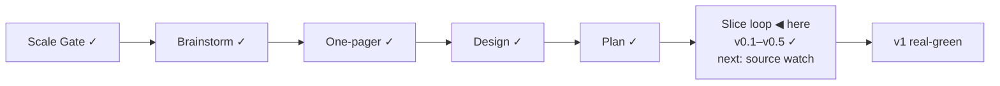

# STATUS — Visa Navigator

## Where are we

Genesis, slice loop; scale **Product**; current version **v0.5 — generalized leverage analysis** (see KANBAN `## versions`).

## What is happening now

**"Source watch + change flag" (s4) is built and live-verified**: DE spike resolved without headless (ZAV edition-index sentinel + direct value pages), 5/5 sources fetched plain on a real run, baselines committed, change-detection demoed live, BOM edge fixed, 65 tests — awaiting only the mandatory code-review exit (running in background) before the real-green stamp. steward-3+4 adopted: English-on-disk, edge-profile scenario lines, `CONTEXT.md` domain glossary at the root, ADRs `docs/adr/0001–0004` graduated from DECISIONS, triage labels (`bug`/`design-flaw`/`new-need`) on both GitHub repos, and both repos now push to origin (github.com/OytunOnal/…).

## What is expected from you

Nothing blocking — code-review lands, then s4 stamps v0.6 and the s5 "Four countries filled" boundary comes to you. Still open on your side: click-check the two learn links (Anabin + § 18g) to close s3's last de-mock item.
