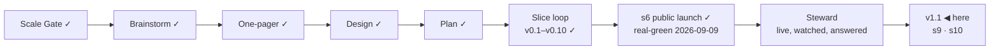

# STATUS — Permit Rulebook

## Where are we

**v1, public and announced** (2026-09-09). Genesis is done: the launch slice's
scenario is real-green, the product is live at https://permitrulebook.com with
23 routes across Germany, France, Spain and the Netherlands, and the
announcement went out on LinkedIn in the human's own words. The project is in
**Steward mode** from here: feedback — a tracker issue, a watch flag, a number
that comes back, a message from a stranger — enters through the steward
protocol, which decides what it is, which promise let it happen, and what to do
about it.

Pace, from the ledger: s5e real-green 2026-09-07, s5f 2026-09-07, s6
2026-09-09, s7 building 2026-09-10 — about one slice a day while the human is
in the loop daily. v1.1 holds two ruled candidates beyond s7; at that pace it
is days, not weeks, but the nationality reads for three more countries sit in
front of it and each is a research day before a build day.

## What is happening now

**s8 is live** (2026-09-10, on your word: *"merge"*). The first deploy under
Steward mode's rule — **merge is the deploy, and the deploy is your word**. Site
`f6af596`, data `6bbc831`, 504 + 320 tests, deploy green in 2m20s, walked on
the live host after it landed:

- With an Algerian passport asking about France: the intra-corporate transfer
  card sits under **Not open to your passport** with the fiche's own sentence,
  and the four talent routes stand under **Open on the rules — unsettled for
  your passport** with the notice above them. The headline says *"1 route meets
  the rules — whether your passport can use it is unsettled."*
- The four renamed routes answer at the addresses they always had.
  `/france/sent-by-your-employer-abroad/` is a 404 and always was: the address
  never moved, so nothing linked to it.

**Two fixes from your s9 walk** (2026-09-11). The country heading read
*"five routes scored, 1 quoted"* — one count spelled and the other not, in the
same breath; it counts in figures now, both halves, and a test holds it that
way (the ledes beneath it stay in words, because they are sentences). And the
call to action at the foot of a country page had borrowed the route page's
two-column row, so the button and its sentence sat at opposite ends; on all
four country pages they are a centred column now, with the button still going
full width on a phone. You walked France end to end and it passed: the route page, and the interview that never offers it.
(`a66214d`, 336 tests.)

**s9 is next, and it is on the preview** — http://localhost:4500 now serves
`s9-build` (site `78a9250`) against `quoted-not-asked` (data `29fde08`),
**513 + 335 tests**. Master went into it by hand: six conflicts, all where s8
and s9 had changed the same lines for different reasons — the country card's
stamp, the route page's main block, two imports, one test both sides had
already fixed, and the root-build fingerprint, which moved because two
templates became one.

What s9 puts on the site: five routes the interview does not ask about — the
French employee card, Spain's general employed regime and its international
teleworker, German self-employment and the Dutch single permit — with their
rules in the authority's words, dated and watched, under **quoted and dated ·
not scored**. Nothing is scored, no profile can be told it qualifies, and
validation refuses both directions.

**The passport side is counted, not guessed** (2026-09-10). Hold one reader's
answers fixed and move only the passport: **199 passports produce six distinct
screens** — 157 ordinary third-country ones; 30 free-movement ones; the nine
whose passport needs no MVV; **Algeria**; **Switzerland**, which is both
free-movement and MVV-exempt, a class of one; and **Türkiye**. All six are
walked; the last two never had been.

**The walk found one** (data #15, filed). On the free-movement screen the notice
says citizens of the EU, of Iceland, Liechtenstein and Norway, **and of
Switzerland** may live and work here — and the single sentence under it is *"As
an EU national you generally don't need a work permit to work anywhere in the
EU."* For four of those thirty-one passports the quote does not cover the
reader: the EEA three hold that right under the EEA Agreement and Switzerland
under the 1999 agreement, not under TFEU art. 45. The claim is right; the
evidence beneath it is not evidence for it. Not a live blocker — no verdict is
wrong, no value is stale — so it queues.

**The site's daily schedule does fire, late.** This file said since 2026-09-08
that it never had. It ran on schedule at 11:49 UTC on 2026-09-09 and 11:48 UTC
on 2026-09-10, both green — about five hours after the cron says, the same
lateness the data watch shows. The redundant path is real; it is just slow.

**The lesson from today, written down:** reading the source and the built
bundle is not walking the product. The partition that stops "criteria met" was
half-applied twice, and both halves were found by opening the page — once by
you, once by walking it properly. Tests now hold the two layouts, the card
badge, the summary strip and the headline to each other.

What runs without anyone asking:

- **The daily watch** (05:17 UTC, data repository) re-reads every source, files
  an issue for each change and tells the site to rebuild.
- **The site's daily rebuild** (06:40 UTC nominal, ~11:48 in practice) is the
  redundant path, and it is working.
- **The counter** (Cloudflare Web Analytics) records one view per page load and
  nothing about the reader.
- **The pre-registered numbers** in `docs/spine/assumptions.md` decide A2, A7
  and A8 thirty days after the announcement — 2026-10-09.

## What is expected from you

**The 48-hour window closes 2026-09-11 09:00 (GMT+3)** — the announcement
went out 2026-09-09 around 09:00. Until then the live site is frozen: it is
touched only for a blocker (a wrong verdict confirmed against its source, a
value gone stale on a live page, a legal objection to a quote) — s7 is one, the
CLS fix is not. The three lines, left here until the window closes:

- *Watch:* the counter (visits, entry pages), both trackers, the watch's
  issues, the post's comments.
- *Where:* Cloudflare Web Analytics → permitrulebook.com; `gh issue list` on
  both repositories; the LinkedIn post.
- *Pull if:* a confirmed wrong verdict, a stale live value, or a legal
  objection — fix the value with its history line, let the rebuild land, edit
  the post to say what was wrong and what it says now.

Nothing is blocked on you. These are the things only you can see, when you want
to look:

- [x] **The daily rebuild needs nothing from you.** This list asked you to run
      one by hand if a day passed without one. It was written on a false
      premise: the site's schedule has fired every day, about five hours late
      (11:49 UTC on 2026-09-09, 11:48 on 2026-09-10, both green).

- [x] **The card's quote cap, 10 → 11** (human, 2026-09-10): ratified for
      `nl-hsm-under30`. Twelve would have to be argued again.
- [x] **The human-tier number is 2** (human, 2026-09-10: "tamamdır", after the
      alternatives were laid out). Two of s8's sources ship human-tier with
      their sentences in `verify-s5e.md` and a 90-day re-read. Checked in a
      real browser the same day: both pages open and both sentences are there
      — the limit is this fetcher, not the page. A browser-driven read for
      bot-walled sources is on the roadmap, gated on a headless-Chrome
      measurement from the runner.
- [ ] **Switch on the preview address** (once, ~5 minutes):
      `docs/spine/preview.md` has the six steps — connect Cloudflare Pages to
      `OytunOnal/permit-rulebook`, project name `permit-rulebook`, production
      branch `preview-only` (a branch that does not exist, so this project can
      never publish the live site), build command
      `bash scripts/preview-build.sh`, output `dist`, and two preview
      variables. *Pass:* `feedback-line` builds and
      https://feedback-line.permit-rulebook.pages.dev shows the site with the
      new line at the end of a results screen. *If the build fails:* paste the
      last twenty lines here.
- [x] **s8 walked and merged** (2026-09-10, your word). Live, and walked again
      on the live host afterwards.
- [ ] **Say merge, and s9 goes live.** You walked France on 2026-09-11 — the
      employee card's page states the labour-market test in service-public's
      words with no score on it, and the interview never offers the route. The
      branch is `s9-build` (site `a66214d`) against `quoted-not-asked` (data
      `29fde08`), 513 + 336 tests. Nothing else is waiting on you for it.
- [ ] **Walk `feedback-line`, then say merge** (site #6; this one waits for the
      window to close at 09:00 tomorrow). One line under your results: "Wrong
      about you? A value that does not match its source, or something this
      screen should do — report a wrong value or suggest a change. Both open
      GitHub, where filing needs an account." *Pass:* you would let it sit under
      your own results. *If not:* say what it should say instead.
- [x] **The four country reads are done** (2026-09-10): the Netherlands and
      France produced fixes (s7 is live, s8 waits on your walk), Germany and
      Spain produced findings with dates on them and nothing to change.
- [ ] **A third human-tier source, or not** (your call, and only yours). The
      French employee card's page states the labour-market test in
      service-public's words. The statute's own word for it — CESEDA L414-13,
      « la situation du marché de l'emploi est **opposable** au demandeur » —
      is on Legifrance, which answers this fetcher 403. You ratified the
      human-tier count at **two** this morning; carrying that sentence would
      make it three, with a person re-reading it every 90 days. *Say yes and it
      goes on the page; say no and it stays where it is now — recorded in
      `exclusions.md` with the reason.*
- [ ] **The post's replies.** Anything a reader says that is a bug, a missing
      need or a design flaw is worth pasting here — the steward protocol turns
      it into a fix or a recorded decision, rather than a note that gets lost.
- [ ] **In thirty days (2026-10-09):** the counter's visits from search and
      referrals, whether a stranger has touched the data, and how many domains
      link to it. The numbers that decide A2, A7 and A8 were written before the
      post so they cannot be moved afterwards.
- [ ] **The token expires 2027-09-09** (`DISPATCH_TOKEN`). GitHub e-mails
      first; an expired one turns the watch red and files an issue, so it
      cannot fail quietly.

Ledgers: this file (now), `KANBAN.md` (the board and the versions),
`DECISIONS.md` (why anything is the way it is), `docs/spine/` (the scenario,
the threat model, the architecture, the critiques, the announcement).
