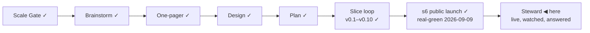

# STATUS — Permit Rulebook

## Where are we

**v1, public and announced** (2026-09-09). Genesis is done: the launch slice's
scenario is real-green, the product is live at https://permitrulebook.com with
23 routes across Germany, France, Spain and the Netherlands, and the
announcement went out on LinkedIn in the human's own words. The project is in
**Steward mode** from here: feedback — a tracker issue, a watch flag, a number
that comes back, a message from a stranger — enters through the steward
protocol, which decides what it is, which promise let it happen, and what to do
about it.

## What is happening now

**Steward has run once** (2026-09-10). The human found that the way back in had
no door for a suggestion: all three templates asked about a defect or about
data, and the "new need" form required a checkbox about a route. The wording is
fixed in both repositories — the labels are unchanged — and the footer now says
"Suggest a route or a change".

**A second report came in, and it is at its gate:** a reader suggested asking
for feedback at some point — a popup, or a permanent icon. The footer's two
links stay as they are; what is being decided is a moment, not a replacement.
Two shapes are drawn in `docs/spine/design/s7-feedback.html` (served at
http://localhost:4400/s7-feedback.html): **A**, a slip docked to the bottom
edge that never dims the page, and **B**, a centred modal that stops the
reading. Both fire once ever, only after the results have been read, ask for
the two things the product can act on, send nothing off the device, and say out
loud that the tracker needs a GitHub account. Recommended: A. **Waiting on the
human's pick.**

**The bug the human mentioned is still undescribed** — nothing is built for it
until it is.

What runs without anyone asking:

- **The daily watch** (05:17 UTC, data repository) re-reads every source, files
  an issue for each change and tells the site to rebuild. Its first three real
  flags were read on 2026-09-09 — all three were our own slice change, not the
  law, and the gap that let that happen is now a test.
- **The site's daily rebuild** (06:40 UTC) is the redundant path. **It did not
  fire on 2026-09-09.** The fast path (the watch's dispatch) is proven end to
  end and carried the day's data instead, by hand once. If the schedule keeps
  missing, the sentence "a daily schedule rebuilds even if every signal fails"
  has to change or the trigger has to.
- **The counter** (Cloudflare Web Analytics) records one view per page load and
  nothing about the reader.
- **The pre-registered numbers** in `docs/spine/assumptions.md` decide A2, A7
  and A8 thirty days after the announcement — 2026-10-09, read from the counter
  and the tracker.

## What is expected from you

Nothing is blocked on you. These are the things only you can see, when you want
to look:

- [ ] **The feedback prompt — pick A or B** (or change the words):
      http://localhost:4400/s7-feedback.html. *Pass:* you would let it appear
      on your own screen after your own results. Nothing is built until you
      pick.
- [ ] **The bug you mentioned** (2026-09-10): the screen, what you did, what
      you expected, what happened. It goes through the steward protocol from
      here.
- [ ] **The post's replies.** Anything a reader says that is a bug, a missing
      need or a design flaw is worth pasting here — the steward protocol turns
      it into a fix or a recorded decision, rather than a note that gets lost.
- [ ] **In thirty days (2026-10-09):** the counter's visits from search and
      referrals, whether a stranger has touched the data, and how many domains
      link to it. The numbers that decide A2, A7 and A8 were written before the
      post so they cannot be moved afterwards.
- [ ] **The token expires 2027-09-09** (`DISPATCH_TOKEN`). GitHub e-mails
      first; an expired one turns the watch red and files an issue, so it
      cannot fail quietly.

Ledgers: this file (now), `KANBAN.md` (the board and the versions),
`DECISIONS.md` (why anything is the way it is), `docs/spine/` (the scenario,
the threat model, the architecture, the critiques, the announcement).
