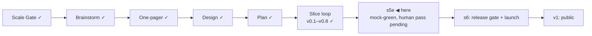

# STATUS — Visa Navigator *(working name; the project is named **Permit Rulebook** from the v1 tag)*

## Where are we

Genesis, slice loop; scale **Product**; **v0.8 shipped**. **s5e** — every
sentence carries its source — is built and reviewed, at mock-green, awaiting
the human pass over five PDF-tier quotes. **s6 (public launch) is the last slice
before v1.** 9 candidates on the roadmap (5 unversioned). Spine skills reloaded
2026-09-07 at steward-26.

## What is happening now

**s5e is built, reviewed on both axes, and its findings applied.** The
measurement that started it — 45 criterion notes, none with a source, 39
quoting an authority — now reads: 55 conditions carry a covering source, 8
sentences are declared ours, 1 is declared unsourced with a reason, 5 sit on
the human tier. Quotes the machine verifies on every check went from 28 to 78.
The value set is byte-identical and verdicts are pinned by a SHA the reviewer
recomputed independently. 289 tests in visa-rules, 69 in the navigator.

Two things the review caught matter beyond this slice. The provenance gate as
the scenario specified it keyed on quotation marks — a surface feature, which
the Spine rule landing the same day names as exactly the mistake — and it now
keys on a declared kind, so a statute citation with no marks and no source
fails the build. And the IND pages, which answered the watch fetcher in full,
returned a 1.4 kB shell to a bare fetch twice today with no identified cause;
the review found a shell would have been committed as the snapshot and turned
~35 verified quotes into "missing" with a flag telling a curator to overwrite
correct data. Every IND and BAMF entry now carries slice markers, so a shell
reports unreachable and touches nothing. The intermittency itself is
unexplained and is written into the checklist as such.

`Route.readings` is a new construct: our own reading of a route, in its own
place, because the glossary says a statement is the source's words and a
reading is ours. CONTEXT.md carries it, plus **Renderable kind** and **Prose
provenance**.

## What is expected from you

- [ ] **Read five sentences on two PDFs — `visa-rules/data/verify-s5e.md`, section 1.**
      Each item names the PDF, the exact sentence to find, what a pass looks
      like and what to do on a fail. The machine cannot read either file; these
      are the only five quotes in the dataset that no gate verifies.
      **Chancenkarte leaflet** (German embassy Cairo,
      `kairo.diplo.de/…/250122-deu-merkblatt-chancenkarte-data.pdf`): the
      qualification sentence *"einen ausländischen Hochschulabschluss, einen
      mindestens zweijährigen Berufsabschluss (jeweils im Ausbildungsstaat
      staatlich anerkannt)"* and the livelihood figure *"monatlich mindestens
      1.091 Euro"*. **UGE salary PDF** (`inclusion.gob.es/…/umbral-salarial.pdf`
      — first confirm it says **"Junio 2026"**): *"Umbral general: 41.356,36 €"*,
      *"Umbral reducido: 33.085,09 €"*, *"umbral único de 41.356,36 €"*. Plus one
      derivation sentence to read while the PDF is open (the INE average that
      moves these figures — the watch cannot warn you when it changes; that
      sentence is the only warning). **A pass:** all five sentences present word
      for word. **On a fail:** the file says per item whether it is a number
      change (edit, move the old value into history) or a rule change (record
      and raise, do not edit). **Why it is yours:** both are PDFs — one scanned —
      and no fetch from here yields their text.
- [ ] **Section 2 of the same file is a decision table, not a checklist.** Eight
      notes that were our own reasoning got one of three outcomes — sourced,
      demoted to a reading, or deleted. Read the table once; reversing any row
      is a data edit. Say if one looks wrong.
- [ ] **The licence** — the last release-gate decision, separate for the code,
      the dataset, and anything derived from a source with its own terms. I
      bring the options with what each obliges a reuser to do; say when.

Passing the first item makes s5e real-green and stamps v0.9. Then the s6
boundary: roadmap forks, the licence, and the launch scenario.
