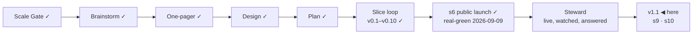

# STATUS — Permit Rulebook

## Where are we

**v1, public and announced** (2026-09-09). Genesis is done: the launch slice's
scenario is real-green, the product is live at https://permitrulebook.com with
23 routes across Germany, France, Spain and the Netherlands, and the
announcement went out on LinkedIn in the human's own words. The project is in
**Steward mode** from here: feedback — a tracker issue, a watch flag, a number
that comes back, a message from a stranger — enters through the steward
protocol, which decides what it is, which promise let it happen, and what to do
about it.

Pace, from the ledger: s5e real-green 2026-09-07, s5f 2026-09-07, s6
2026-09-09, s7 building 2026-09-10 — about one slice a day while the human is
in the loop daily. v1.1 holds two ruled candidates beyond s7; at that pace it
is days, not weeks, but the nationality reads for three more countries sit in
front of it and each is a research day before a build day.

## What is happening now

**How this product ships changed today** (steward-51). From here the live site
changes only by a branch you walked and merged: **merge is the deploy, and the
deploy is your word.** The blocker exception stands — a wrong value on a live
page is fixed on master directly, because a reader is being told something
untrue while a branch waits. Everything else queues. The preview address is
yours to switch on once (`docs/spine/preview.md`, six steps); after that every
branch renders at `https://<branch>.permit-rulebook.pages.dev` and the live
site stays where it is.

**Steward has run once** (2026-09-10). The human found that the way back in had
no door for a suggestion: all three templates asked about a defect or about
data, and the "new need" form required a checkbox about a route. The wording is
fixed in both repositories — the labels are unchanged — and the footer now says
"Suggest a route or a change".

**A second report came in, and it is at its gate:** a reader suggested asking
for feedback at some point — a popup, or a permanent icon. The footer's two
links stay as they are; what is being decided is a moment, not a replacement.
Two shapes are drawn in `docs/spine/design/s7-feedback.html` (served at
http://localhost:4400/s7-feedback.html): **A**, a slip docked to the bottom
edge that never dims the page, and **B**, a centred modal that stops the
reading. Both fire once ever, only after the results have been read, ask for
the two things the product can act on, send nothing off the device, and say out
loud that the tracker needs a GitHub account. Recommended: A. **Waiting on the
human's pick.**

**The counter was read** (2026-09-10): 57 visits and 75 page views since it went
live, 41 visits in the announcement's first 24 hours; United States 26,
Türkiye 24, seven other countries once each; LinkedIn and its app the only
referrers besides one Bing and one Google; **every visit entered at `/`** — no
route page has been landed on yet, which is what an unindexed week looks like.
The reading also found a defect: Core Web Vitals put CLS **poor for 23%** of
samples (`#app` 0.402, the footer 0.414, against a 0.25 threshold) — the
interview paints and then fills itself. Site #8. The A2/A7/A8 numbers stay
where they were pre-registered: 2026-10-09.

**s7 is live** (`docs/spine/scenarios/s7-nationality.md`, real-green
2026-09-10). A statement can name the passports it does not bind: a Turkish
passport no longer meets the recognised-sponsor condition on the two Dutch
highly skilled migrant permits or the researcher permit, because the IND says
it does not bind them; all six Dutch routes now state the provisional residence
permit, which ten passports do not need. Walked live with both passports.
Reviewed on both axes — one blocker, and it was in the spec I wrote, not the
build: the MVV shipped as a caveat and is a precondition.

**The rule that keeps it from happening again:** every question the interview
asks must change something the reader sees, as a generated check. Against this
morning's dataset, 168 third-country passports produced one screen — it would
have found data #8 by itself.

**The feedback line is built and waiting** (site #6): one line at the end of
the results screen — "Wrong about you? … report a wrong value or suggest a
change. Both open GitHub, where filing needs an account." Nothing opens,
nothing is dismissed, nothing is remembered. It sits on the branch
`feedback-line` (`20681e6`, 300 tests), **not on master**, because the window
is open and it is an improvement rather than a blocker. It merges when the
window closes.

**Germany is read and closed** (data #10). The answer came back different from
the Dutch one, and the difference is the finding: **nothing in the eight German
routes is wrong.** Every nationality rule found sits beside the routes rather
than inside them — § 26 Abs. 1 BeschV (eleven states, any employment, no
qualification) and § 26 Abs. 2 (the Western Balkans regulation, with its quota
and its mission-of-application rule) are ways in this dataset does not model;
Decision 1/80's rights attach after employment has begun, which is exactly what
the dataset's Türkiye notice already says — an official German source confirmed
a statement instead of correcting one; § 41 AufenthV decides where paperwork is
filed, and this product states conditions, not procedure. Three rows in
`exclusions.md` with the text they were read from. One defect fell out of it:
the Opportunity Card's "Official page" link points at handbookgermany.de, which
is not an authority (data #13 — the replacement is a real choice: the federal
portal serves a bot check, so it is a page a reader can use against a page the
watch can keep its eye on).

**Spain is read and closed** (data #12): the four routes ask the same of every
third-country nationality, and that sentence now has a date on it — three route
pages section by section, Ley 14/2013 arts. 61–76 from the BOE's consolidated
text, and the salary PDF. No country is named in any of those articles. The one
country-group carve-out is the free-movement gate this dataset already applies,
and its class does hold Norway, Iceland, Liechtenstein and Switzerland — checked
rather than assumed. Two real nationality rules in Spanish law reach none of
these four.

**France is read, and it is the heavy one** (data #11). Two findings, and they
are handled differently on purpose:

- **Settled:** the intra-corporate transfer permit is not open to Algerian
  nationals — service-public states the eligibility as *"Vous êtes étranger
  (sauf Européen ou Algérien)"* and routes an Algerian reader to a different
  fiche. The product offers that route to Algerian passports today.
- **Not settled, and not decided by us:** for the four passeport-talent routes
  the sources conflict. The Conseil d'État says CESEDA's residence titles do
  not apply to Algerians — in a case about a shopkeeper's certificate — and
  the administration's own page for Algerians lists sixteen situations with no
  talent card among them; but Directive (EU) 2021/1883 puts every third-country
  national in the Blue Card's scope, and CESEDA L421-11 names no exclusion. No
  page found says either way in one sentence.

**v1.1 is open** (boundary, 2026-09-10; the human chose its scope from three).
Two slices, both bound to something already written down. **s9** publishes the
first five routes this product will not score — FR carte salarié, ES cuenta
ajena, ES digital nomad, NL GVVA, DE § 21 — with their rules in the authority's
own words and the reason each is unscoreable quoted beside them; it uses the
third scope value, "quoted and dated · not scored", which the dataset has
carried since s6 and never used. It is bound to **A5**, refuted: 23 routes
against a promise of 35–40. **s10** is the CLS defect the counter found — poor
for 23% of samples while LCP and INP are good for 100%.

The French read is in and written up (`docs/spine/research-04-quoted-not-asked.md`):
the carte « salarié » turns on a sentence a person cannot check — *« la
situation du marché de l'emploi est opposable au demandeur »* — and behind it a
three-week recruitment search they never see, plus a compliance check on the
employer rather than on them. That is exactly the sentence the page will carry
under "we do not score this". The other four reads are running in parallel; no
build begins until they are in.

**The live site moved on its own today, correctly:** the watch's dispatch built
and pinned the data at `17cd1fe` — the Germany and Spain reads' exclusions rows
— without anyone touching master. The fast path, on schedule, for the second
day.

**s8 is built, reviewed, fixed and waiting on you** — `algeria-closure` in both
repositories (data `43938be`, site `a51e20b`; **504 + 307 tests**, quote
fidelity 139, `human_tier: 2` by your word). The first slice under the new mode: it waits for your walk and
your word, and the merge is the deploy.

Both reviews ran and eleven findings are applied. The two that mattered: the
notice stood over a screen showing **Germany alone**, telling a reader about
four French permits they had not asked for — a notice that names routes is now
stated only where the reader asked about a country one of them is in; and the
body pointed at the wrong page — the transfer card's callout links to F2215,
not F35600, and F2215 carries the same sentence and the same absence (checked
by hand). From the other axis: the long-quote trim had been left behind when
the notice moved out of the page, so the Türkiye notice's 640-character quote
was printing whole on a results card; the empty-body guard moved from one
fetcher into the core where every fetcher passes; and a test that proved
"closed routes are filed apart" by grepping three identifiers now asserts what
the page does.

What it does. `fr-ict` closes itself to an Algerian passport in the fiche's own
words, and the dataset gained the operator that made that sayable — `not-in`, a
closure, which ships only with its own plain sentence beside the quote, because
a closed route is the one verdict whose reason cannot be assembled from the
answers it names. On the results screen such a route leaves met, within reach
and not yet, and stands in a section of its own: **Not open to your passport**.

The four talent routes stay scored, and an Algerian reader sees a notice of a
kind this product did not have — an **open question**. It carries three
authorities in their own words: the Conseil d'État (2 March 2026, n° 500835 —
a case about a trader's certificate, and the notice says so rather than reading
it for more than it decided), service-public's own page for Algerian nationals
(seventeen first-application situations, no talent card among them), and the EU
directive whose scope covers every third-country national. Then it says we
searched four official sites for a page that settles it and found none, and
that the routes are scored as they are for anyone else — "that is us declining
to guess, not an answer".

**The build corrected the spec twice, with fetches**: a routing sentence I had
written into the brief does not exist on the page (the real one is a callout
linking to a different fiche), and sixteen situations are seventeen. Both fixed
in the scenario, marked as corrections. It also found two defects on the way:
`htmlToText` spliced service-public's unfilled tooltip placeholder into the
very sentence we quote, and the watch counted an empty HTTP 202 as a good read
— a snapshot that would have said "unchanged" forever.

What runs without anyone asking:

- **The daily watch** (05:17 UTC, data repository) re-reads every source, files
  an issue for each change and tells the site to rebuild. Its first three real
  flags were read on 2026-09-09 — all three were our own slice change, not the
  law, and the gap that let that happen is now a test.
- **The site's daily rebuild** (06:40 UTC) is the redundant path. **It did not
  fire on 2026-09-09.** The fast path (the watch's dispatch) is proven end to
  end and carried the day's data instead, by hand once. If the schedule keeps
  missing, the sentence "a daily schedule rebuilds even if every signal fails"
  has to change or the trigger has to.
- **The counter** (Cloudflare Web Analytics) records one view per page load and
  nothing about the reader.
- **The pre-registered numbers** in `docs/spine/assumptions.md` decide A2, A7
  and A8 thirty days after the announcement — 2026-10-09, read from the counter
  and the tracker.

## What is expected from you

**The 48-hour window is open until 2026-09-11 09:00 (GMT+3)** — the announcement
went out 2026-09-09 around 09:00. Until then the live site is frozen: it is
touched only for a blocker (a wrong verdict confirmed against its source, a
value gone stale on a live page, a legal objection to a quote) — s7 is one, the
CLS fix is not. The three lines, left here until the window closes:

- *Watch:* the counter (visits, entry pages), both trackers, the watch's
  issues, the post's comments.
- *Where:* Cloudflare Web Analytics → permitrulebook.com; `gh issue list` on
  both repositories; the LinkedIn post.
- *Pull if:* a confirmed wrong verdict, a stale live value, or a legal
  objection — fix the value with its history line, let the rebuild land, edit
  the post to say what was wrong and what it says now.

Nothing is blocked on you. These are the things only you can see, when you want
to look:

- [ ] **If a day passes with no rebuild — run one.** The site's own 06:40 UTC
      schedule has not fired once since it was written (2026-09-08); GitHub's
      scheduler is best-effort, and the data watch's own schedule runs three to
      four hours late every day. The daily rebuild that actually happens is the
      watch's: it commits its heartbeat and dispatches the site. *Check:* the
      footer of https://permitrulebook.com/data/ says "last run <today or
      yesterday>". *If it says an older day:* in a terminal,
      `gh workflow run pages.yml -R OytunOnal/permit-rulebook` — that builds
      against the pinned data and deploys; a green run appears within ten
      minutes at https://github.com/OytunOnal/permit-rulebook/actions. Nothing
      else is needed; it cannot break anything that the daily run would not.

- [x] **The card's quote cap, 10 → 11** (human, 2026-09-10): ratified for
      `nl-hsm-under30`. Twelve would have to be argued again.
- [x] **The human-tier number is 2** (human, 2026-09-10: "tamamdır", after the
      alternatives were laid out). Two of s8's sources ship human-tier with
      their sentences in `verify-s5e.md` and a 90-day re-read. Checked in a
      real browser the same day: both pages open and both sentences are there
      — the limit is this fetcher, not the page. A browser-driven read for
      bot-walled sources is on the roadmap, gated on a headless-Chrome
      measurement from the runner.
- [ ] **Switch on the preview address** (once, ~5 minutes):
      `docs/spine/preview.md` has the six steps — connect Cloudflare Pages to
      `OytunOnal/permit-rulebook`, project name `permit-rulebook`, production
      branch `preview-only` (a branch that does not exist, so this project can
      never publish the live site), build command
      `bash scripts/preview-build.sh`, output `dist`, and two preview
      variables. *Pass:* `feedback-line` builds and
      https://feedback-line.permit-rulebook.pages.dev shows the site with the
      new line at the end of a results screen. *If the build fails:* paste the
      last twenty lines here.
- [ ] **The feedback line, when the window closes** (site #6, branch
      `feedback-line`): read it once — "Wrong about you? A value that does not
      match its source, or something this screen should do — report a wrong
      value or suggest a change. Both open GitHub, where filing needs an
      account." *Pass:* you would let it sit under your own results. Then I
      merge it. *If not:* say what it should say instead.
- [ ] **Nothing right now** on the audit: the Netherlands is being built (s7),
      Germany (#10) is read next, then France (#11) and Spain (#12).
- [ ] **The post's replies.** Anything a reader says that is a bug, a missing
      need or a design flaw is worth pasting here — the steward protocol turns
      it into a fix or a recorded decision, rather than a note that gets lost.
- [ ] **In thirty days (2026-10-09):** the counter's visits from search and
      referrals, whether a stranger has touched the data, and how many domains
      link to it. The numbers that decide A2, A7 and A8 were written before the
      post so they cannot be moved afterwards.
- [ ] **The token expires 2027-09-09** (`DISPATCH_TOKEN`). GitHub e-mails
      first; an expired one turns the watch red and files an issue, so it
      cannot fail quietly.

Ledgers: this file (now), `KANBAN.md` (the board and the versions),
`DECISIONS.md` (why anything is the way it is), `docs/spine/` (the scenario,
the threat model, the architecture, the critiques, the announcement).
