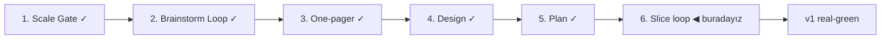

# STATUS — Visa Navigator

## Where are we

Genesis pipeline, ölçek: **Product**. Scale Gate kapandı; Brainstorm Loop başlıyor.

## What is happening now

**S2 mock-green** (2026-09-02): Almanya tam route seti canlı — 8 route (Blue Card ×2, §18a/§18b, §19c deneyimli+IT, §18d, ICT, Chancenkarte doğrudan-veya-6-puan), 15 alan, tüm değerler alıntı+kaynak+tarihli. Engine: `points`/`in`/`any` op'ları, adaptif information-gain sıralaması, "karar değiştiremeyecek soru sorulmaz" budaması (33 test). Tarayıcıda iki uçtan uca akış: teklifli mühendis 7 soruda "3 routes open", teklifsiz gezgin 13 soruda "Points 4 of 6 · Gap: 2 points short". S1 insan koşumundan üç düzeltme de girdi (budama, footer, iki-kolon yerleşim kararı).

## What is expected from you

S2'yi real-green yapmak için **değer doğrulaması** 🛑: `docs/spine/scenarios/s2.md`'deki listedeki ~10 değeri kaynağından gözünle doğrula (ZAV bültenleri, elçilik Merkblatt PDF'i, buzer Anlage). Ayrıca istersen `npm run dev` ile yeni akışı dene. Sonrası: S3 boundary (gap analizi dilimi senaryosu).
