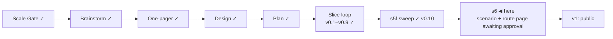

# STATUS — Visa Navigator *(working name; the project is named **Permit Rulebook** from the v1 tag)*

## Where are we

Genesis, slice loop; scale **Product**; **v0.10 shipped** (s5f real-green
2026-09-07, walked by the session at the human's delegation). The release
gate is closed; the identity is closed. **s6 (public launch) is the last slice
before v1** — its scenario and its route-page mock are in front of the human;
the build starts on their word.
Spine skills reloaded 2026-09-07 at steward-29.

## What is happening now

**v0.10 is stamped.** The sweep's 15 moved verdicts were read as a list and
each moved toward the reader; the two cards that turned "criteria met" were
entered by hand in the live interview and say what they should — the salary
threshold genuinely cleared on one, "no salary threshold of its own" said
plainly on the other. The translation check passed on the s3b entry. The walk
was the session's, not an independent reader's, by the human's decision; the
record says so.

**One dataset bug found on the way, and fixed:** the es-ict transfer criterion
carried the precondition's quote, so one card showed the same sentence twice.
It now cites art. 73.1, the sentence that defines the transfer; the live card
was re-read. No verdict moved; quote gate ok.

Numbers: 323 tests in visa-rules, 70 in the navigator; 120 quotes verified,
`human_tier: 0`; every rendered sentence sourced, ours, or declared unsourced
with a reason.

## What is expected from you

- [ ] **s6, two approvals in one word each:** the scenario
      (`docs/spine/scenarios/s6.md`, 13 decisions) and the route-page mock
      (`docs/spine/design/s6-route-page.html`, two columns, revised after the
      isolated critique and your three corrections). The identity is closed
      (2026-09-07). Say "s6" or "onaylıyorum" and the build starts. **Why it is yours:** the
      scenario is the exam the build is graded on, and the screen is the one
      new thing a stranger sees.
- [ ] **One line, optional:** the copyright holder in the three LICENSE files
      reads "Oytun", the git author. Say so if you want the full name before
      the repositories go public.

Nothing else is open.
