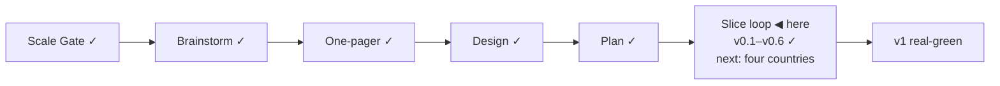

# STATUS — Visa Navigator

## Where are we

Genesis, slice loop; scale **Product**; current version **v0.6 — source watch** (see KANBAN `## versions`).

## What is happening now

**v0.6 "Source watch + change flag" is real-green.** The code-review exit returned 10 verified findings — three independent alert-loss paths in the CI workflow, entity hash-blindness (&ge;/&le; hashed equal), a crashing code-point path, non-exhaustive criterion walks, reminder pile-up, and two lesser ones — all 10 fixed and re-tested (69 tests, pushed as `visa-rules@374c9c5`). The liveness promise now has scaffolding: every dataset source is watched (coverage enforced both ways), changes produce quoted-context flags, and the daily cron is hardened to never lose an alert. Next: the s5 "Four countries filled: FR·ES·NL" boundary — the last big curation slice before launch.

## What is expected from you

The s5 boundary scenario will come to you next 🛑. Still open on your side: click-check the two learn links (Anabin + § 18g) to close s3's last de-mock item.
