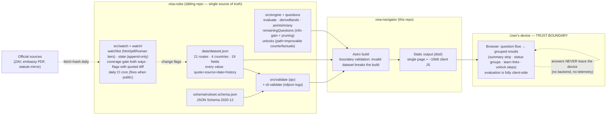

# ARCHITECTURE — Visa Navigator (as of v0.6)

Updated at every slice exit; always depicts the latest real-green state.

Components, one line each:

- **data/dataset.json** — the rules dataset; every numeric value carries its
  official source URL, verbatim quote, retrieval date and an append-only
  `history` (CC-BY-4.0).
- **ruleset.schema.json** — the public contract; a value without its quote or
  date cannot pass the schema.
- **engine** — pure functions: eligibility by `if` (`eq`/`in`/`gte`/`points`/
  `any`), band edges = the thresholds themselves, met/near/hold + gaps;
  questions derive from rules, ordering by greedy information gain, no
  question is asked that cannot change a verdict; `unlocks` computes provable
  single-step counterfactual recommendations. Invariants guarded by property
  tests over 2,900 seeded-random profiles.
- **validate / cli-validate** — boundary validation; CI and build gate,
  ndjson structured logs.
- **Astro build** — validates the dataset at the boundary, bundles the engine
  as one small island; ajv never reaches the client bundle.
- **Static site** — health line (dataset/schema version + newest retrieval
  date), IRCC-style disclaimer; tokens.css ("Stamped Panel") design system.
- **Trust boundary** — personal declarations (citizenship, salary band, age…)
  live only in browser memory; no network request carries them out.

- **watch** — declared watchlist over every dataset source (coverage enforced
  both ways in CI); html text-hash, pdf byte-hash, human tier with
  verification-age reminders; change flags carry quoted context; the daily
  cron workflow persists state before filing issues and survives unreachable
  sources without losing alerts.

Not built yet (planned): FR/ES/NL data files (s5), deploy target + live cron
firing (s6).
