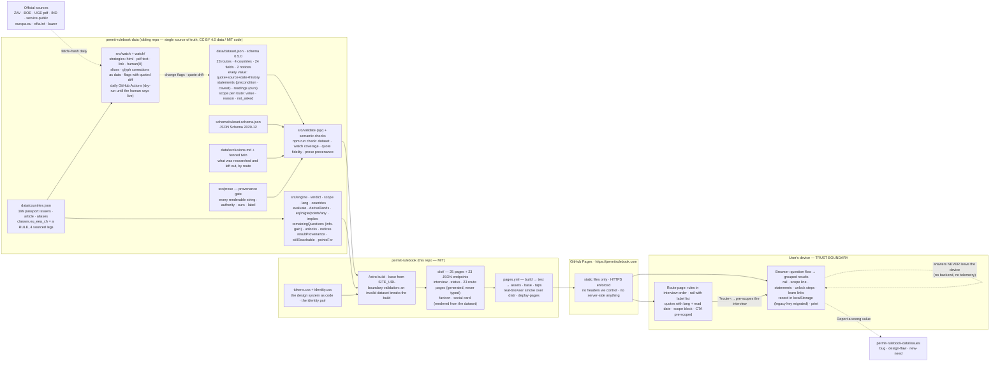

# ARCHITECTURE — Permit Rulebook (as of v0.10 real-green; s6 "public launch" mock-green, live at https://permitrulebook.com, 2026-09-08)

Updated at every slice exit. The diagram depicts what is built and verified;
what is not yet real-green is called out at the bottom.

Components, one line each:

- **data/dataset.json** — the rules dataset: every numeric value carries its
  official source URL, verbatim quote, retrieval date and append-only history;
  every route carries its statements (preconditions and caveats in the
  source's words), its readings (ours, declared), and a **scope** value with
  the limbs it does not ask; the `experience` ladder is ordinal (`implies`).
- **data/countries.json** — the passport vocabulary: 199 issuers, hand-written
  labels, aliases, the grammatical article a country takes; `classes.eu_eea_ch`
  is a rule with four sourced legs.
- **data/exclusions.md** — prose for a person plus a fenced machine twin; a
  test holds the two halves to each other and both to the routes' scope.
- **schema** — the public contract (0.5.0): a value without quote or date, a
  route without scope, cannot pass.
- **engine** — pure functions: eligibility, band edges = thresholds, deciding
  path, still-reachable, points as the best row an answer satisfies, questions
  by information gain, provable single-step unlocks, notices. Property tests
  over thousands of generated profiles.
- **prose** — the provenance gate for sentences: authority (needs a quote),
  ours (declared), label — keyed on the declared kind, never on a surface trace.
- **validate / check** — schema + semantic checks; `npm run check` prints the
  four gates (dataset valid · watch coverage · quote fidelity · prose provenance).
- **watch** — the daily re-read: html, pdf-text (embedded-font text layer,
  bytes hash beside words hash), link liveness; slices bound each page to its
  operative text; glyph corrections are declared data; `human_tier: 0`.
- **Astro build** — reads the sibling package, derives `base` from `SITE_URL`,
  generates the interview, the status page and 23 route pages plus JSON
  endpoints, the favicon set and the social card from the dataset's own facts.
- **CI (pages.yml)** — checks out both repositories, runs the data gates,
  builds, then tests (a real browser walks `dist/`), asset truth, base-path
  check, tap-target measurement at 390 px, then deploys to Pages.
- **tokens.css / identity.css** — the design system and the identity pair
  (the tilted PR stamp over the read-date stamp) as code; one source, inlined
  by the route page, linked by the interview.
- **GitHub Pages** — static hosting at the custom domain, HTTPS enforced; the
  accepted cost is no response headers of our own.
- **Browser** — the interview and the results run entirely on the device; the
  record lives in localStorage; nothing is sent anywhere.

Not yet real-green (s6): the phone walk on the live site, the isolated v1-gate
critique's blockers cleared, the watch switched from dry-run to filing issues,
and the announcement.
