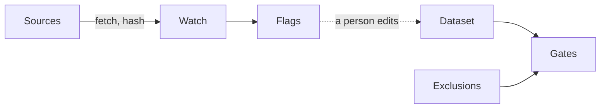
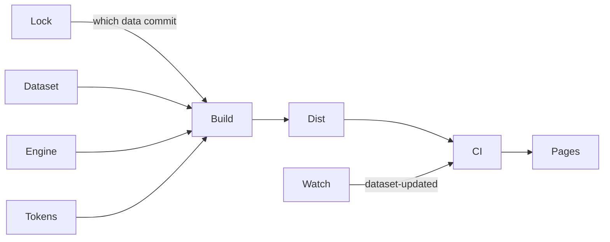
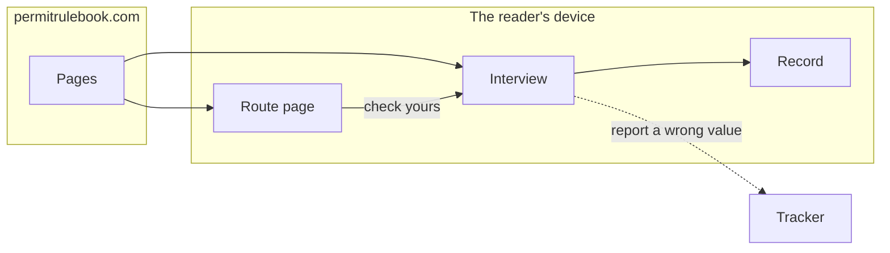

# ARCHITECTURE — Permit Rulebook (as of v1, public and announced 2026-09-09)

Updated at every slice exit. Three diagrams, one question each: where the facts
come from, how they become a site, where the reader's answers stay. Labels are
names; what each name means is in the list below the diagrams.

## 1 · Data flow — where the facts come from

## 2 · Pipeline — how the facts become a site

## 3 · Trust boundary — where the answers stay

Nothing crosses the boundary from the device outward except a reader's own
click on the tracker link. Answers never leave the device.

## The names

**Diagram 1 — permit-rulebook-data** (sibling repository; data CC BY 4.0, code MIT)

- **Sources** — the official pages and PDFs: ZAV, BOE, UGE, IND,
  service-public.gouv.fr, europa.eu, efta.int, buzer.
- **Watch** — the daily re-read (`src/watch`, GitHub Actions): strategies
  html, pdf-text (embedded-font text layer, bytes hash beside words hash) and
  link liveness; slices bind each page to its operative text; glyph
  corrections are declared data; `human_tier: 2` since 2026-09-10 (two sources a browser reads and this fetcher cannot — see the glossary); runs daily in GitHub
  Actions and files an issue (`source-change`) per flag.
- **Flags** — one file per change with the quoted diff; read by a person, who
  edits the dataset or records a false alarm.
- **Dataset** — `data/dataset.json` (schema 0.5.0): 23 routes, 4 countries;
  every numeric value with its source URL, verbatim quote, retrieval date and
  append-only history; per route its statements (preconditions and caveats in
  the source's words), its readings (ours, declared) and a scope value with
  the limbs it does not ask; the experience ladder is ordinal. Beside it
  `data/countries.json` (199 passport issuers, labels, aliases, articles;
  `classes.eu_eea_ch` is a rule with four sourced legs) and
  `schema/ruleset.schema.json`, the public contract.
- **Exclusions** — `data/exclusions.md`: what was researched and left out, by
  route, as prose plus a fenced machine twin.
- **Gates** — `npm run check`: schema and semantic validation · watch coverage
  both ways · quote fidelity (every shipped quote found in its snapshot) ·
  prose provenance (every renderable sentence is authority, ours or label,
  keyed on the declared kind). A failing gate fails the build downstream.

**Diagram 2 — permit-rulebook** (this repository; MIT)

- **Engine** — pure functions in the data package: eligibility by
  eq/in/gte/points/any, band edges = thresholds, deciding path,
  still-reachable, points as the best row an answer satisfies, questions by
  information gain, provable single-step unlocks, notices; property tests over
  thousands of generated profiles.
- **Tokens** — `tokens.css` (the design system) and `identity.css` (the
  identity pair: the tilted PR stamp over the read-date stamp; one source,
  inlined by the route page, linked by the interview).
- **Build** — Astro, `base` derived from `SITE_URL`; an invalid dataset breaks
  the build; the social card is rendered from the dataset's own facts with a
  sidecar that makes a stale card fail CI.
- **Dist** — 25 pages (the interview, the status page, 23 route pages
  generated from the dataset, never typed) plus 23 JSON endpoints, favicons,
  the social card.
- **CI** — `pages.yml`: both repositories checked out, data gates, build,
  tests with a real browser over `dist/`, asset truth, base-path check, tap
  targets at 390 px, then deploy.
- **Pages** — GitHub Pages at the custom domain, HTTPS enforced; static files
  only; the accepted cost is no response headers of our own.

**Diagram 3 — the reader**

- **Route page** — rules in interview order, the rail with its label list,
  quotes with language and read date, the scope block, the data door (JSON,
  repository, tracker), one call to action that pre-scopes the interview.
- **Interview** — questions by information gain, then results: grouped
  verdicts, the rail, statements, unlock steps, learn links; runs entirely in
  the browser.
- **Record** — localStorage (legacy key migrated) or nothing; a print
  stylesheet for a paper copy.
- **Tracker** — `permit-rulebook-data/issues` with `bug`, `design-flaw`,
  `new-need`; reached only by the reader's own click.

Not yet real-green (s6): the phone walk on the live site, the isolated v1-gate
critique's blockers cleared, and the announcement.
