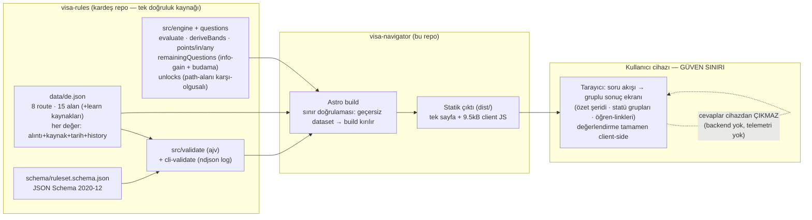

# ARCHITECTURE — Visa Navigator (v0.4 itibarıyla)

Her dilim çıkışında güncellenir; her zaman son real-green durumu resmeder.

Bileşenler, birer satır:

- **data/de.json** — kural veri seti; sayısal her değer resmî kaynak URL'si,
  birebir alıntı, okunma tarihi ve append-only `history` taşır (CC-BY-4.0).
- **ruleset.schema.json** — kamusal sözleşme; alıntısız/tarihsiz değer şemadan
  geçemez.
- **engine** — saf fonksiyonlar: uygunluk `if` ile (`eq`/`in`/`gte`/`points`/
  `any`), bant sınırları = eşikler, met/near/hold + gap; sorular kurallardan
  türer, sıralama greedy information-gain, karar değiştiremeyecek soru sorulmaz.
- **validate / cli-validate** — sınır doğrulaması; CI ve build kapısı, ndjson
  yapılandırılmış log.
- **Astro build** — dataset'i sınırda doğrular, engine'i tek küçük island
  olarak paketler; ajv client'a sızmaz.
- **Statik site** — health satırı (dataset/şema sürümü + en yeni okuma tarihi),
  IRCC-tarzı disclaimer; tokens.css ("Damgalı Panel") tasarım sistemi.
- **Güven sınırı** — kişisel beyanlar (vatandaşlık, maaş bandı, yaş…) yalnız
  tarayıcı belleğinde; hiçbir ağ isteğiyle dışarı çıkmaz.

Henüz yok (planlı): kaynak izleme cron'u (s4, `visa-rules` CI'ında koşacak),
FR/ES/NL veri dosyaları (s5), deploy hedefi (s6).
