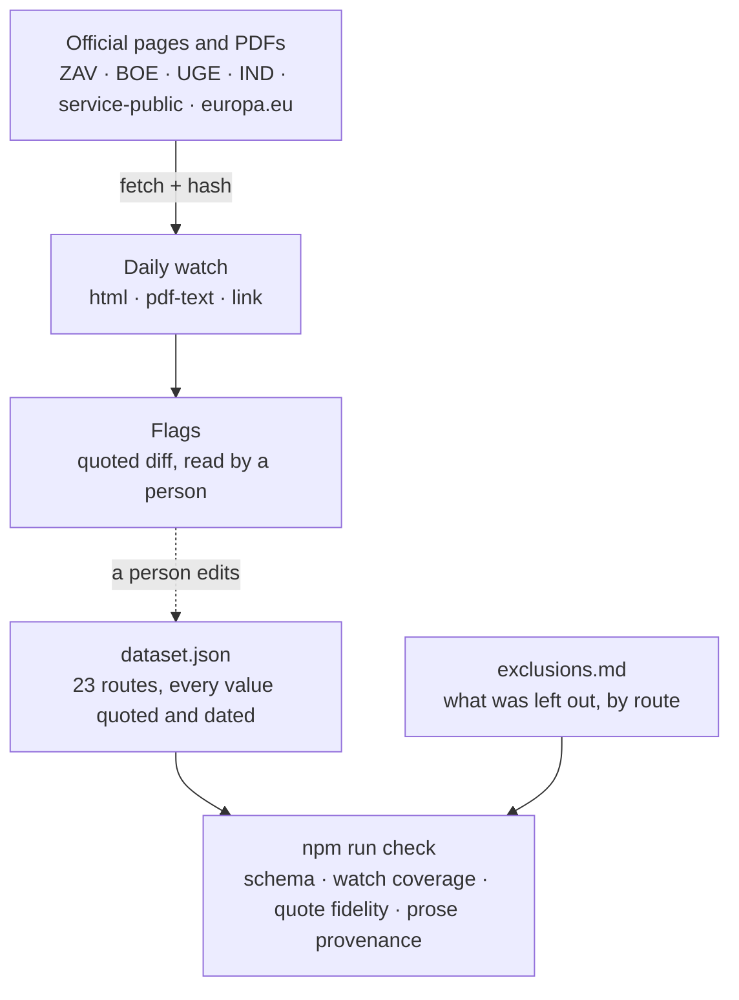
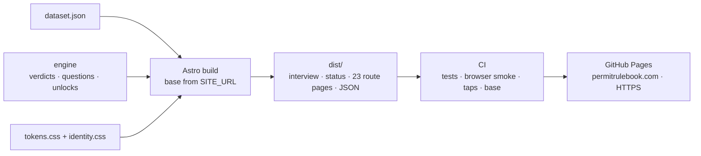
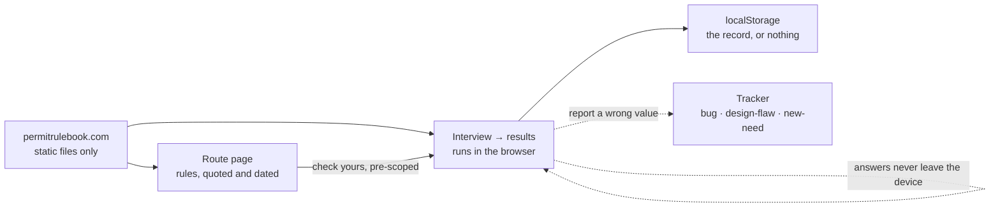

# ARCHITECTURE — Permit Rulebook (as of v0.10 real-green; s6 "public launch" mock-green, live at https://permitrulebook.com, 2026-09-08)

Updated at every slice exit. Three small diagrams, read top to bottom: where the
facts come from, how they become a site, and where the reader's answers stay.
Detail lives in the component list, not in the boxes.

## 1 · The facts: sources → watch → dataset → gates

## 2 · The site: build → check → deploy

## 3 · The reader: everything stays on the device

## Components, one line each

**permit-rulebook-data** (sibling repository; data CC BY 4.0, code MIT)

- **data/dataset.json** (schema 0.5.0) — the rules: every numeric value with
  its official source URL, verbatim quote, retrieval date and append-only
  history; per route its statements (preconditions and caveats in the source's
  words), its readings (ours, declared), and a scope value with the limbs it
  does not ask. The experience ladder is ordinal (`implies`).
- **data/countries.json** — 199 passport issuers, hand-written labels,
  aliases, the article a country takes; `classes.eu_eea_ch` is a rule with
  four sourced legs.
- **data/exclusions.md** — prose for a person plus a fenced machine twin; a
  test holds the halves to each other and both to the routes' scope.
- **schema/ruleset.schema.json** — the public contract: no value without its
  quote and date, no route without its scope.
- **src/engine, verdict, scope, lang, countries** — pure functions:
  eligibility, band edges = thresholds, deciding path, still-reachable, points
  as the best row an answer satisfies, questions by information gain, provable
  single-step unlocks, notices; property tests over thousands of profiles.
- **src/prose** — the provenance gate for sentences: authority (needs a
  quote), ours (declared), label — keyed on the declared kind.
- **src/watch** — the daily re-read: html, pdf-text (text layer, bytes hash
  beside words hash), link liveness; slices bind each page to its operative
  text; glyph corrections are declared data; `human_tier: 0`; runs in GitHub
  Actions, dry-run until the human says live.
- **npm run check** — the four gates in one line each.

**permit-rulebook** (this repository; MIT)

- **Astro build** — reads the sibling package, derives `base` from
  `SITE_URL`, generates the interview, the status page, 23 route pages and
  their JSON endpoints, the favicon set and the social card from the dataset's
  own facts (a sidecar makes a stale card fail CI).
- **tokens.css / identity.css** — the design system and the identity pair as
  code; one source, inlined by the route page, linked by the interview.
- **CI (pages.yml)** — both repositories checked out; data gates; build; tests
  with a real browser over `dist/`; asset truth; base-path check; tap targets
  at 390 px; deploy to Pages.
- **GitHub Pages** — static hosting at the custom domain, HTTPS enforced; the
  accepted cost is no response headers of our own.

**The device**

- **Interview and results** — run entirely in the browser; the record lives in
  localStorage (legacy key migrated) or not at all; print stylesheet.
- **Route page** — rules in interview order, the rail with its label list,
  quotes with language and read date, the scope block, one call to action that
  pre-scopes the interview, the data door (JSON, repository, tracker).

Not yet real-green (s6): the phone walk on the live site, the isolated v1-gate
critique's blockers cleared, the watch switched from dry-run to filing issues,
and the announcement.
