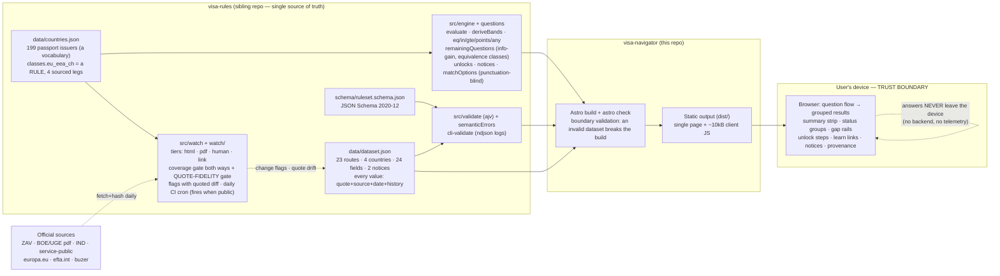

# ARCHITECTURE — Visa Navigator (as of v0.6; s5·s5b·s5c mock-green)

Updated at every slice exit. The diagram depicts what is built and verified;
what is not yet real-green is called out at the bottom.

Components, one line each:

- **data/dataset.json** — the rules dataset; every numeric value carries its
  official source URL, verbatim quote, retrieval date and an append-only
  `history`. Also holds `notices` (facts that precede eligibility, e.g. EU free
  movement) and per-route `preconditions` (requirements we do not check).
- **data/countries.json** — the passport vocabulary: 199 issuers, hand-written
  English labels, aliases for the names people actually type. Dependent
  territories are deliberately absent (their residents hold the metropolitan
  passport). `classes.eu_eea_ch` is not vocabulary but a rule — it decides who
  needs a permit at all — so each of its four legs carries a quote and is
  watched like a threshold.
- **ruleset.schema.json** — the public contract; a value without its quote or
  date cannot pass the schema.
- **engine** — pure functions: eligibility by `eq`/`in`/`gte`/`points`/`any`,
  band edges = the thresholds themselves, met/near/hold + bounded gaps,
  `hard_fail` on every result; questions derive from the rules, ordered by
  greedy information gain over option equivalence classes; `unlocks` computes
  provable single-step counterfactuals; `notices` answers "do you even need a
  permit"; `matchOptions` folds away case, diacritics and punctuation so a
  country is findable by the name its holder types. Invariants guarded by
  property tests over ~2,900 seeded-random profiles.
- **validate / cli-validate** — schema plus semantic checks (unique ids,
  threshold consistency keyed on `field#quote`, vocabulary membership);
  CI and build gate; ndjson structured logs.
- **watch** — a declared watchlist over every dataset source, coverage enforced
  both ways in CI. Four tiers: `html` text-hash (with `slice` markers for pages
  whose chrome rotates), `pdf` byte-hash, `human` with verification-age
  reminders, and `link` — liveness only, for the "find out yourself" links that
  back no value. Beyond hashing, the **quote-fidelity gate** re-reads every
  shipped quote in the latest snapshot: a hash says something moved, only this
  says the sentence we quote is still on the page.
- **Astro build** — validates the dataset at the boundary, runs `astro check`,
  bundles the engine as one small island; ajv never reaches the client bundle.
- **Static site** — health line (dataset/schema version + newest retrieval
  date), disclaimer; tokens.css ("Stamped Panel") design system.
- **Trust boundary** — personal declarations (citizenship, salary, age…) live
  only in browser memory; no network request carries them out.

## Not yet real-green

Everything above is real-green as of **v0.7** (2026-09-06): values verified at
their sources by a human, acceptance scenarios walked on the live product.

Still to come in s6:

- **Deploy target and the live cron** — the daily watch fires once `visa-rules`
  is public.
- **Per-route micro-pages** and the launch surface.
- **The name and the licence** — release-gate decisions, not code.
